# 一、Nginx

## 1. Nginx应用场景

- **HTTP服务器** :Nginx本身也是一个静态资源的服务器，当只有静态资源的时候，就可以使用Nginx来做服务器，如果一个网站只是静态页面的话，那么就可以通过这种方式来实现部署。
- **FTP服务器** :FTP服务器，通常会提供一个上传的功能，其他应用如果需要静态资源就从该静态服务器中获取
- **反向代理:**反向代理(Reverse Proxy)方式是指以代理服务器来接受Internet上的连接请求，然后将请求转发给内部网络上的服务器，并将从服务器上得到的结果返回给Internet上请求连接的客户端，此时代理服务器对外就表现为一个反向代理服务器。
- **负载均衡:**负载均衡也是Nginx常用的一个功能，负载均衡其意思就是分摊到多个操作单元上进行执行例如Web服务器、FTP服务器、企业关键应用服务器和其它关键任务服务器等，从而共同完成工作任牙

## 2.Nginx优点

- **高并发支持**: 单机能够支持10W+的并发连接(取决于内存大小，极限能够到百万)，那么在实际生产中也是非常能接近这个数字的，这主要得益于nginx在linux环境下使用了epollO多路复用模型。
- **内存消耗低** :在同类型web服务中，nginx比apache占用的内存资源更少，在一般情况下10K非活跃的HTTP Keep-Alive连接在nginx中仅消耗2.5M内存。
- **高扩展性**:低耦合的模块设计，并且有丰富的第三方模块支持
- **高可靠性**:经过十几年各种复杂场景和各大公司的生产环境验证，并且nginx的架构是由master进程和worker进程组成的，如果worker进程出现问题，那么master进程可以快速开启一个新的worker进程提供服务。

## 3.指令

- 启动nginx：

  ```vbscript
  start nginx
  ```

- 关闭nginx服务使用以下命令

  快速停止

  ```vbscript
  nginx -s stop
  ```

  完整有序的关闭

  ```undefined
  nginx -s quit
  ```

- 重新加载配置文件并重启

  ```
  nginx -s reload 
  ```

- 查看nginx进程

  ```
  tasklist /fi "imagename eq nginx.exe"
  ```

- 查看所有nginx进程

  ```
  tasklist /fi "imagename eq nginx.exe"
  ```

- 彻底停止nginx服务

  ```
  taskkill /f /t /im nginx.exe
  ```

  

## 4.反向代理

Http代理，反向代理：作为web服务器最常用的功能之一，尤其是反向代理。

- 正向代理：代理的是客户端。（比如翻墙软件啥的）

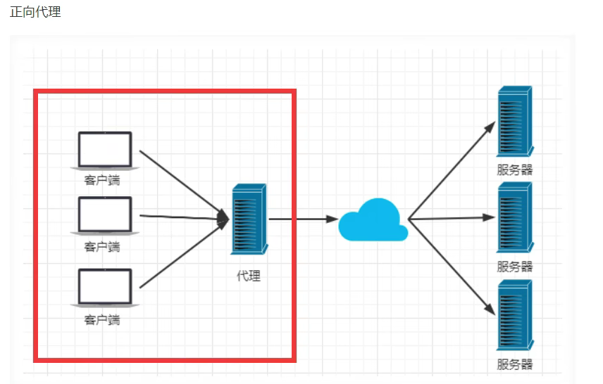

- **反向代理：代理的是服务端**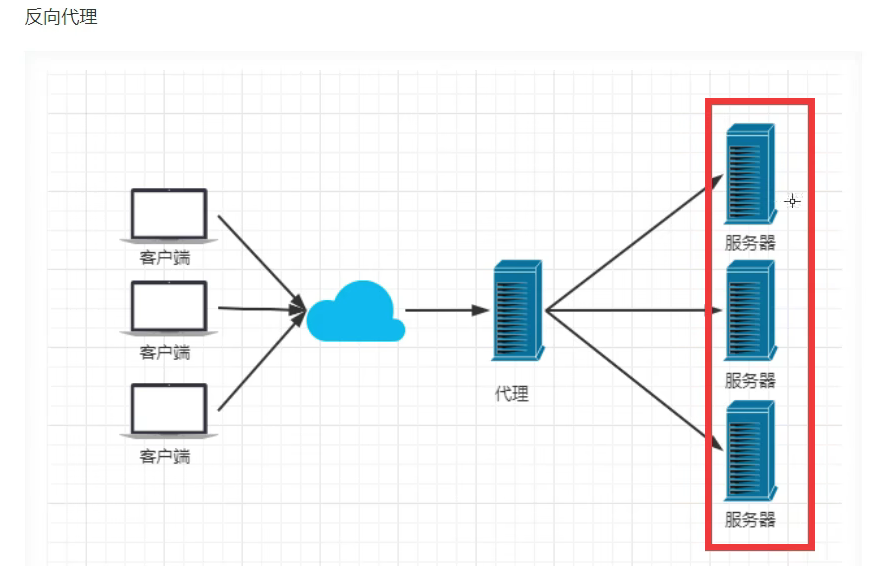

## 5.负载均衡

Nginx提供的负载均衡策略有两种：**内置策略**和**扩展策略**。

内置策略为轮询，Ip hash 。

扩展策略，就是天马行空，只有你想不到，没有他做不到

- 轮询：依次循环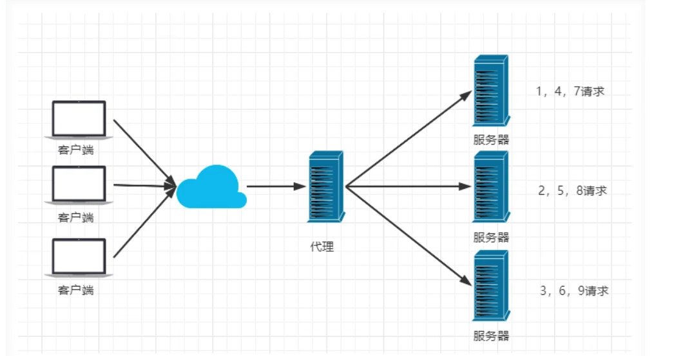
- 加权轮询：权重高的接受的请求多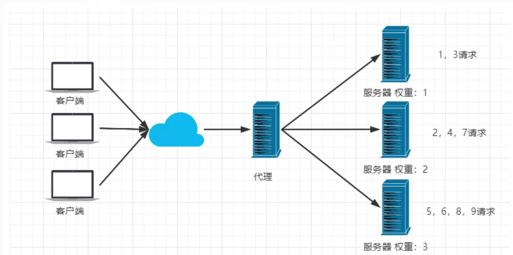
-  iphash对客户端请求的ip进行hash操作，然后根据hash结果将同一个客户端ip的请求分发给同一服务器进行处理，<br>可以解决session不公享问题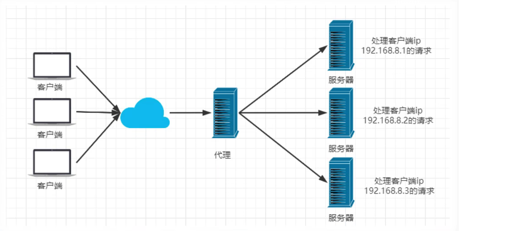

## 6.动静分离

**动静分离**，在我们的软件开发中，有些请求是需要后台处理的，有些请求是不需要经过后台处理的(如:css、html、jpg、js等等文件)，这些不需要经过后台处理的文件称为静态文件。让动态网站里的动态网页根据一定规则把不变的资源和经常变的资源区分开来，动静资源做好了拆分以后，我们就可以根据静态资源的特点将其做缓存操作。提高资源响应的速度。

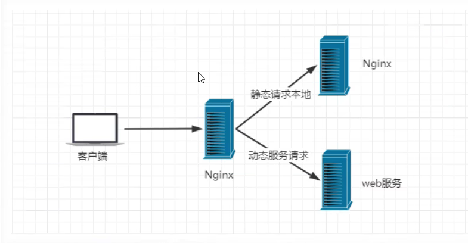

## 7.入门

- conf简化

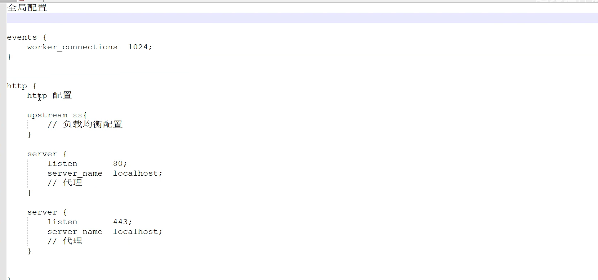

反向代理和负载均衡的配置

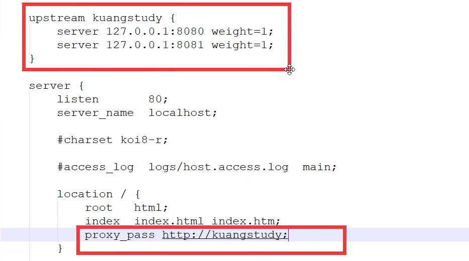

# 二、Redis

## 1. Redis介绍

- 区别于关系型数据库，它提供了非常丰富的存储结构 (String、List、Hash、Set、SortedSet等)
- 访问速度快，这主要得益于内存存储，高效的存储结构设计
- 社区活跃(简洁的API、丰富的文档、活跃的社区)

开启指令

```
redis-cli
```


## 2. Redis之基本数据结构String

- 字符串键是Redis中最基本的键值对类型，这种类型的键值对会在数据库中把单独的一个键和单独的一个值关联起来，被关联的键和值既可以是普通的文字数据，也可以是图片、视频、音频、压缩文件等更为复杂的二进制数据。
- String类型是二进制安全的，意思是 Redis 的 string 可以包含任何数据。如数字，字符串，jpg图片或者序列化的对象。

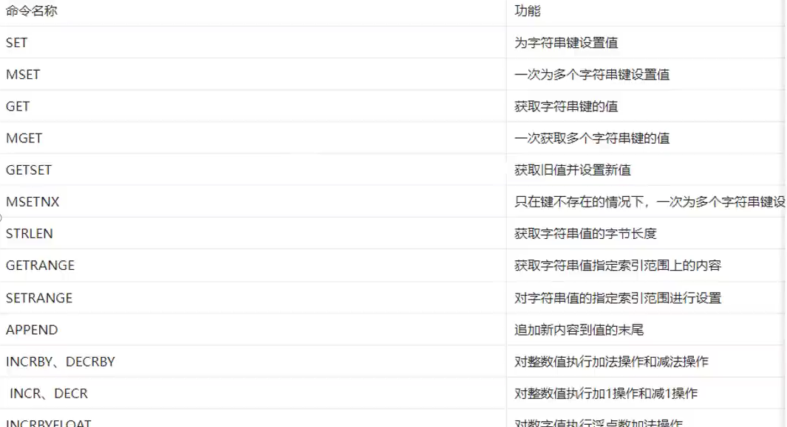

## 3. Redis之基本数据结构list

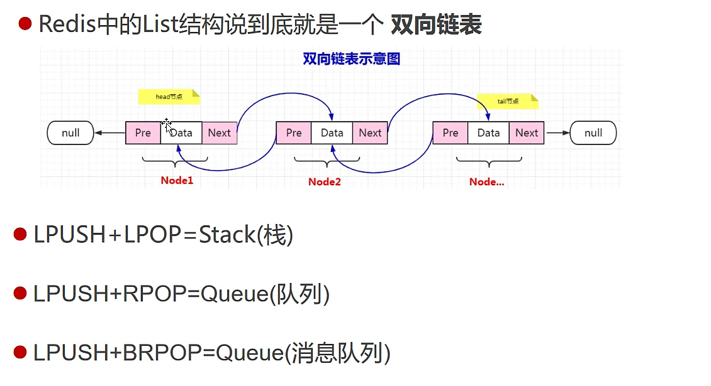

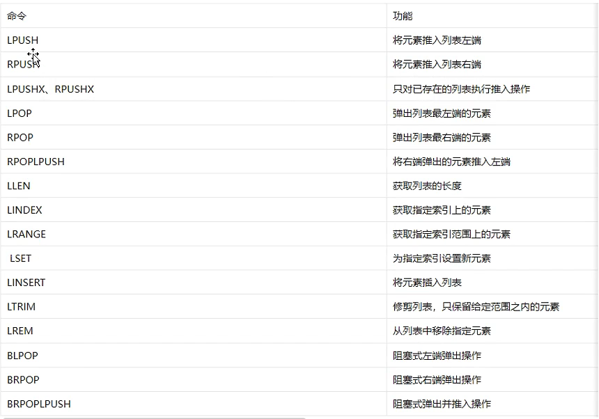

## 4. Redis之基本数据结构Set

- 元素不能重复
- 无序集合
- 底层通过哈希表实现

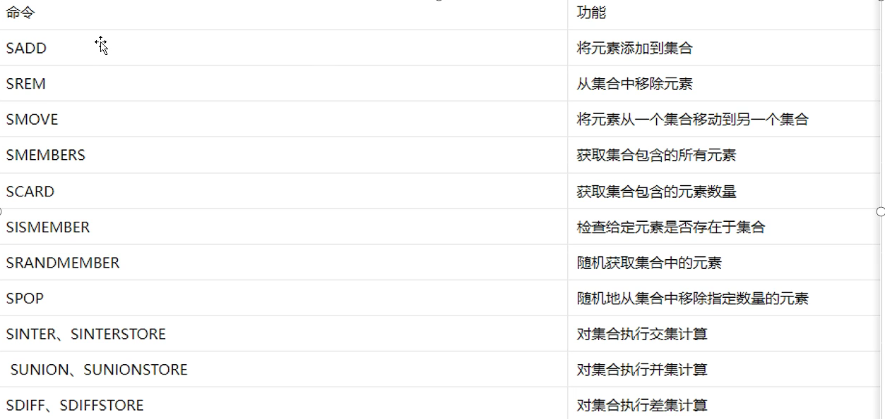

## 5. Redis之基本数据结构ZSet

- Redis有序集合和集合一样也是 string 类型元素的集合,且不允许重复的成员。不同的是每个元素都会关联一个 double 类型的分数。Redis 正是通过分数来为集合中的成员进行从小到大的排序

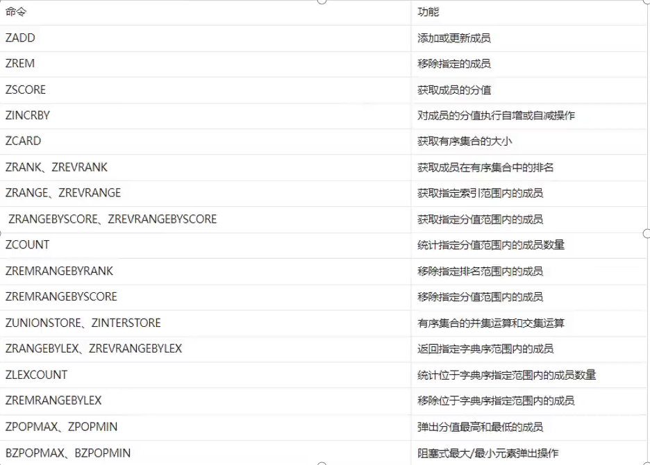

## 6. Redis之基本数据结构Hash

- Redis hash 是一个 string 类型的 field (字段) 和 value (值) 的映射表，hash 特别适合用于存储对象。

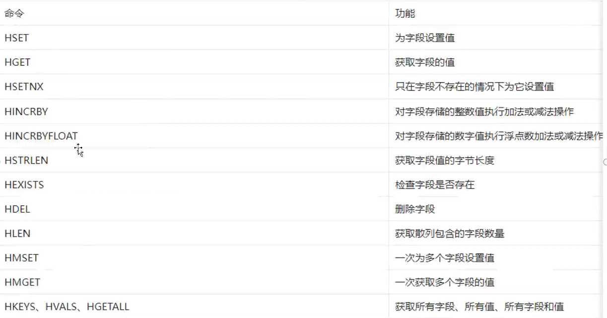

## 7. SpringBoot继承Redis

配置yml文件

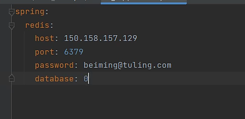

## 8. Redis GEO

Redis 3.2 版本新增了geo相关命令，用于存储和操作地理位置信息。提供的命令包括添加、计算位置之间距离、根据中心点坐标和距离范围来查询地理位置集合

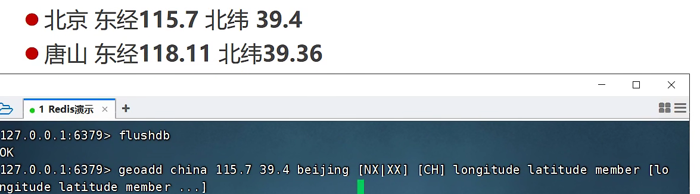

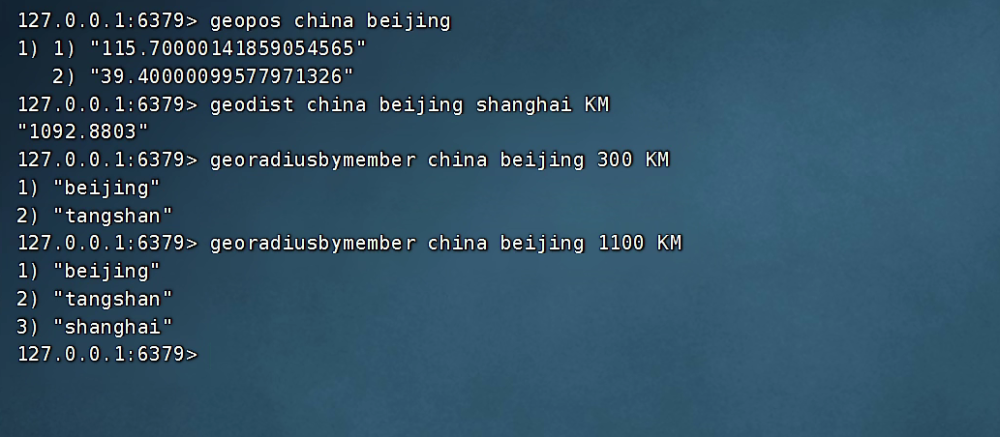

## 9. Redis HyperLogLog

- Redis 在 2.8.9 版本添加了 HyperLogLog 结构。Redis HyperLogLog是用来做基数统计的算法，HyperLogLog 的优点是，在输入元素的数量或者体积非常非常大时，计算基数所需的空间总是固定 的、并且是很小的。在 Redis 里面，每个 HyperLogLog 键只需要花费 12 KB 内存，就可以计算接近 2^64 个不同元素的基 数。这和计算基数时，元素越多耗费内存就越多的集合形成鲜明对比。但是，因为 HyperLogLog 只会根据输入元素来计算基数，而不会储存输入元素本身，所以 HyperLogLog 不能像集合那样，返回输入的各个元素

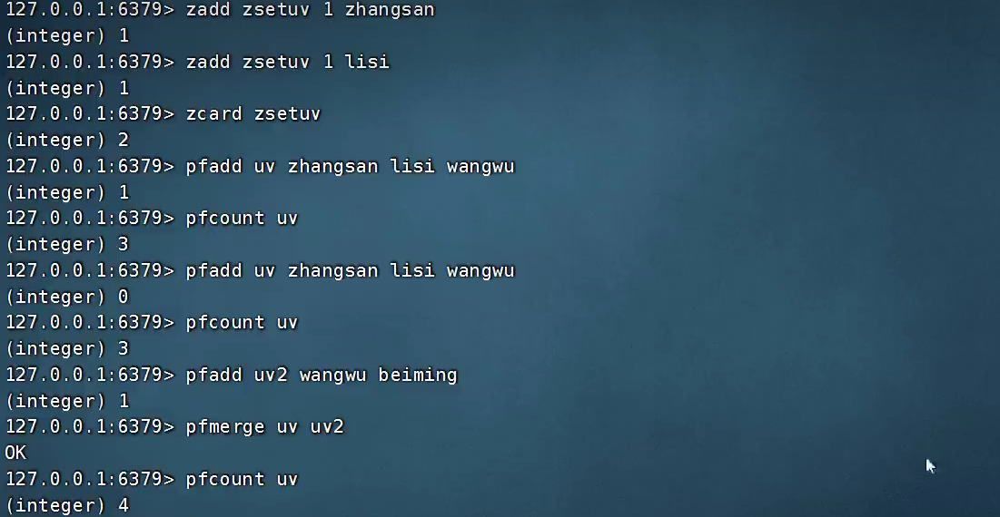

## 10. Redis数据结构之bitmap命令合集

- 位图(bitmap)同样属于 string 数据类型。Redis 中一个字符串类型的值最多能存储512 MB的内容，每个字符串由多个字节组成，每个字节又由8个Bit 位组成。它存储上限为232，时间复杂度为O(1)。
- 位图结构正是使用“位”来实现存储的，它通过将比特位设置为0或1来达到数据存取的目的，这大大增加了 value 存储数量。由于bit是计算机中最小的单位，使用它进行储存将非常节省空间，特别适合一些数据量大且使用二值统计的场景(签到)。

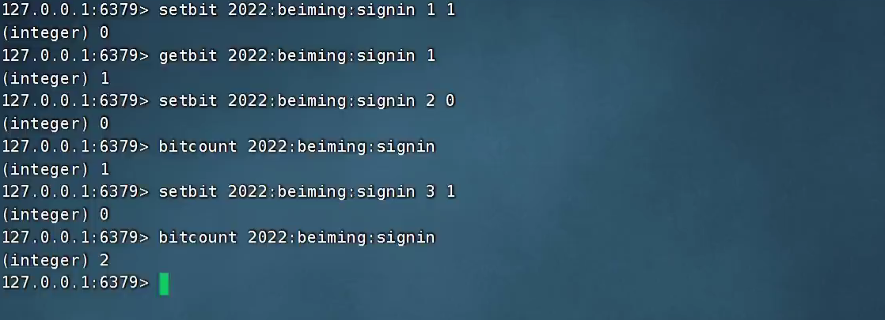

## 11.持久化

1. **RDB**

   **优点**：

   1. 数据一致性：关系数据库采用事务处理机制，可以保证数据的一致性。在一个事务中，要么所有的操作都成功，要么所有的操作都失败，避免了数据的不完整和错误。

   2. 数据完整性：关系数据库支持定义数据约束，如主键、外键、唯一约束等，可以保证数据的完整性，防止非法或不合规的数据插入。

   3. 数据查询：关系数据库支持复杂的查询操作，可以使用SQL语言进行灵活的数据检索，满足不同业务需求。

   4. 数据索引：关系数据库支持索引，可以提高查询性能，加快数据检索的速度。

   5. 数据安全：关系数据库提供访问控制和权限管理，可以限制用户对数据的访问权限，确保数据的安全性。

   6. 数据备份和恢复：关系数据库支持数据备份和还原，可以防止数据丢失，保障数据的可靠性。

   7. 成熟稳定：关系数据库是经过长期发展和验证的技术，具有较高的稳定性和可靠性。

   **缺点**：

   1. 性能限制：对于大规模数据和高并发访问的场景，关系数据库的性能可能受到限制，特别是在某些复杂查询时，性能可能较低。

   2. 扩展性：关系数据库在扩展方面存在一定的挑战，尤其是在分布式系统中，需要付出更多的工作来实现水平扩展。

   3. 数据模型变更：当需要对数据模型进行较大的变更时，可能需要对现有数据进行迁移，增加了维护成本和风险。

   4. 存储开销：关系数据库的存储结构较为复杂，可能会占用较多的磁盘空间，尤其在存储大量稀疏数据时。

   5. ACID 特性开销：关系数据库支持 ACID（原子性、一致性、隔离性、持久性）特性，但这些特性的实现会带来一定的开销，特别是在高并发场景下可能影响性能。

2. **AOF**

   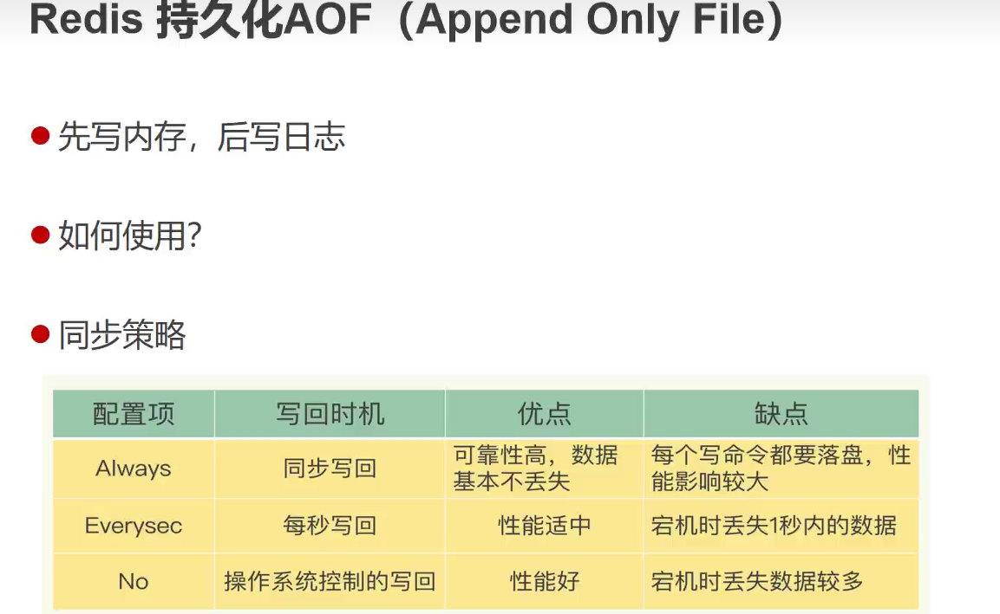