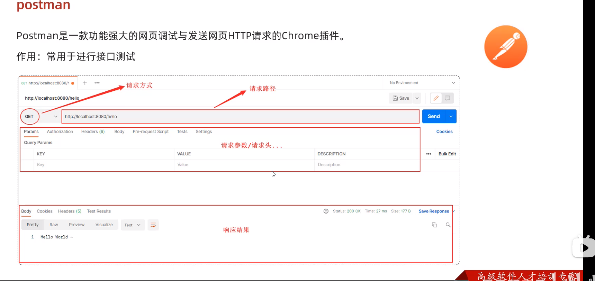
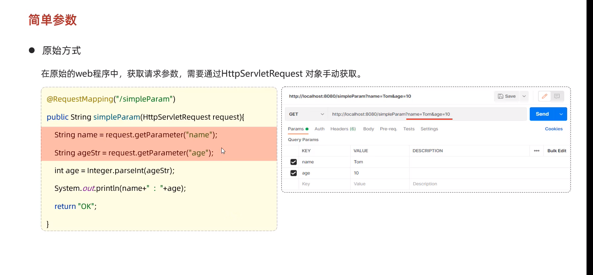
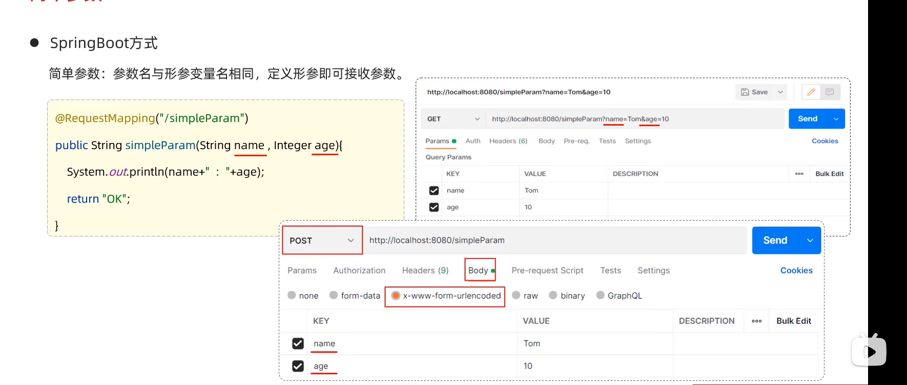
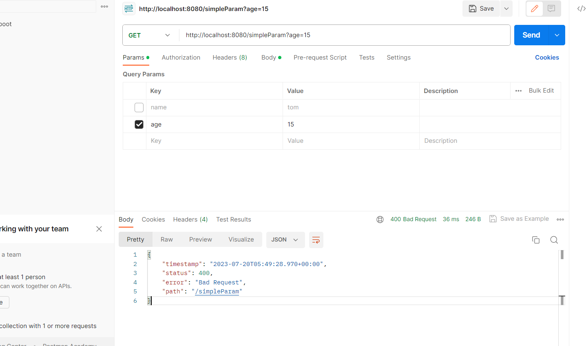
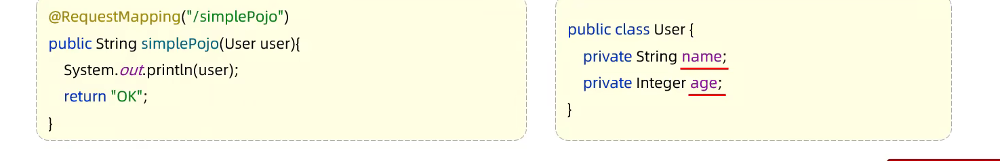
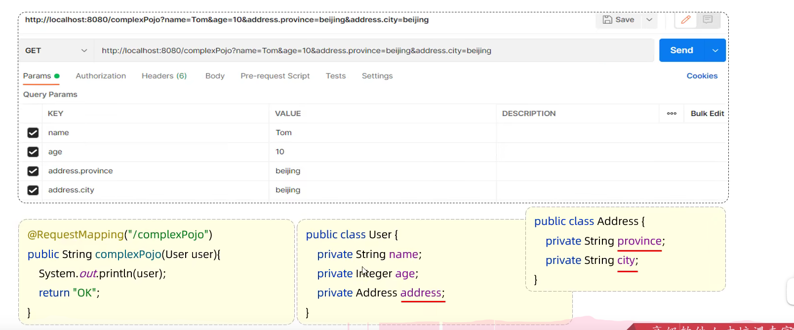
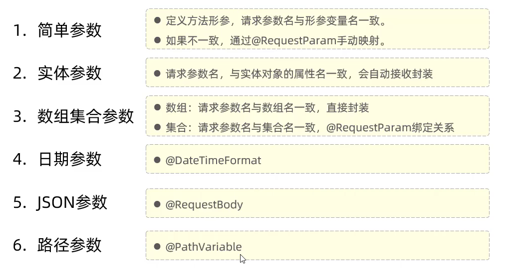

# 一、请求

### 1）postman介绍



### 2）简单参数



- 对于简单参数来说，get和post请求都一样



- 如果方法形参名称与请求参数名称不匹配，可以使用@RequestParam完成映射

  ```java
  @RequestMapping("/simpleParam")
  public String simpleParam(@RequestParam(name = "name") String username, Integer age ){
  	System.out.println(username + " : " + age);
      return "ok";
  }
  ```

  注意：@RequestParam中required属性默认为true，代表该请求参数必须传递，如果不传递讲报错。如果该参数是可选的，可以将requried属性设置为false。

  ```java
   @RequestMapping("/simpleParam")
      public String simpleParam(@RequestParam(name = "name",required = false) String username, Integer age ){
          System.out.println(username + " : " + age);
          return "ok";
      }
  ```

  

  (400:客户端错误)

- 小结：

  1.  原始方式获取请求参数
     - Contoller方法形参中声明HttpServletRequest对象
     - 调用对象的getParameter(参数名)
  2. Springboot中接收简单参数
     - 请求参数名与方法形参变量名相同
     - 会自动进行类型转换
  3. @RequestParam注解
     - 方法形参名称与请求参数名称不匹配，通过该注解完成映射
     - 该注解的required属性默认是true，代表请求参数必须传递

### 3)实体参数

- 简单实体对象：请求参数名与形参对象属性名相同，定义POJO接收即可

  

- 复杂实体对象：请求参数名与形参对象属性名相同，按照对象层次结构关系即可嵌套POJO属性参数

  

### 4）数组集合参数

- 数组参数：请求参数名与形参**数组名称相同**且请求参数为多个，定义数组类型形参即可接受参数

  ```java
  @RequestMapping("/arrayParam")
  public String arrayParam(String[] hobby){
      System.out.println(Arrays.toString(hobby));
      return "OK";
  }
  ```

- 集合参数：请求参数名与形参**集合名称相同**且请求参数为多个，**@RequestParam**绑定参数关系

  ```java
  @RequestMapping("/listParam")
  public String listParam(@RequestParam List<String> hobby){
      System.out.println(hobby);
      return "OK";
  }
  ```

  

### 5）日期参数

日期参数：使用@DateTimeFormat注解完成

```java
@RequestMapping("/dateParam")
public String dateParam(@DateTimeFormat(pattern = "yyyy-MM-dd HH:mm:ss") LocalDateTime updateTime){
    System.out.println(updateTime);
    return "OK";
}
```

### 6）JSON参数

JSON参数：JSON数据键名与形参对象属性名相同，定义POJO类型形参即可接受参数，需要使用@RequestBody标识

```java
@RequestMapping("/jsonParam")
public String jsonParam(@RequestBody User user){
    System.out.println(user);
    return "ok";
}
```

### 7）路径参数

- 路径参数：通过请求URL直接传递参数，使用{...}来表示该路径参数，需要使用@PathVariable获取路径参数

  - 单个参数

    ```java
    @RequestMapping("/path/{id}")
    public String pathParam1(@PathVariable Integer id){
        System.out.println(id);
        return "OK";
    }
    ```

  - 多个参数

    ```java
    @RequestMapping("/path/{id}/{name}")
    public String pathParam2(@PathVariable Integer id, @PathVariable String name){
        System.out.println("id = " + id);
        System.out.println("name = " + name);
        return "OK";
    }
    ```

### 8)小结



# 二、响应

#### @ResponseBody

- 类型：**方法注解、类注解**
- 位置：Controller方法上/类上
- 作用：将方法返回值直接响应，如果返回值类型是**实体对象/集合**，将会转换为JSON格式响应
- 说明：@RestController = @Controller + @ResponseBody;

#### 统一响应结果

Result (Code、message、data)
