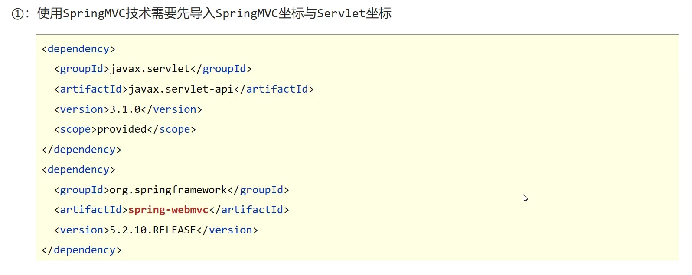
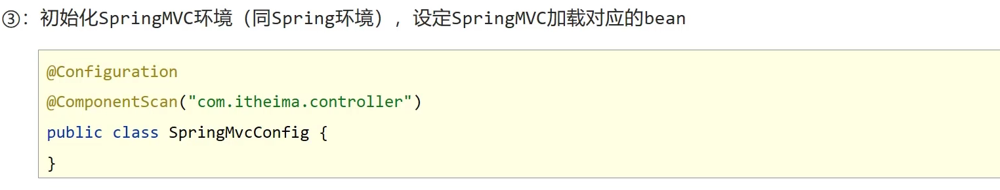
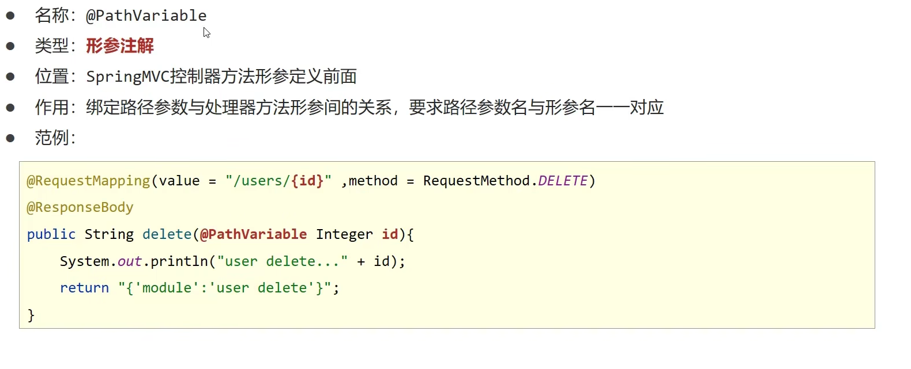
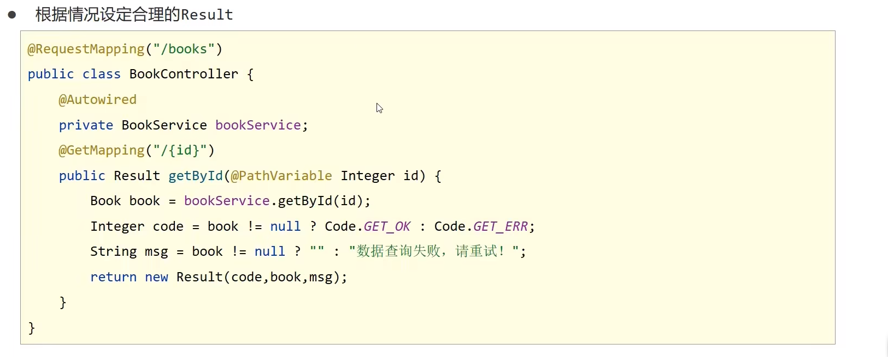
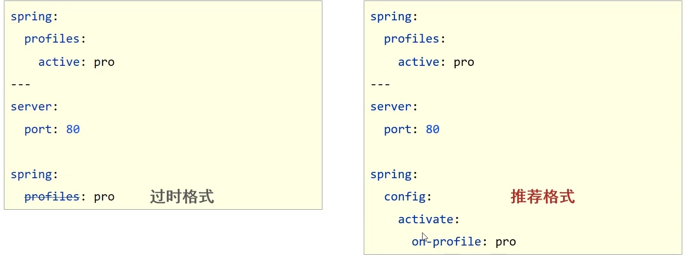
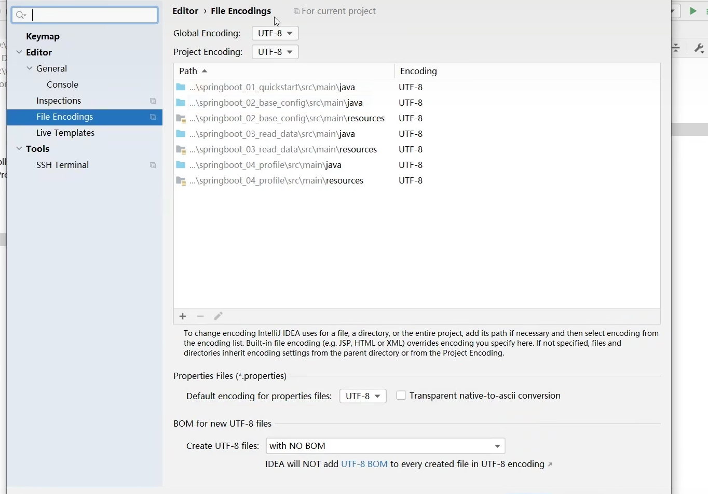
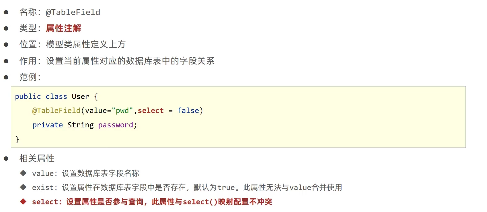

#  一、简述

### 1）Spring Framework 系统架构

- Core Container:核心容器
- AOP：面向切面编程
- Aspects: AOP思想实现
- Data Access: 数据访问
- Data Integration:  数据集成
- Web: Web开发
- Test：单元测试与集成测试

### 2）核心概念

1. **IOC容器**
   - **IoC控制反转**：
     - 使用对象时，由主动new产生对象转换为由**外部**提供对象，此过程中对象创建控制器由程序转移到**外部**，<br>此思想称为控制反转
   - Spring技术对IoC思想进行了实现
     - Spring提供了一个容器，称为**IoC容器**，用来充当IoC思想中的”**外部**“
     - IoC容器负责对象的创建、初始化等一系列工作，被创建或被管理的对象在IoC容器中统称为**Bean**
   - **DI依赖注入**
     - 在容器中建立bean与bean之间的依赖关系的整个过程，称为依赖注入

 2. 目标：**充分解耦**

    - 使用IoC容器管理bean(IoC)
    - 在IoC容器内将有依赖关系的bean进行关系绑定(DI)

    最终效果：使用对象时不仅可以直接从IoC容器中获取，并且获取到的bean已经绑定了所有依赖关系

# 二、Spring

### 1）IoC入门案例

- 思路分析

1. 导入依赖坐标

   ```java
   <dependency>
   	<groupId>org.springframework</groupId>
       <artifactId>spring-context</artifactId>
       <version>5.2.10.RELEASE</version>
   </dependency>
   ```

2. 定义Spring管理类的接口

   ```java
   public interface BookService {
       public void save();
   }
   ```

   ~~~java
   public class BookServiceImpl implements BookService {
       BookDao bookDao = new BookDaoImpl();
       @Override
       public void save() {
           System.out.println("book service save...");
           bookDao.save();
       }
   }
   ~~~

3. 创建Spring配置文件，配置对应类作为Spring管理的bean

   ```java
   <?xml version="1.0" encoding="UTF-8"?>
   <beans xmlns="http://www.springframework.org/schema/beans"
          xmlns:xsi="http://www.w3.org/2001/XMLSchema-instance"
          xsi:schemaLocation="http://www.springframework.org/schema/beans http://www.springframework.org/schema/beans/spring-beans.xsd">
   
       <bean id="bookDao" class="cn.homyit.Dao.impl.BookDaoImpl"/>
       <bean id="bookService" class="cn.homyit.Service.impl.BookServiceImpl"/>
   </beans>
   ```

   注意：bean定义时id属性在同一个上下文中不能重复

4. 初始化IoC容器(Spring核心容器/Spring容器)，通过容器获取bean

   ~~~java
   public class App2 {
       public static void main(String[] args) {
           //3.h获取IoC容器
           ClassPathXmlApplicationContext context = new ClassPathXmlApplicationContext("applicationContext.xml");
           //4。获取bean
           BookDao bookDao = (BookDao) context.getBean("bookDao");
           bookDao.save();
       }
   }
   
   ~~~

### 2）DI入门案例

- 思路分析

  

1. 删除使用new的形式创建对象的代码

   

2. 提供依赖对象对应的setter方法

   

3. 配置service与dao之间的关系

### 3）bean配置

#### 3.1bean基础配置


#### 3.2bean别名配置


#### 3.3bean作用范围配置


#### 3.4bean作用范围

- spring中为什么bean默认为单例
  - Spring默认将Bean定义为单例是为了提高性能和方便管理

- 适合交给容器管理的bean
  - 表现层对象
  - 业务层对象
  - 数据层对象
  - 工具对象
- 不适合交个容器管理的bean
  - 封装实体的域对象

### 4）bean实例化

- bean本质上就是对象，创建bean使用构造方法完成

#### 4.1 实例化bean的三种方式——构造方法(常用)

- 提供可访问的构造方法

  ```java
  public class BookDaoImpl implements BookDao {
      public BookDaoImpl() {
          System.out.println("book 构造器 run...");
      }
  
      @Override
      public void save() {
          System.out.println("book dao save...");
      }
  }
  ```

- 配置

  ```xml
  <bean 
        id="bookDao" 
        class="cn.homyit.Dao.impl.BookDaoImpl" 
        />
  ```

  - 无参构造方法如果不存在，将抛出异常**BeanCreationException**

#### 4.2 实例化bean的三种方式——静态工厂(了解)

- 静态工厂

  ~~~java
  public static OrderDao getOrderDao(){
          return new OrderDaoImpl();
      }
  ~~~

- 配置

  ~~~xml
  <bean 
        id="orderDao" 
        class="cn.homyit.factory.OrderDaoFactory" 
        factory-method="getOrderDao"
        />
  ~~~

#### 4.3 实例化bean的三种方式——实例工厂(了解)


#### 4.4实例化bean的第四种方式——FactoryBean

- FactoryBean

~~~java
public class UserDaoFactoryBean implements FactoryBean<UserDao> {
    //代替原始实例工厂中创建的方法
    //获取bean实例
    @Override
    public UserDao getObject() throws Exception {
        return new UserDaoImpl();
    }


    //获取bean的类型
    @Override
    public Class<?> getObjectType() {
        return UserDao.class;
    }
}
~~~

- 配置

~~~xml
<bean 
      id="userDao" 
      class="cn.homyit.factory.UserDaoFactoryBean"
      />
~~~

### 5）bean的生命周期

- 生命周期：从创建到消亡的完整过程
- bean生命周期：bean从创建到销毁的整体过程
- bean生命周期控制：在bean创建后到销毁前做一些事情

#### 1. 提供生命周期控制

~~~java
public class BookDaoImpl implements BookDao {
    @Override
    public void save() {
        System.out.println("book dao save...");
    }
    //表示bean初始化对应的操作
    public void init(){
        System.out.println("init...");
    }

    //表示bean销毁前对应地操作
    public void destroy(){
        System.out.println("destroy...");
    }
}

~~~

配置

~~~xml
<bean id="bookDao"  
      class="cn.homyit.Dao.impl.BookDaoImpl"  
      init-method="init" 
      destroy-method="destroy"
      />
~~~

#### 2. 提供生命周期控制方法——接口控制

~~~java
public class BookServiceImpl implements BookService, InitializingBean, DisposableBean {
    public void save() {
        System.out.println("book service save...");
    }
    public void destroy() throws Exception {
        System.out.println("destroy");
    }
    public void afterPropertiesSet() throws Exception {//属性设置完之后
        System.out.println("afterPropertiesSet");
    }
}
~~~

#### 3. bean初始化地每一阶段

- 初始化容器
  1. 创建对象(内存分配)
  2. 执行构造方法
  3. 执行属性注入(set操作)
  4. **执行bean初始化方法**
- 使用bean
  - 执行业务操作
- 关闭/销毁容器
  - **执行bean销毁方法**

#### 4. **bean销毁时机**


### 6) 依赖注入


#### 6.1 setter注入——引用类型


#### 6.2 setter注入——简单类型

- 在bean中定义引用类型属性并提供可访问地set方法

  ~~~java
  public class BookDaoImpl implements BookDao {
  
      private int connectionNum;
  
      public void setConnectionNum(int connectionNum) {
          this.connectionNum = connectionNum;
      }
  }
  ~~~

- 配置

  ~~~xml
  <bean id="bookDao"  class="cn.homyit.Dao.impl.BookDaoImpl"  >
          <property name="connectionNum" value="10"/>
      </bean>
  ~~~


#### 6.3 构造器注入——引用类型(了解)

- 在bean中定义引用类型属性并提供可访问的构造方法

  ~~~java
  public class BookServiceImpl implements BookService {
      private BookDao bookDao ;
  
      public BookServiceImpl(BookDao bookDao) {
          this.bookDao = bookDao;
      }
  }
  ~~~

- 配置

  ~~~xml
  <bean id="bookService"  class="cn.homyit.Service.impl.BookServiceImpl">
          <constructor-arg name="bookDao" ref="bookDao"/>
      </bean>
  <bean id="bookDao"  class="cn.homyit.Dao.impl.BookDaoImpl" />
  ~~~

#### 6.4 构造器注入——简单类型(了解)

- 在bean中定义引用类型属性并提供可访问的构造方法

  ~~~java
  public class BookDaoImpl implements BookDao {
  
      private int connectionNum;
  
      public BookDaoImpl(int connectionNum) {
          this.connectionNum = connectionNum;
      }
  }
  ~~~

- 配置

  ~~~xml
  <bean id="bookDao"  class="cn.homyit.Dao.impl.BookDaoImpl" >
          <constructor-arg name="connectionNum" value="10"/>
      </bean>
  ~~~

#### 6.5 构造器注入——参数适配(了解)


#### 6.6）依赖注入方式选择


### 7）依赖自动装配


- **依赖自动装配特征**


### 8）集合注入

- 注入**数组**对象

  ~~~xml
  <property name="array">
              <array>
                  <value>100</value>
                  <value>200</value>
                  <value>300</value>
              </array>
          </property>
  ~~~

- 注入**list**对象(重点)

  ~~~xml
  <property name="list">
              <list>
                  <value>it</value>
                  <value>ds</value>
                  <value>answer</value>
              </list>
          </property>
  ~~~

- 注入**set**对象

  ~~~xml
  <property name="set">
              <set>
                  <value>iw</value>
                  <value>dsa</value>
                  <value>dsa</value>
              </set>
          </property>
  ~~~

- 注入**Map**对象(重点)

  ~~~xml
  <property name="map">
              <map>
                  <entry key="country" value="china"/>
                  <entry key="province" value="hebei"/>
                  <entry key="city" value="cangzhou"/>
              </map>
          </property>
  ~~~

- 注入**properties**对象

  ~~~xml
  <property name="properties">
              <props>
                  <prop key="country">china</prop>
                  <prop key="province">hebei</prop>
                  <prop key="city">cangzhou</prop>
              </props>
          </property>
  ~~~

### 9）Spring管理第三方资源


### 10）加载properties文件


### 11）容器

#### 11.1 创建容器


#### 11.2 获取bean


#### 11.3 容器类层次结构图


#### 11.4 beanFactory初始化


### 12）小结

- 容器相关

  

- bean相关

  

- 依赖注入相关

  

### 13）注解开发

#### 13.1 注解开发定义bean


**衍生注解**


#### 13.2 纯注解开发模式


#### 13.3 bean管理

- **bean作用范围**

  - **使用@Scope定义bean作用范围**

    ~~~java
    @Repository
    @Scope("singleton")
    //@Scope("prototype")
    public class BookDaoImpl implements BookDao {
    }
    ~~~

- **bean生命周期**

  - **使用@PostConstruct、@PreDestroy定义bean生命周期**

    ~~~java
    @Repository
    @Scope("singleton")
    //@Scope("prototype")
    public class BookDaoImpl implements BookDao {
        public BookDaoImpl() {
            System.out.println("book dao constructor...");
        }
        @PostConstruct
        public void init() {
            System.out.println("init...");
        }
    
        @PreDestroy
        public void destroy() {
            System.out.println("destroy...");
        }
    }
    ~~~

#### 13.4 依赖注入

- **引用类型**


- **简单类型**


- **加载properties文件**

  

#### 13.5 第三方bean管理

-  第三方bean管理

  

  **独立配置**（推荐使用导入式）

  

​	

​	


#### 13.6 第三方bean依赖注入

##### 简单类型


##### 引用类型


#### 13.7 注解小结


# 三、Spring整合

## （一）Spring整合mybatis

### 1. mybatis基本操作


### 2. 配置


### 3.整合


## （二）Spring整合JUnit

### 使用Spring整合Junit专用的类加载器

~~~java
@Runwith(SpringJUnit4ClassRunner.class)
@ContextConfiguration(classes = SpringConfig.class)
public class BookServiceTest {
	@Autowired
	private BookService bookService;
	@Test
	public void testSave(){
		bookService.save();
    }
}
~~~

# 四、spring——AOP

### 1. AOP简介与作用

- AOP(Aspect Oriented Programming)面向切面编程，一种编程范式，指导开发者如何组织程序结构
  - 00P(Object Oriented Programming)面向对象编程
- 作用:在不惊动原始设计的基础上为其进行功能增强
- Spring理念:无入侵式/无侵入式

### 2.核心概念

- **连接点**( JoinPoint):程序执行过程中的任意位置，粒度为执行方法、抛出异常、设置变量等
  - 在SpringAOP中，理解为方法的执行
- **切入点** ( Pointcut ) :匹配连接点的式子
  - 在SpringAOP中，一个切入点可以只描述一个具体方法，也可以匹配多个方法
    - 一个具体方法:com.itheima.dao包下的BookDao接口中的无形参无返回值的save方法
    - 匹配多个方法:所有的save方法，所有的get开头的方法，所有以Dao结尾的接口中的任意方法，所有带有一个参数的方法
- **通知** ( Advice):在切入点处执行的操作，也就是共性功能
  - 在SpringAOP中，功能最终以方法的形式呈现
- **通知类**:定义通知的类
  - 切面( Aspect ): 描述通知与切入点的对应关系


### 3.AOP入门案例

- AOP入门案例思路分析

- 入门案例

  

  

  

  

  

  

  

### 4.AOP工作流程

1. Spring容器启动
2. 读取所有切面配置中的切入点
3. 初始化bean，判定bean对应的类中的方法是否匹配到任意切入点
   - 匹配失败，创建对象
   - 匹配成功，创建原始对象(**目标对象**)的**代理**对象
4. 获取bean执行方法
   - 获取bean，调用方法并执行，完成操作
   - 获取的bean是代理对象时，根据代理对象的运行模式运行原始方法与增强的内容，完成操作

- 核心概念
  - 目标对象(Target ): 原始功能去掉共性功能对应的类产生的对象，这种对象是无法直接完成最终工作的
  - 代理( Proxy ): 目标对象无法直接完成工作，需要对其进行功能回填，通过原始对象的代理对象实现

### 5. AOP切入点表达式

- 切入点：要进行增强的方法
- 切入点表达式：要进行增强的方法的描述方式


- **切入点表达式标准格式：动作关键词(访问修饰符 返回值 包名.类/接口名.方法名(参数)异常名)**

  ~~~java
  execution(public User cn.homyit.service.Userservice.findById(int))
  ~~~

  

- **可以使用通配符描述切入点，快速描述**

  

- **书写技巧**

  

### 6.AOP通知类型

- AOP通知描述了抽取的共性功能，根据共性功能抽取的位置不同，最终运行代码时要将其加入到合理的位置

- AOP通知共分为5种类型

  - 前置通知

    

  - 后置通知

  - 

  - 环绕通知( 重点 )

    

  - 返回后通知(了解）

    

  - 抛出异常后通知(了解 )

    

  #### **@Around注意事项**

  

  **实例**：测量业务层接口万次执行效率

### 7.AOP通知获取数据

- 获取切入点方法的参数

  - JoinPoint : 适用于前置、后置、返回后、抛出异常后通知
  - ProceedJointPoint : 适用于环绕通知

  

- 获取切入点方法返回值

  - 返回后通知
  - 环绕通知

  

- 获取切入点方法运行异常信息

  - 抛出异常后通知
  - 环绕通知

  

# 五、Spring事务简介

- 事务作用：在数据层保障一系列的数据库操作同成功同失败
- Spring事务作用：在数据层或**业务层**保障一系列的数据库操作同成功同失败


### 1. 案例


### 2.Spring事务角色

- **事务管理员:发起事务方，在Spring中通常指代业务层开启事务的方法**
- **事务协调员: 加入事务方，在Spring中通常指代数据层方法，也可以是业务层方法**


### 3.Spring属性

#### 3.1**事务相关配置**


#### 3.2事务传播行为

- 事务传播行为：事务协调员对事务管理员所携带事务的处理态度

  


# 六、SpringMVC

### 1.SpringMVC概述

- SpringMVC技术与Servlet技术功能相同，均属于web层开发技术

- SpringMVC是一种基于Java实现MVC模型的轻量级Web框架
- 优点
  - 使用简单，开发便捷(相比于Servlet)
  - 灵活性强

### 2.SpringMVC入门案例







### 3.入门工作流程分析


### 4.bean加载控制


### 5.postman补充

#### 1.注解详叙


#### 2.**post请求中文乱码**


#### 3.SpringMVC接受json参数


#### 4.@ResquestBody和@ResquestParam的区别


#### 5.接受日期参数


#### 6.类型转换器


#### 7.响应补充

**类型转换**


### 6.REST风格


#### 6.1RESTful入门案例





#### 6.2简化开发


# 七、SSM整合

## 1.SSM整合流程

1. 创建工程
2. SSM整合
   - Spring
     - SpringConfig
   - MyBatis
     - MybatisConfig
     - JdbcConfig
     - jdbc.properties
   - SpringMVC
     - ServletConfig
     - SpringMvcConfig
3. 功能模块表与实体类
   - dao(接口+自动代理)
   - service(接口+实现类
   - 业务层接口测试(整合JUnit )
     - controller
   - 表现层接口测试 ( PostMan )

## 2.Spring整合MyBatis

#### 配置

##### SpringConfig


##### JdbcConfig、jdbc,properties


##### MyBatisConfig


#### 模型

##### Book


#### 数据层标准开发

##### BookDao


#### 业务层标准开发

##### BookService


##### BookServiceImpl


#### 测试接口

##### BookServiceTest


#### 事务处理


## 3.Spring整合SpringMVC

#### web配置类


#### springMVC配置类


#### 基于Restful的Controller开发


## 4.SSM整合表现层数据封装

###  设置统一数据返回结果类

### 设置统一数据返回结果编码


### 根据情况设定合理的Result



## 5.SSM整合异常处理器

### 5.1出现异常现象的常见位置与常见诱因如下

- **框架内部抛出的异常**: 因使用不合规导致
- **数据层抛出的异常**: 因外部服务器故障导致 (例如: 服务器访问超时)
- **业务层抛出的异常**:因业务逻辑书写错误导致(例如: 遍历业务书写操作，导致索引异常等)
- **表现层抛出的异常**:因数据收集、校验等规则导致 (例如: 不配的数据类型间导致异常）
- **工具类抛出的异常**:因工具类书写不严谨不够健壮导致(例如:必要释放的连接长期未释放等

### 5.2异常处理器


## 6.项目异常处理

### 6.1项目异常分类

- 业务异常 (BusinessException）
  - 规范的用户行为产生的异常
  - 不规范的用户行为操作产生的异常
- 系统异常 (SystemException)
  - 项目运行过程中可预计且无法避免的异常
- 其他异常 (Exception)
  - 编程人员未预期到的异常

### 6.2项目异常处理方案

- 业务异常 (BusinessException)
  - 发送对应消息传递给用户，提醒规范操作
- 系统异常 (SystemException
  - 发送固定消息传递给用户，安抚用户
  - 发送特定消息给运维人员，提醒维护
  - 记录日志
- 其他异常 (Exception)
  - 发送固定消息传递给用户，安抚用户
  - 发送特定消息给编程人员，提醒维护 (纳入预期范围内)
  - 记录日志


#### 1.自定义项目系统级异常


#### 2.自定义项目业务级异常


#### 3.自定义异常编码(持续补充)


#### 4.触发自定义异常


#### 5.拦截并处理异常


#### 6.异常处理器效果对比


# 八、拦截器

- **拦截器( Interceptor)是一种动态拦截方法调用的机制**
- 作用
  - 在指定的方法调用前后执行预先设定后的的代码
  - 阻止原始方法的执行

- **拦截器与过滤器区别**
  - 归属不同 : Filter属于Servlet技术，Interceptor属于SpringMVC技术
  - 拦截内容不同: Fiter对所有访问进行增强，Interceptor仅针对SpringMVC的访问进行增强

## 1.入门案例


**执行流程**


## 2.拦截器参数

### 前置处理


### 后置处理


### 完成后处理


## 3.多拦截器执行顺序


# 九、maven高级

**分模块开发意义**

- 将原始模块按照功能拆分成若干个子模块，方便模块间的相互调用，接口共享


## 1.分模块开发与设计


## 2.依赖管理

### 1.依赖传递

- 依赖具有传递性
  - 直接依赖：在当前项目中通过依赖配置建立的依赖关系
  - 间接依赖：被依赖资源的资源如果依赖其他资源，当前项目间接依赖其他资源
- 依赖传递冲突问题
  - 路径优先：当依赖中出现相同的资源时，层级越深，优先级越低，层级越浅，优先级越高
  - 声明优先：当资源在相同层级被依赖时，配置顺序靠前的覆盖配置顺序靠后的
  - 特殊优先：当同级配置了相同资源的不同版本，后配置的覆盖先配置的

### 2.可选依赖

- 可选依赖指对外隐藏当前所依赖的资源--**不透明**

  ```xml
  <dependency>
  	<groupId>com.itheima</groupId>
  	<artifactId>maven 03 pojo</artifactId>
  	<version>1.0-SNAPSHOT</version>
  	<!-- 可选依赖是隐藏当前工程所依赖的资源，隐藏后对应资源将不具有依赖传递性-->
  	<optional>false</optional>
  </dependency>
  ```

### 3.排除依赖

- 排除依赖指主动断开依赖的资源，被排除的资源无需指定版本--**不需要**

```xml
<dependencv>
	<groupId>com.itheima</groupId>
	<artifactId>maven 04 dao</artifactId
	<version>1.0-SNAPSHOT</version>
	<!-- 排除依赖是隐藏当前资源对应的依赖关系--
	<exclusions>
		<exclusion>
			<groupId>log4j</groupId>
			<artifactId>log4j</artifactId>
		</exclusion>
		<exclusion>
			<groupId>org.mybatis</groupId>
			<artifactId>mvbatis</artifactId>
		</exclusion>
	</exclusions>
</dependency>
```

- 排除依赖资源仅指定GA即可，无需指定V

## 3.继承与聚合

### 1.聚合

- 聚合: 将多个模块组织成一个整体，同时进行项目构建的过程称为聚合
- 聚合工程: 通常是一个不具有业务功能的“空”工程(有且仅有一个pom文件)
- 作用:使用聚合工程可以将多个工程编组，通过对聚合工程进行构建，实现对所包含的模块进行同步构建
  - 当工程中某个模块发生更新(变更)时，必须保障工程中与已更新模块关联的模块同步更新，此时可以使用聚合工程来解决批量模块同步构建的问题

**聚合工程开发**


### 2.继承

- 概念:继承描述的是两个工程间的关系，与java中的继承相似，子工程可以继承父工程中的配置信息，常见于依赖关系的继承
- 作用:
  - 简化配置
  - 减少版本冲突

**继承开发**


### 3.继承与聚合的区别

- 作用
  - 聚合用于快速构建项目
  - 继承用于快速配置
- 相同点:
  - 聚合与继承的pom.xm1文件打包方式均为pom，可以将两种关系制作到同一个pom文件中
  - 聚合与继承均属于设计型模块，并无实际的模块内容
- 不同点
  - 聚合是在当前模块中配置关系，聚合可以感知到参与聚合的模块有哪些
  - 继承是在子模块中配置关系，父模块无法感知哪些子模块继承了自己

## 4.属性

### 1.属性

**属性配置与使用**步骤：


**资源文件引用属性**步骤：


**其他属性**（了解）


### 2.版本管理

- SNAPSHOT (快照版本)
  - 项目开发过程中临时输出的版本，称为快照版本
  - 快照版本会随着开发的进展不断更新
- RELEASE (发布版本)
  - 项目开发到进入阶段里程碑后，向团队外部发布较为稳定的版本，这种版本所对应的构件文件是稳定的，即便进行功能的后续开发，也不会改变当前发布版本内容，这种版本称为发布版本
- 发布版本
  - alpha版
  - beta版
  - 纯数字版

## 5.多环境配置与应用

### 多环境开发


### 跳过测试

- 应用场景
  - 功能更新中并且没有开发完毕
  - 快速打包


## 6.私服

### 1.私服简介与安装


### 2. 私服仓库分类


### 3.资源的上传与下载 


**需要访问私服进入浏览**


# 十、SpringBoot

## 1.SpringBoot入门

### 1.1Springboot入门案例


### 1.2SpringBoot工程网创建方式

#### Spring程序和SpringBoot程序对比


#### SpringBoot官网获取


### 1.3SpringBoot项目快速启动


### 1.4SpringBoot简介

#### Springboot概述

- SpringBoot是由Pivotal团队提供的全新框架，其设计目的是用来**简化**Spring应用的**初始搭建**以及**开发过程**

- Spring程序缺点

  - 配置繁琐
  - 依赖设置繁琐

- SpringBoot程序优点

  - 自动配置
  - 起步依赖 (简化依赖配置)
  - 辅助功能(内置服务器，.....)

- SpringBoot工作依靠

  - **SpringBoot起步依赖**

  - starter

    - SpringBoot中常见项目名称，定义了当前项目使用的所有项目坐标，以达到**减少依赖配置**的目的

  - parent

    - 所有SpringBoot项目要继承的项目，定义了若干个坐标版本号(依赖管理，而非依赖)，以达到**减少依赖冲突**的目的
    - spring-boot-starter-parent (2.5.0)与 spring-boot-starter-parent (2,4,6)共计57外标版本不同

  - 实际开发

    - 使用任意坐标时，仅书写GAV中的G和A，V由SpringBoot提供
    - 如发生坐标错误，再指定version (要小心版本冲突)

  - 辅助功能

  - **SpringBoot程序启动**

  - 启动方式

    ~~~java
    @SpringBootApplication
    public class TestApplication {
    
        public static void main(String[] args) {
            SpringApplication.run(TestApplication.class, args);
        }
    
    }
    ~~~

  - SpringBoot在创建项目时，采用jar的打包方式

  - SpringBoot的引导类是项目的入口，运行main方法就可以启动项目

  - 

## 2.SpringBoot基础配置

### 2.1**配置格式**

- 修改服务器端口

  

- SpringBoot提供了多种属性配置方式

  

- SpringBoot配置文件加载顺序 (了解)
  application.**properties** >application.**yml**>application.**yaml**


### 2.2yaml

- YAML (YAML Ain't Markup Language)，一种数据序列化格式
- 优点:
  - 容易阅读
  - 容易与脚本语言交互
  - 以数据为核心，重数据轻格式
- YAML文件扩展名
  - .yml (主流)
  - .yaml

**yaml语法规则**


**yaml数组数据**

- 数组数据在数据书写位置的下方使用减号作为数据开始符号，每行书写一个数据，减号与数据间空格分隔

  ~~~java
  enterprise:
   name: it
   age: 16
   tel: 1231
   subject: 
     - Java
     - 大数据
  ~~~

### 2.3yaml数据读取方式


**自定义对象封装数据警告解决方案**

~~~xml
<dependency>
	<groupId>org.springframework.boot</groupId>
    <artifactId>spring-boot-configuration-processor</artifactId>
    <optional>true</optional>
</dependency>
~~~

### 2.4多环境启动

##### 启动




##### **乱码解决**




##### 参数加载优先顺序


### 2.5Maven与SpringBoot多环境兼容

1. Maven中设置多环境属性

   ```xml
   <profiles>
   	<profile>
   		<id>dev env</id>
   		<properties>
   			<profile.active>dev</profile.active>
   		</properties>
   		<activation>
   			<activeByDefault>true</activeByDefault>
   		</activation>
   	</profile>
   	<profile>
   		<id>pro env</id>
   		<properties>
   			<profile.active>pro</profile.active></properties>
   		</profile>
   	<profile>
   		<id>test env</id>
   			<properties>
                   <profile.active>test</profile.active>
           	</properties>
   	</profile>
   </profiles>
   ```

2. SpringBoot中引用Maven属性

   

3. 执行Maven打包指令

   

4. 对资源文件开启对默认占位符的解析

   ```xml
   <build>
   	<plugins>
   		<plugin>
   			<artifactId>maven-resources-plugin</artifactId>
               <configuration>
   				<encoding>utf-8</encoding>
   				<useDefaultDelimiters>true</useDefaultDelimiters>
               </configuration>
   		</plugin>
   	</plugins>
   </build>
   ```

   

### 2.6配置文件分类


## 3.SpringBoot整合JUnit


## 4.SpringBoot整合SSM


####  步骤


# 十一、MyBatisPlus

## 1.MyBatisPlus简介

### 入门案例


### MyBatisPlus特性

- 无侵入: 只做增强不做改变，不会对现有工程产生影响
- 强大的 CRUD 操作:内置通用 Mapper，少量配置即可实现单表CRUD 操作
- 支持 Lambda:编写查询条件无需担心字段写错
- 支持主键自动生成
- 内置分页插件

## 2.标准数据层开发

### 标准数据层CRUD功能


### 标准分页功能制作


## 3.DQL编程控制

### 3.1条件查询

#### 3.1.1条件查询——设置查询条件


#### 3.1.2条件查询——组合查询条件


#### 3.1.3条件查询——null值处理


### 3.2查询投影


### 3.3查询条件


### 3.4字段映射与表名映射




## 4.DML编程控制

### 4.1id生成策略控制


### 4.2多记录操作


###  4.3逻辑删除

- 删除操作业务问题: 业务数据从数据库中丢弃
- 逻辑删除:为数据设置是否可用状态字段，删除时设置状态字段为不可用状态，数据保留在数据库中

**案例**


### 4.4乐观锁

**案例**


## 5.快速开发

**代码生成器**

- 模板:MyBatisPlus提供
- 数据库相关配置:读取数据库获取信息
- 开发者自定义配置:手配置

代码生成器

- 导入依赖

```xml
<dependency>
	<groupId>com.baomidou</groupId>
	<artifactId>mybatis-plus-generator</artifactId>
	<version>3.4.1</version>
</dependency>
<dependency>
	<groupId>org.apache.velocity</groupId>
	<artifactId>velocity-engine-core</artifactId>
	<version>2.3</version>
</dependency>
```

~~~java
//创建代码生成器对象，执行生成代码操作
AutoGenerator autoGenerator = new AutoGenerator();
autoGenerator.execute();
~~~

~~~java
//数据源相关配置:读取数据库中的信息，根据数据库表结构生成代码
DataSourceConfig dataSourceConfig = newDataSourceConfig();
dataSourceConfig.setUrl("jdbc:mysql://localhost:3306/mybatisplus db?serverTimezone=UTc");
dataSourceConfig.setDriverName("com.mysql.ci.jdbc.Driver");
dataSourceConfig.setUsername("root");
dataSourceConfig.setPassword("root");
autoGenerator.setDataSource(dataSourceConfig);
~~~

~~~java
//设置全局配置
GlobalConfig globalConfig = new GlobalConfig();
globalConfig.setOutputDir(System.getProperty("user,din")+"/mybatisplus 04 generator/src/main/java");
globalConfig.setOpen(false);
globalConfig.setAuthor("黑马程序员");
globalConfig.setFileOverride(true);
globalConfig.setMapperName("%sDao"):
globalConfig.setIdType(IdType.ASSIGN ID);
autoGenerator.setGlobalConfig(globalConfig);
~~~

~~~java
//包相关配置
PackageConfig packageInfo = new PackageConfig();
packageInfo.setParent("com.itheima");
packageInfo.setEntity("domain");
packageInfo.setMapper("dao");
autoGenerator.setPackageInfo(packageInfo);
~~~

~~~java
//策略配置
StrategyConfig strategy = new StrategyConfig();
strategy.setInclude("tbl user");
strategy.setTablePrefix("tbl");
strategy.setRestControllerStyle(true);
strategy.setEntityLombokModel(true);
strategy.setLogicDeleteFieldName("deeted");
strategy.setVersionFieldName("version");
autoGenerator.setStrategy(strategy);
~~~

