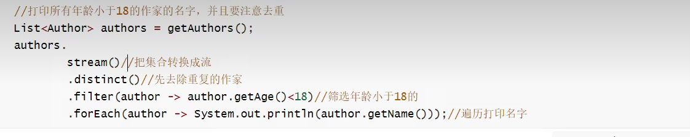
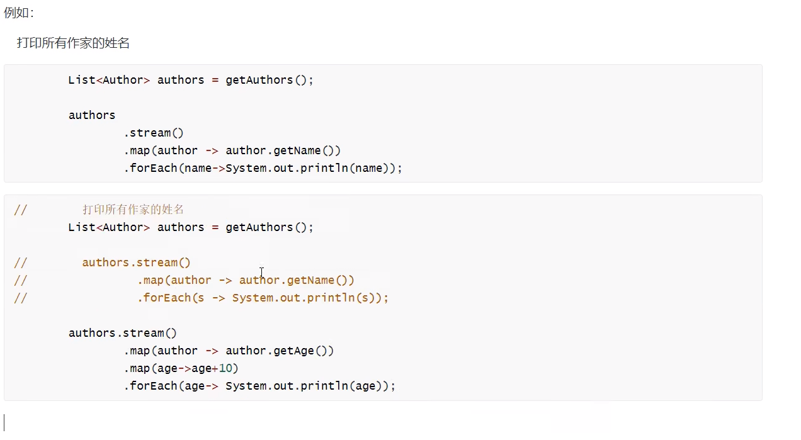
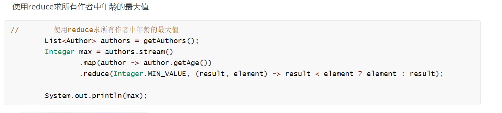
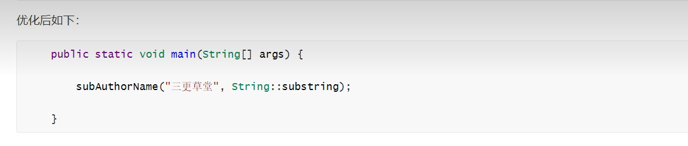

### 1.Lambda表达式

#### 1.1概述

lambda是JDK8中一个语法糖。他可以对一些匿名内部类的写法进行简化。它是函数式编程思想的一个重要体现。

#### 1.2核心原则

**可推导可省略**

#### 1.3基本格式

```java
（参数列表）->{代码}
```

例：创建线程并启动时可以使用匿名内部类的写法：

```java
new Thread(new Runnable() {
	@Override
    public void run() {
    	System.out.println("lambda运行");
    }
}).start();
```

可以使用lambda的格式对其进行修改：

```java
new Thread(() -> {
	System.out.println("lambda运行");
}).start();
```

#### 1.4省略规则

- 参数类型可以省略
- 方法体只有一句代码时大括号return和唯一一句代码的分号可以省略
- 方法只有一个参数时小括号可以省略


可以alt + 回车快捷转换为最简

### 2.Stream流

#### 2.1概述

Java 8 的Stream使用的是函数式编程模式，如同它的名字一样，它可以被用来对集合或数组进行链状流式的操作。可以更方便的让我们对集合或数组操作。

#### 2.2快速入门



#### 2.3常用操作

##### 2.3.1创建流

单列集合(Collection接口)：**集合对象.stream()**

```java
		List<Author> authors = getAuthors()
        Stream<Author> stream = authors.stream()
```

数组：**Arrays.stream(数组)或者使用Stream.of来创建**

```java
		Integer[] arr ={1,2,3,4,5};
		Stream<Integer> stream = Arrays.stream(arr);
		Stream<Integer> stream = Stream.of(arr);
```

双列集合：**转换成单列集合后再创建**

```java
		Map<String, Integer> map = new HashMap<>();
        map.put("蜡笔小新",19);
        map.put("黑子",18);
        map.put("日向",17);
		//先转换为set集合然后再变为流
        Stream<Map.Entry<String, Integer>> stream = map.entrySet().stream();
```

##### 2.3.2中间操作

- **filter**：可以对流中的操作进行过滤，符合过滤条件的才能继续留在流中

  ```java
  要求：打印大于2的数字
  Integer[] arr ={1,2,3,4,5};
  Stream<Integer> stream = Arrays.stream(arr);
  	stream
  			.distinct()
              .filter(integer -> integer > 2)
              .forEach(integer -> System.out.println("integer = " + integer));
  Stream<Integer> stream1 = Stream.of(arr);
  ```

- **map**:可以把对流中的元素进行计算或转换

  

- **distinct**:可以去除流中的重复元素

  

  **注意：distinct方法是依赖Object的equals方法来判断是否是相同对象的。所以需要注意重写equals().**

- **sorted:**可以对流中的元素进行排序

  

  注意：如果调用空参的sorted()方法，需要流中的元素实现了Comparable接口。

- **limit**:可以设置流的最大长度，超出的部分将被抛弃

  

- **skip**：跳过流中的前n个元素，返回剩下的元素

  

- **flatMap**: map只能把一个对象转换成另一个对象来作为流中的元素。而flatMap可以把一个对象转换成多个对象作为流中的元素。

  

  

##### 2.3.3.终结操作

- **forEach:**对流中的元素进行遍历操作，我们通过传入的参数去指定对遍历到的元素进行什么具体操作。

- **count**：可以用来获取当前流中元素的个数。

  

- **max&min**:可以用来获取流中的最值

  

- **collect**：把当前流转换成一个集合

  

  

- 查找与匹配

  - **anyMatch**:可以用来判断是否有任意符合匹配条件的元素，结果为Boolean类型

    

  - **allMatch**：可以用来判断是否都符合匹配条件，结果为Boolean类型。如果都符合结果为true，不符合结果为false。

    

  - **noneMatch**：可以判断流中的元素是否都不符合匹配条件。如果都不符合，结果为true，否则结果为false

    

  - **findAny**：获取流中的任意一个元素。该方法没有办法保证获取的一定是流中的第一个元素

    

  - **findMatch**：获取流中的第一个元素

    

  - reduce归并

    对流中的数据按照你指定的计算方法计算出一个结果。(缩减操作)<br>reduce的作用是把stream中的元素给组合起来，我们可以传入一个初始值，它会按照我们的计算方式依次拿流中的元素和初始值进行计算，计算结果再和后面的元素计算

    **reduce两个参数的重载形**式内部的计算方式如下:

    ```java
    T result = identify;
    for(T element : this stream)
        result = accumulator.apply(result, element)
    return result
    ```

    其中identify就是我们可以通过方法参数传入的初始值，accumulator的apply具体进行什么计算也是通过方法参数来确定的。

    

    

    

    reduce一个参数的重载形式内部计算

    ~~~java
     boolean foundAny = false;  
    T result = null;  
    for (T element : this stream) {      
        if (!foundAny) {          
            foundAny = true;          
            result = element;      
        }      
        else          
            result = accumulator.apply(result, element);  
    }  
    return foundAny ? Optional.of(result) : Optional.empty();
    ~~~

    

#### 2.4注意事项

- 惰性求值(如果没有终结操作，中间操作是不会执行的)
- 流是一次性的(一旦一个流对象经过一个终结操作后，这个流就不能再被正常使用)
- 不会影响原数据(我们在流中可以多数据做很多处理，但是正常情况下是不会影响原来集合中的元素的。)

### 3.Optional

#### 3.1概述

我们在编写代码的时候出现最多的是空指针异常。所以在很多情况下我们需要做各种非空判断。


JDK 8 中引入了Optional,可以让我们更好的避免空指针异常

#### 3.2使用

##### 3.2.1创建对象

 	Optional就好像是包装类，可以把我们的具体数据封装Optional对象内部。然后我们去使用Optional中封装好的方法操作封装进去的数据就可以非常优雅的避免空指针异常。
 	我们一般使用**Optional**的**静态方法ofNullable**来把数据封装成一个Optional对象。无论传入的参数是否为null了都不会出现问题

```java
Author author = getAuthor(); 
Optional<Author> authoroptional = Optiona.ofNulable(author);
```

​	如果觉得还要加一行代码来封装数据比较麻烦，但是如果改造下getAuthor()，让其的返回值就是封装好的Optional的话，我们年使用时就会方便很多
而且在实际开发中我们的数据很多是从数据库获取的。Mybatis从3.5版本可以也已经支持Optional了。我们可以直接把dao方法的返回值类型定义成Optional类型，Mybatis会自己把数据封装成Optional对象返回。封装的过程也不需要我们自己操作。
如果你**确定一个对象不是空**的则可以使用**Optional**的**静态方法of**来把数据封装成Optional对象

```java
	Author author = new Author();
	Optional<Author> authoroptional = Optional.of(author);
```

但是一定要注意，如果使用of的时候传入的参数必须不为null。 (**传入null会出现空指针异常**)
如果一个方法的返回值类型是Optional类型。而如果我们经判断发现某次计算得到的返回值为null，这个时候就需要把null封装成

Optional对象返回。这时则可以使用**Optional的静态方法empty**来进行封装

```java
		Optional.empty()
```

##### 3.2.2安全消费值

我们获取到一个Optional对象后肯定需要对其中的数据进行使用。这时候我们可以使用其**ifPresent**方法来消费其中的值。
这个方法会判断其内封装的数据是否为空，不为空时才会执行具体的消费代码。这样使用起来就更加安全了.
例如,以下写法就优雅的避免了空指针异常。

```java
Optional<Author> authoroptional = optional.ofNullable(getAuthor());
authorOptional.ifpresent(author -> System.out.printIn(author,getName()));
```

##### 3.2.3获取值

如果我们想获取值自己进行处理可以使用get方法获取，但不推荐。因为当Optional内部的数据为空的时候会出现异常

##### 3.2.4安全获取值

若想安全的获取值可以使用Optional提供的一下方法。

- orElseGet：

  获取数据并且设置数据为空的默认值。如果数据不为空就能获取到该数据。<br>如果为空则根据传入的参数来创建对象作为默认值返回。

  ```java
  Optional<Author> authorOptional = Optional.ofNullable(getAuthor());
  Author author1 =authorOptional.orElseGet(()->new Author());
  ```

- orElseThrow

  获取数据，如果数据不为空就能获取到该数据。如果为空则根据传入的参数来创建异常抛出。

  ```java
  		Optional<Author> authoroptional = optional.ofNullable(getAuthor());
  		try {
  			Author author = authoroptional.orElseThrow((supplier<Throwable>) () -> new RuntimeException("author为空"));
  			System.out.printIn (author .getName());
          } catch (Throwable throwable){
              throwable.printstackTrace();
          } 
  ```

##### 3.2.5过滤

我们可以使用filter方法对数据进行过滤。如果原本是有数据的，但是不符合判断，也会变成一个无数据的Optional对象。

```java
		optional<Author> authoroptional = optional.ofNullable(getAuthor());
		authoroptional.filter(author -> author.getAge()>100).ifpresent(author ->
System.out.printIn(author .getName()));
```

##### 3.2.6判断

我们可以使用isPresent方法进行是否存在数据的判断。如果为空返回值为false,如果不为空，返回值为true。但是这种方式并不能体现Optional的好外，**更推荐使用ifPresent方法。**

```java
		Optional<Author> authoroptional = Optional.ofNullable(getAuthor());
		if (authoroptiona1.isPresent)) {
            System.out.printIn(authoroptiona1.get().getName());
        }
```

##### 3.2.7数据转换

Optional还提供了map可以让我们的对数据进行转换，并且转换得到的数据也还是被Optional包装好的，保证了我们的使用安全

例如我们想获取作家的书籍集合。

```java
	private static void testMap() {
        Optional<Author> authoroptiona1 = getAuthoroptiona1();
        Optional<List<Book>> optionalBooks = authoroptional.map(author ->author.getBooks ());
        optionalBook.ifpresent(books -> System.out.printIn(books));
    }
```

### 4.函数式接口

#### 4.1概述

**只有一个抽象方法**的接口我们称之为函数接口

JDK的函数式接口都加上了@**Functionallnterface**注解进行标识，但是无论是否加上该注解只要接口中有一个抽象方法，<br>都是函数式接口

#### 4.2常见的函数式接口

- Consumer消费接口

  根据其中抽象方法的参数列表和返回值类型知道，我们可以在方法中对传入的参数进行消费

  

- Function计算接口

  根据其中抽象方法的参数列表和返回值类型知道，我们可以在方法中对传入的参数计算或转换，把结果返回

  

- Prediction判断接口

  根据其中抽象方法的参数列表和返回值类型知道，我们可以在方法中对传入的参数条件判断，返回判断结果

  

- Supplier生产型接口

  根据其中抽象方法的参数列表和返回值类型知道，我们可以在方法中创建对象，把创建好的对象返回

  

#### 4.3常用的默认方法

- and

  我们使用Predicate接口时，可能需要进行判断条件的拼接。而and方法相当于是使用&&来拼接两个判断条件

  

- or

  我们在使用Predicate接口时候可能需要进行判断条件的拼接。而or方法相当于使用||来拼接两个判断条件

  

- negate

  Predicate接口中的方法。negate方法相当于是在判断条件前加了个！表示取反

  

### 5.方法引用

我么在使用lambda方法时，如果方法体只有一个方法的调用的话(包括构造方法)，我么可以用方法引用进一步简化该代码

#### 5.1基本格式

类名或者对象名::方法名

#### 5.2语法

##### 5.2.1引用静态方法

​		可以理解为引用类的静态方法

**格式**

```java
类名::方法名
```

**使用前提**

​	如果我们在重写方法的时候，方法体**只有一行代码**，并且这行代码是**调用了某个类的静态方法**，并且我们把要重写的**抽象方法中所有的参数都按照顺序传入了静态方法中**，这个时候我们就可以引用类的静态方法。


##### 5.2.2引用对象的实例方法

**格式**

```java
对象名::方法名
```

**使用前提**
	如果我们在重写方法的时候，方法体中**只有一行代码**，并且这行代码是**调用了某个对象的成员方法**，<br>并且我们把要重写的**抽象方法中*所有*的参数按照顺序传入了这个成员方法中**，这个时候我们就可以引用对象的实例方法

 


##### 5.2.3引用类的实例方法

**格式**

```java
类名::对象名
```

**使用前提**

​	如果我们在重写方法的时候，方法体中**只有一行代码**，并且这行代码是**调用了第一个参数的成员方法**，并且我们把要**重写的抽象方法中剩余的所有的参数都按照顺序传入了这个成员方法中**，这个时候我们就可以引用类的实例方法


 



##### 5.2.4构造器引用

**格式**

```java
类名 :: new
```

**使用前提**

​	如果我们在重写方法的时候，方法体中**只有一行代码**，并且这行代码是**调用了某个类的构造方法**，并且我们把要**重写的抽象方法中的所有的参数都按照顺序传入了这个构造方法中**，这个时候我们就可以引用构造器。

### 6.高级用法

- **基本数据类型优化**

​	我们之前用到的很多stream的方法由于都使用了泛型。所以涉及到的参数和返回值都是引用数据类型。

​	即使我们操作的是整数小数，但是实际用的都是他们的包装类。JDK 5中引入的自动装箱和自动拆箱让我们在使用对应的包装类时就好像使用基本数据类型一样方便，但是**装箱和拆箱肯定是要消耗时间的**。虽然这个时间消赶很下，但是在大量的数据不断的重复装箱拆箱的时候就不能无视这个时间损耗了。

​	所以为了让我们能够对这部分的时间消耗进行优化。stream还提供了很多专门针对基本数据类型的方法

例如: mapTolnt, mapToLong, mapToDouble, flatMapTolnt, flatMapToDouble等

```java
	private static void test27() {
        
		List<Author> authors = getAuthors();
        authors .stream()
				.map(author -> author .getAge())
            	.map(age -> age + 10)
            	.fiTter(age->age>18)
            	.map(age->age+2)
            	.forEach(system.out::printin);  
		authors.stream()
				.mapToInt(author -> author.getAge())
				.map(age -> age + 10)
				.filter(age->age>18)
				.map(age->age+2)
				.forEach(system.out::println);
    }
```


- **并行流**

​	当流中有大量元素时，我们可以使用并行流去提高操作的效率。其实并行流就是把任务分配给多个线程去完全。如果我们自己去用代码实现的话其实会非常的复杂，并且要求你对并发编程有足够的理解和认识。而如果我们使用Stream的话，我们只需要修改一人方法的调用就可以使用并行流来帮我们实现，从而提高效率。

**parallel方法可以把串行流转换成并行流**

```java
	private static void test28() {
        stream<Integer> stream = stream,of(1， 2，3，4，5，6，7，8，9， 10);
        Integer sum = stream.paralle1()
							.peek(new Consumer<Integer>(){
                                @Override
                                public void accept(Integer num){
                                    System.out.printIn(num+Thread.currentThread().getName());
                                }
                            })
            				.filter(num -> num > 5)
            				.reduce((result, ele) -> resu1t + ele)
            				.get() ;
		System.out.printIn(sum);
    }
```

**也可以通过parallelStream直接获取并行流对象**

```java
		List<Author> authors = getAuthors();
		authors.para11e1stream()
            	.map(author -> author .getAge())
            	.map(age -> age + 10)
            	.filter(age->age>18)
            	.map(age->age+2)
            	.forEach(system.out::print1n);
```

