[TOC]

# 第二章 Javaweb

## 一、Servlet

### 1)Servlet简介与快速入门

- Servlet 是Java提供的一门动态web资源开发技术
- Servlet 是JavaEE规范之一，其实就是一个接口，将来我们需要定义Servlet类实现Servlet接口，<br>并且有web服务器运行Servlet

1. 创建web项目，导入Servlet依赖坐标

   ```java
    <!--servlet-->
       <dependency>
         <groupId>javax.servlet</groupId>
         <artifactId>javax.servlet-api</artifactId>
         <version>4.0.1</version>
         <scope>provided</scope>
       </dependency>
   ```

   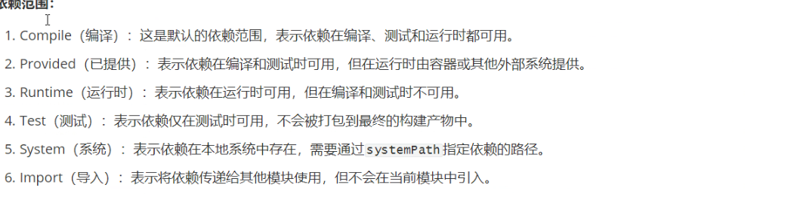

2. 创建：定义一个类，实现Servlet接口，并重写接口中的所有方法，<br>并在service方法中输出一句话

   ```java
   public class ServletDemo1 implements Servlet{
   	public void service(){
           ...
       }
   }
   ```

3. 配置：在类上使用**@WebServlet**注解，配置该Servlet的访问路径

   ```java
   @WebServlet("/demo1")
   public class ServlertDemo1 implements Servlet{}
   ```

4. 访问：启动Tomcat，浏览器输入URL访问该Servlet

   ```
   http://localhost:8080/web-demo/demo1
   ```


### 2）Servlet执行流程

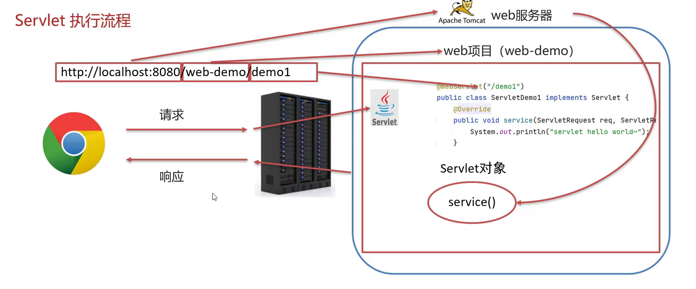

1. Servlet由谁创建？Servlet方法由谁调用？
   - Servlet由web服务器创建
   - Servlet方法由web服务器调用
2. 服务器怎么知道Servlet中一定由service方法？
   - 因为我们自定义的Servlet，必须实现Servlet接口并复写其方法，<br>而Servlet接口中有service方法

### 3）Servlet生命周期

- 对象的生命周期指一个对象从创建到被销毁的整个过程

- Servlet运行在Servlet容器(web服务器)中，其生命周期由容器来管理，分为四个阶段：

  1. 加载和实例化：当服务器启动或第一次请求到达时，Servlet容器加载Servlet类，并创建该Servlet的实例。
  2. 初始化：在实例化之后，Servlet容器调用`init()`方法来进行初始化操作。在初始化阶段，可以进行一些必要的设置，如加载配置文件、建立数据库连接等。该方法默认在Servlet第一次被访问时被调用，**只会调用一次**
  3. 服务：一旦Servlet初始化完成，它就可以开始处理客户端请求。每当有请求到达时，Servlet容器会创建一个新的线程来调用`service()`方法。在`service()`方法中，可以根据请求类型（如GET、POST）执行相应的业务逻辑，生成响应内容。
  4. 销毁：当**Servlet容器关闭或应用程序重新部署**时，Servlet容器会调用Servlet的`destroy()`方法来销毁Servlet实例。在销毁阶段，可以进行一些清理工作，如关闭数据库连接、释放资源等。

  注：Servlet还可以通过配置`<load-on-startup>`来指定在服务器启动时就加载和初始化该Servlet，而不需要等待第一次请求到达。loadOnStartup的默认值为-1

  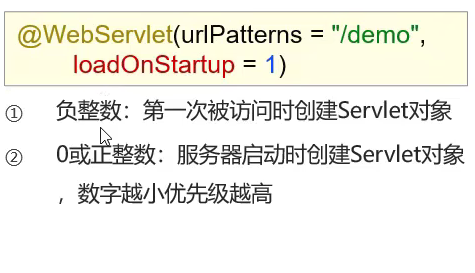

  #### Servlet方法介绍

1. **init(ServletConfig config):**

   ```java
   void init(ServletConfig config)
   ```

   - 该方法在Servlet被实例化后调用，并且只调用一次。
   - 它接收一个ServletConfig对象作为参数，该对象包含Servlet的配置信息。
   - 通常在该方法中进行一些初始化操作，如读取配置文件、建立数据库连接等。

2. **service(ServletRequest request, ServletResponse response):**

   ```java
   void service(ServletRequest req, ServletResponse res)
   ```

   - 该方法用于处理客户端请求，并生成相应的响应。
   - 每当有请求到达时，Servlet容器会调用该方法，并传递ServletRequest和ServletResponse对象作为参数。
   - 开发人员需要在该方法中编写业务逻辑来处理请求，如读取请求参数、执行数据库操作等。
   - Servlet容器根据请求的类型（如GET、POST）来决定调用doGet()、doPost()等特定的方法。

3. **destroy():**

   - 该方法在Servlet实例被销毁前调用，通常在Servlet容器关闭或应用程序重新部署时发生。
   - 开发人员可以在该方法中进行一些清理操作，如关闭数据库连接、释放资源等。

4. **getServletConfig():**

   ```java
   ServletConfig getServletConfig()
   ```

   - 获取ServletConfig对象

5. **getServletInfo():**

   ```java
   String getServletInfo()
   ```

   - 获取Servlet信息

注:还可以使用其他一些方法来扩展Servlet的功能，如doPut()、doDelete()等，用于处理其他类型的HTTP请求。

补充：

1. **doGet(HttpServletRequest request, HttpServletResponse response):**
   - 该方法用于处理HTTP GET请求。
   - 它接收HttpServletRequest和HttpServletResponse对象作为参数，这些对象提供了对请求和响应的更具体的访问方法。
   - 开发人员可以在该方法中编写处理GET请求的业务逻辑，如获取查询参数、读取文件等。

2. **doPost(HttpServletRequest request, HttpServletResponse response):**
   - 该方法用于处理HTTP POST请求。
   - 它接收HttpServletRequest和HttpServletResponse对象作为参数。
   - 开发人员可以在该方法中编写处理POST请求的业务逻辑，如解析表单数据、处理文件上传等。

### 4）Servlet体系结构

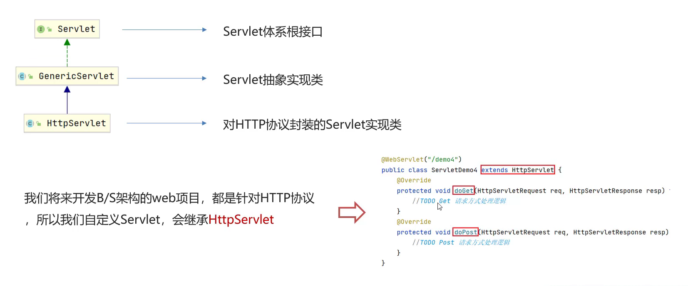

1. HttpServlet中为什么要根据请求方式的不同，调用不同方法？
   - get和post的请求消息不一样，get在请求行，post在请求体
2. 如何调用？
   - 获取请求方式然后进行判断

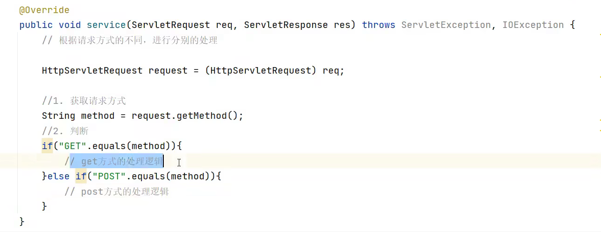

### 5)Servlet urlPattern配置

Servlet 要想被访问**必须配置访问路径**(**urlPatterm**)

1. **一个Servlet，可以配置多个urlPattern**

   ```java
   @WebServlet(urlPatterns = {"/demo1","/demo2"})
   ```

2. **urlPattern配置规则**

   - 精确匹配

     ```java
     配置路径：@WebServlet("/user/select")
     访问路径：localhost:8080/web-demo/user/select
     ```

   - 目录匹配

     ```java
     配置路径:@WebServlet("/user/*")
     访问路径:localhost:8080/web-demo/user/aaa
         	localhost:8080/web-demo/user/bbb
             注:*位置可以任意写
     ```

   - 扩展名匹配

     ```java
     配置路径：@WebServlet("*.do")
     访问路径：localhost:8080/web-demo/aaa.do
         	localhost:8080/web-demo/bbb.do
              注:*位置可以任意写
                 *号前不可以加/，否则(servlet mapping)配置无效
     ```

   - 任意匹配

     ```java
     配置路径：@WebServlet("/")
         	@WebServlet("/*")
     访问路径：localhost:8080/web-demo/heihei
         	localhost:8080/web-demo/youyou
             注:*位置可以任意写
     ```

     - / 和/*区别：
       - 当我们的项目中的Servlet配置了“/”，会覆盖掉tomcat中的DefaultServlet，<br>当其他的url-pattern都匹配不上时就会走这个servlet
       - 当我们的项目中配置了“*”，意味着匹配任意访问路径
       - 优先级：精确路径 > 目录路径 > 扩展名路径 > /* > /


### 6）XML配置方式编写Servlet

了解一下即可

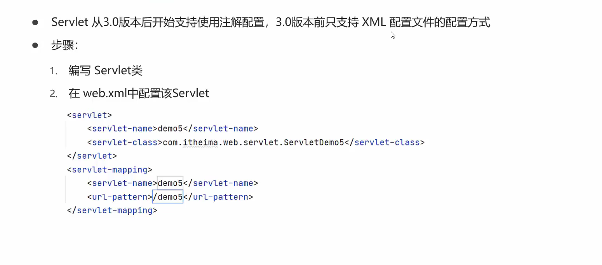

## 二、resquest 和 response

### 1.1）Resquest 和 Response介绍

Request：获取请求数据

Response：设置响应数据

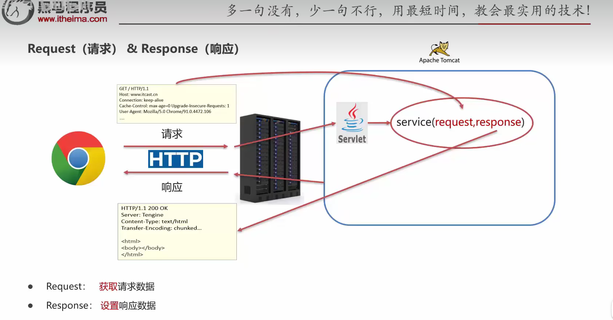

### 1.2）Request继承体系

1. Tomcat需要解析请求数据，封装为request对象，并且创建request对象传递到service方法中
2. 使用request对象可查阅javaEE API文档的HttpServletRequest接口

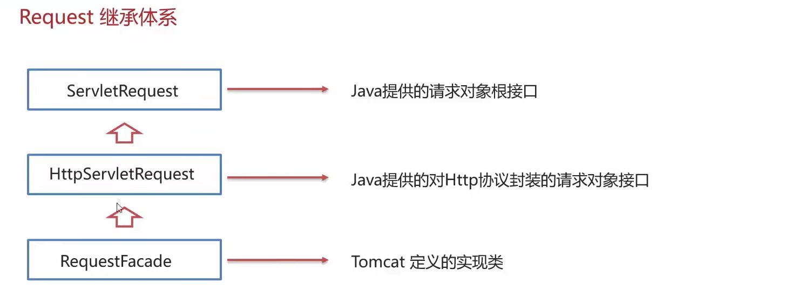

### 1.3）Request获取请求数据

- 请求数据分为三部分：

  1. **请求行：**

     ```java
     GET/request-demo/req1?username=zhangsan HTTP/1.1
     ```

     - String getMethod():获取请求方式：GET
     - String getContextPath():获取虚拟目录(项目访问路径)：/request-demo
     - StringBuffer getRequestURL():获取URL(统一资源定位符)：http：//localhost：8080/request-demo/req1<br>**URL是有长度的，最大为8KB**
     - String getRequestURI():获取URI(统一资源标识符)：/request-demo/req1
     - String getQueryString():获取请求参数(GET方式)：username=zhangsan&password=123

     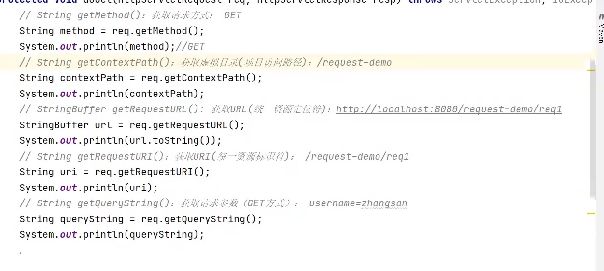

  2. **请求头：**

     ```java
     User-Agent：Mozilla/5.0 Chrome/91.0.4472.106
     ```

     - String getHeader(String name):根据请求头名称，获取值<br>获取请求头：user-agent：浏览器的版本信息

       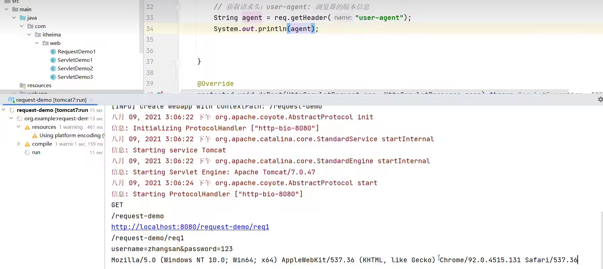

  3. **请求体：**

     - ServletInputStream getInputStream():获取字节输入流(图片或文件等)

     - BufferedReader getReader():获取字符输入流(纯文本)

       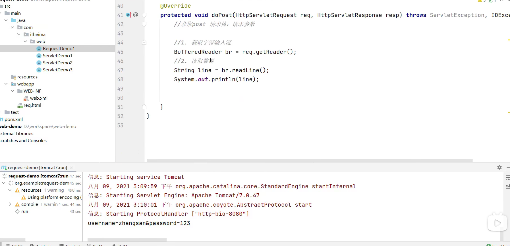

### 1.4)Request通用方式获取参数

请求参数获取方式：

- GET方式：

  ```java
  String getQueryString()
  ```

- POST方式:

  ```java
  BufferedReader getReader()
  ```

通用方式：

- Map<String Striong[]> getParameterMap():获取所有参数Map集合
- String[] getParameterValues(String name):根据名称获取参数值(数组)
- String getParameter(String name):根据名称获取参数值(单个值)

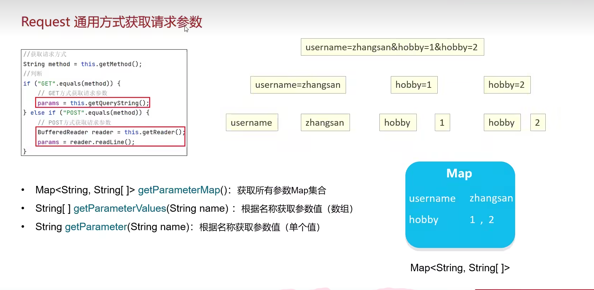

### 1.5）Request请求参数中文乱码

- 请求数据存在中文数据，就会乱码

- 解决方案：

  - POST：设置输入流的编码

    ```java
    req.setCharacterEncoding("UTF-8");
    ```

    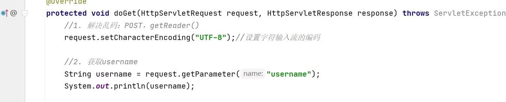

  - 

    - GET乱码原因：tomcat进行URL解码，默认的字符集ISO-8859-1

    - 解决方案(**可以通用)**：

      1. 先对乱码数据进行编码：转为字节数组

         ```java
         byte[] bytes = username.getBytes(StandardCharsets.ISO-8859-1)
         ```

      2. 字节数组解码：

         ```java
         username = new String(bytes, StandardCharsets.UTF-8)
         ```

      也可变为一行：

      ```
      username = new String(username.getBytes(StandardCharsets.ISO-8859-1), StandardCharsets.UTF-8)
      ```

      ***Tomcat 8.0 之后,已将GET请求乱码问题解决，设置默认的解码方式为UTF-8***

    - 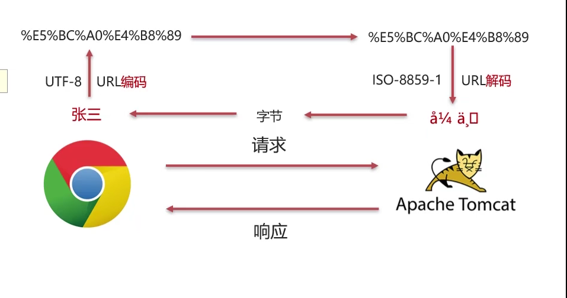

  - URL编码

    1. 将字符串按照编码方式转为二进制
    2. 每个字节转为2个16进制数并在前面加上%

    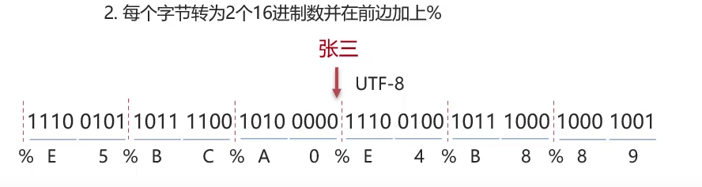

### 1.6）Request请求转发

- 请求转发(forward)：一种在服务器内部的资源跳转方式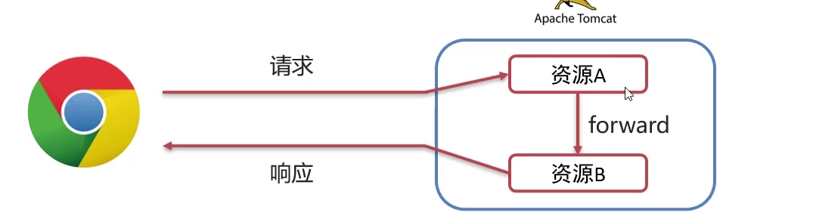

- 实现方式：

  ```java
  req.getRequestDispatcher("资源B路径").forward(req,resp);
  ```

  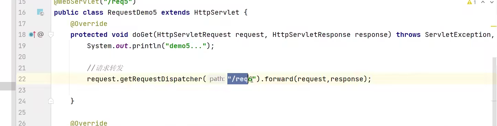

- 请求转发资源间共享数据：使用Request对象

  - void setAttribute(String name, Object o):存储数据到request域
  - Objet getAttribute(String name):根据key，获取值
  - void removeAttribute(String name):根据key，删除该键值对 

- 请求转发特点：

  - 浏览器地址栏路径不发生变化
  - 只能转发到当前服务器的内部资源
  - 一次请求，可以在转发的资源间使用request的共享数据

### 2.1）Response设置响应数据功能介绍

相应数据分为三部分：

1. **响应行：**

   ```java
   HTTP/1.1 200 OK
   ```

   - void setStatus(int sc):设置响应状态码

2. **响应头**

   ```java
   Content-Type:text/html
   ```

   - void setHeader(String name, String value):设置响应头键值对

3. **响应体**

   ```java
   <html><head><head><body></body></html>
   ```

   - PrintWriter getWriter():获取字符输出流
   - ServletOutputStream getOutputStream():获取字节输出流

### 2.2）Response完成重定向

- 重定向(Redirect):一种资源跳转方式

  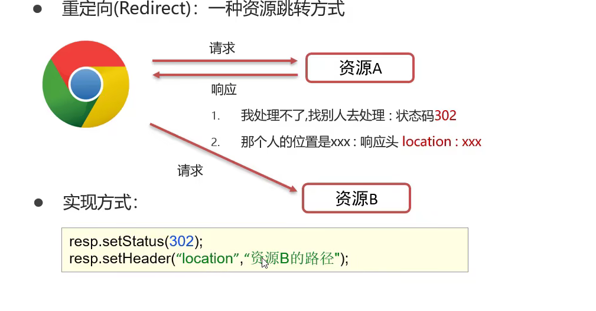

- 实现方式：

  ```java
  resp.setStatus(302)；
  resp.setHeader("Location","资源B的路径");(注:Location是固定的，路径需要加上虚拟目录)
  ```

  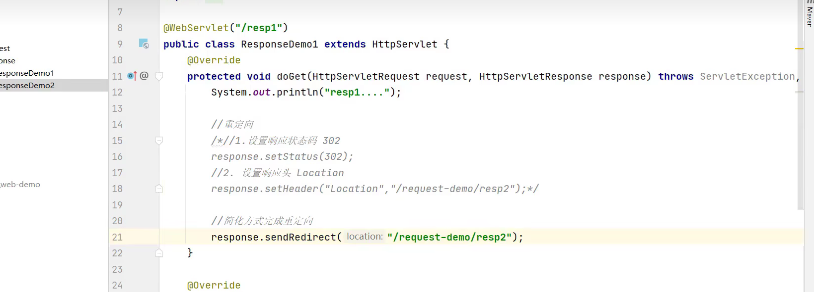

  **简化重定向**

  ```java
  response.sendRedirect("/request-demo/resp2")
  ```

- 重定向特点：

  - 浏览器地址栏路径发生变化
  - 可以重定向到任意位置的资源(服务器内部、外部均可)
  - 两次请求，不能在多个资源使用request共享数据

### 2.2.5）路径问题

明确路径的使用：

- 浏览器器使用：需要加虚拟目录(项目访问路径)
- 服务端使用：不需要加虚拟目录

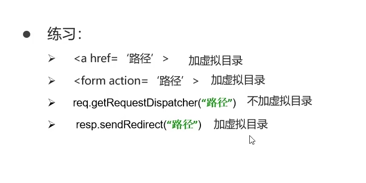

动态获取虚拟目录：

```java
String contextPath = request.getContextPath();
response.senRedirect(contextPath + "重定向要访问的资源路径")
```

### 2.3）Respose响应字符数据

- 使用：

  1. 通过Response对象获取字符输出流

     ```java
     PrintWriter writer = resp.getWriter();
     ```

  2. 写数据

     ```java
     writer.writer("aaa");
     ```

     注：<br>1. 可以设置响应头来声明解析格式下。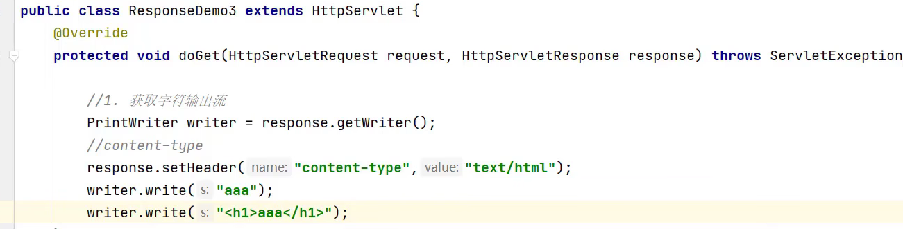

     2.中文数据乱码原因通过Response获取的字符输出流默认编码为：ISO-8859-1

     ```java
     response setContentType("text/html;charset=utf-8")
     ```

  3. 该流不需要关闭，随着响应结束，response对象销毁，由服务器关闭

### 2.4）Response响应字节数据

- 使用：

  1. 通过Response对象获取字节输出流

     ```java
     SrevletOutputStream outputStream = resp.getOutStream();
     ```

  2. 写数据

     ```java
     outputStream.writer(字节数据);
     ```

- IOUtils工具使用

  1. 导入坐标

     ```java
     <dependency>
         <groupld>commons-io</groupld>
         <artifactld>commons-io</artifactld>
         <version>2.6</version>
     <dependency>
     ```

     

  2. 使用

     ```java
     IOUtils.copy(输入流,输出流);
     ```

## 三、Cookie和Session

### 1)会话跟踪技术

- 会话：用户打开浏览器，访问web服务器的资源，会话建立，直到有一方断开连接，会话结束。<br>在一次会话中可以包含**多次**请求和响应
- 会话跟踪：一种维护浏览器状态的方法，服务器需要识别多次请求是否来自于同一浏览器，<br>以便在同一次会的多次请求间**共享数据**
- HTTP协议是**无状态**的，每次浏览器向服务器请求时，服务器都会将该请求视为**新的**请求,<br>因此我们需要会话跟踪技术来实现会话内数据共享
- **实现方式**：
  1. 客户端会话跟踪技术：**Cookie**
  2. 服务端会话跟踪技术：**Session**

### 2.1)Cookie基本使用

- Cookie：客户端会话技术，将数据保存到客户端，以后每次请求都携带Cookie数据进行访问

  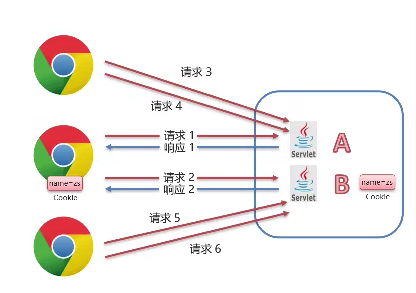

- Cookie：基本使用

  **发送Cookie**

  1. 创建Cookie对象，设置数据

     ```java
     Cookie cookie = new Cookie("key", "value");
     ```

  2. 发送Cookie到客户端：使用response对象

     ```java
     response.addCookie(cookie);
     ```

  **获取Cookie**

  3. 获取客户端携带的所有Cookie，使用request对象

     ```java
     Cookie[] cookies = request.getCookies();
     ```

  4. 遍历数组，获取每一个Cookie对象：for

  5. 使用Cookie对象获取数据

     ```java
     cookie.getName();
     ```

     ```java
     cookie.getValue();
     ```

     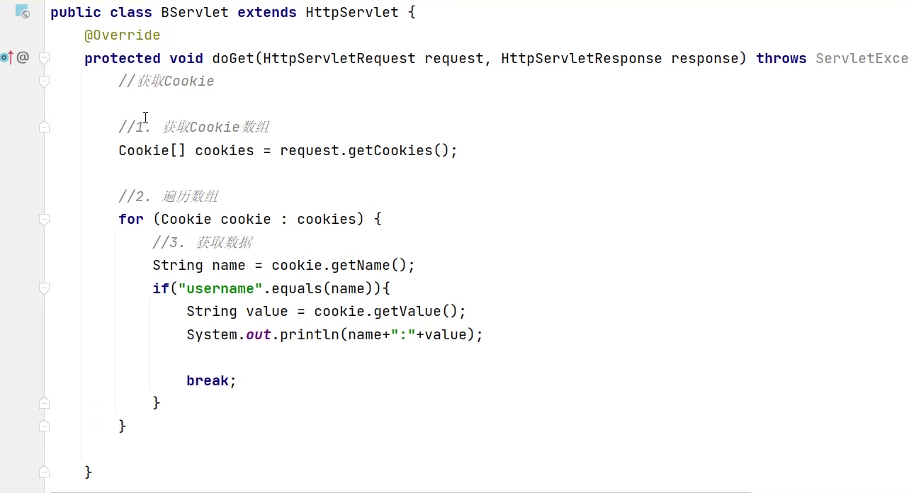

### 2.2)Cookie原理

Cookie的实现是基于HTTP协议的

- 响应头：set- cookie

- 请求头：cookie

  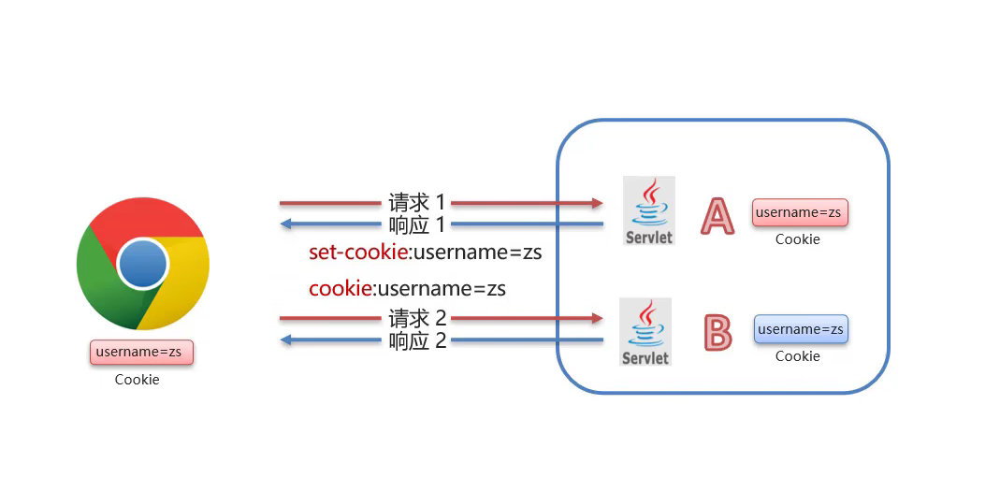

### 2.3）Cookie使用细节

- Cookie存活时间

  - 默认情况下，Cookie存储在浏览器内存中，当浏览器关闭，内存释放，则Cookie被销毁
  - setMaxAge(int seconds):设置Cookie存活时间
    1. 正数：将Cookie写入浏览器所在的电脑硬盘，持久化存储。到时间自动删除
    2. 负数：默认值，Cookie在当前浏览器内存中，当浏览器关闭，则Cookie被销毁
    3. 零：删除对象的Cookie

- Cookie存储中文

  - Cookie不能直接存储中文

  - 如需要存储，则需要进行转码：URL编码

    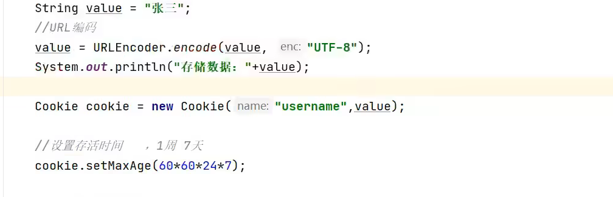

### 3.1）Session基本使用

- 服务端会话跟踪技术：将数据保存到服务端

- JavaEE提供HttpSession接口，来实现一次会话的多次请求间数据共享功能

- 使用：

  1. 获取Session对象

     ```java
     HttpSession session = request.getSession();
     ```

  2. Session对象功能：

     - void setAttribute(String name, Object o):存储数据到session域

     - Objet getAttribute(String name):根据key，获取值

     - void removeAttribute(String name):根据key，删除该键值对 

       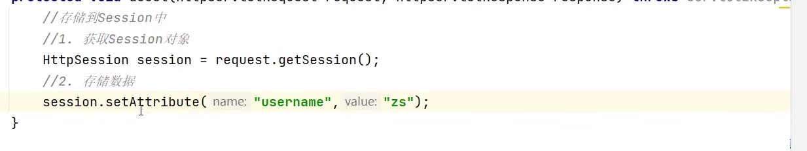

### 3.2）Session原理

- Session时根据Cookie来实现的(**SessionID**)

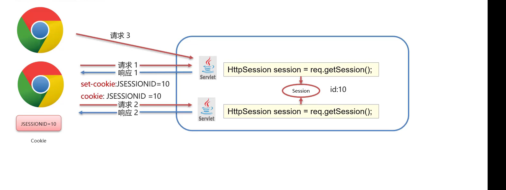

### 3.3)Session使用细节

- Session钝化、活化：

  - 服务器重启后，Session中的数据是否还存在？
    - 钝化：在服务器正常关闭后，Tomcat会自动将Session数据写入硬盘的文件中
    - 活化：再次启动服务器后，从文件中加载数据到Session中

- Session销毁：

  - 默认情况下，无操作，30分钟自动销毁

    ```java
    <session-config>
    	<session-timeout>30</session-timeout>
    </session-config>
    ```

  - 调用Session对象的invalidate()方法


### 4）cookie和session小结

- Cookie和Session都是来完成一次会话内多次请求间**数据共享**的
- 区别：
  - 存储位置：Cookie是将数据存储在客户端，Session将数据存储在服务端
  - 安全性：Cookie不安全，Session安全
  - 数据大小：Cookie最大3KB，Session无大小限制
  - 存储时间：Cookie可以长期存储，Session默认30分钟
  - 服务器性能：Cookie不占服务器资源，Session占用服务器资源

(cookie放在登录之前，session放在登录之后)

## 四、Filter

### 1）Filter概述

- 概念：Filter表示过滤器，是JavaWeb三大组件(Servlet、Filter、Listener)之一
- 过滤器可以把对资源的请求**拦截**下来，从而实现一些特殊功能。
- 过滤器一般完成一些**通用**的操作，比如：权限控制、统一编码处理、敏感字符处理等

### 2）Filter快速入门

1. 定义类，实现Filter接口，并重写所有方法：

   ```java
   public class FilterDemo implements Filter{
       public void init(FilterConfig filterConfig) 
       public void doFilter(ServletRequest request)
       public void destory(){}
   }
   ```

2. 配置Filter拦截资源的路径：在类上定义@webFilter注解

   ```java
   @WebFilter("/*")
   public class FilterDemo implements Filter{
   ```

3. 在doFilter方法中放行

   ```
   public void dpFilter(ServletRequest request,ServletResponse response){
   	System.out.println("filter 被执行了...");
   	chain.doFilter(request, response);
   }
   ```

   

### 3）Filter执行流程

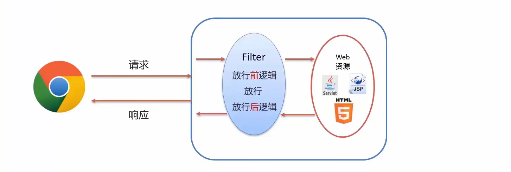

1. 放行后访问对应资源,资源访问完成后，还**会回到Filter中**

2. 如果回到拦截其中应该**执行放行后逻辑**

   执行顺序：**执行放行前逻辑 --->放行--->访问资源 --->执行放行后逻辑**

   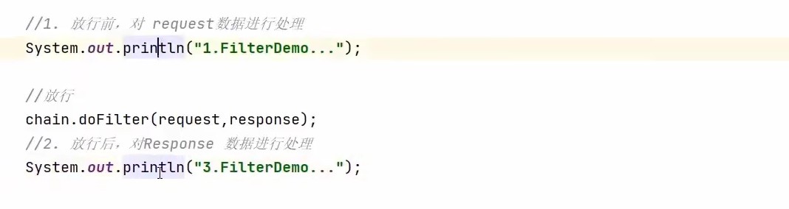

### 4）Filter使用细节

- Filter拦截路径配置

  - Filter可以根据需求，配置不同的**资源拦截路径**

    ```java
    @WebFilter("/*")
    public class Filtrer
    ```

    - 拦截具体的资源：/index.jsp:只有访问index.jsp时才会被拦截
    - 目录拦截：/user/*:访问/user下的所有资源，都会被拦截
    - 后缀名拦截：*.jsp:访问后缀名为jsp的资源，都会被拦截
    - 拦截所有：/*：访问所有资源，都会被拦截

- 过滤器链

  - 一个Web应用，可以配置多个过滤器，这多个过滤器称为过滤器链
  - 注解配置的Filter,优先级按照过滤器类名(字符串)的自然排序

  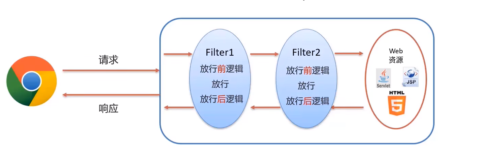

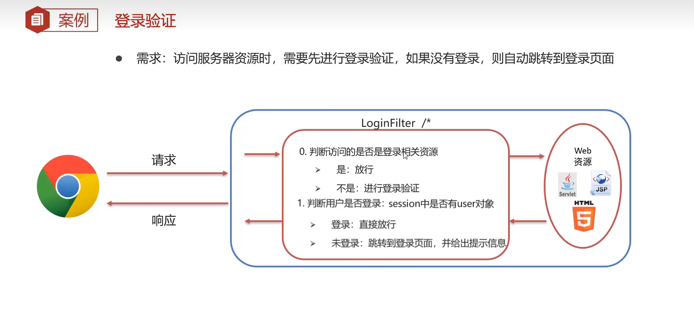

## 五、listener

### 1）listener概述

- 概念：listener表示监听器，是JavaWeb三大组件(Servlet、Filter、Listener)之一

- 监听器可以监听就是在application，session，request三个对象创建、销毁或者<br>往其中添加修改删除属性时**自动**执行代码的功能组件

- listener分类：JavaWeb中提供了8个监听器

  | 监听器分类         | 监听器名称                      | 作用                                           |
  | ------------------ | ------------------------------- | ---------------------------------------------- |
  | ServletContext监听 | ServletContextListener          | 用于对ServletContext对象进行监听（创建、销毁） |
  |                    | ServletContextAttributeListener | 对ServletContext对象中属性的监听(增删改属性)   |
  | Session监听        | HttpSessionListener             | 对Session对象的整体状态的监听(创建、销毁)      |
  |                    | HttpSessionAttributeListener    | 对Session对象中的属性的监听(增删改属性)        |
  |                    | HttpSessionBindingListener      | 监听对象于Session的绑定和解除                  |
  |                    | HttpSessionActivitionListener   | 对Session数据的钝化和活化的监听                |
  | Request监听        | ServletRequestListener          | 对Request对象进行监听(创建、销毁)              |
  |                    | ServletRequestAttributeListener | 对Request对象中属性的监听(增删改属性)          |

### 2）listener使用

1. 定义类，实现ServletContextListener接口
2. 在类上添加@WebListener注解

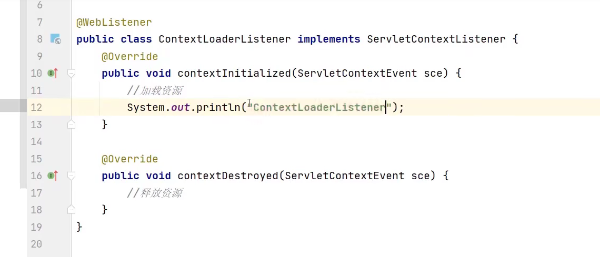
