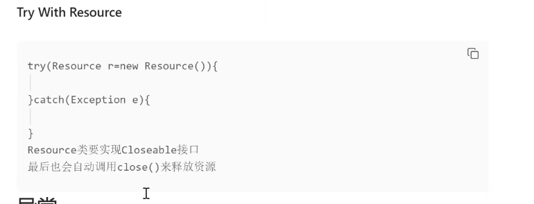

在Java中，IO流（Input/Output Stream）用于处理与输入和输出相关的操作。IO流主要用于读取和写入数据，可以从文件、网络、标准输入和标准输出等来源读取或写入数据。

Java的IO流分为**字节流**和**字符流**两种类型。字节流主要用于处理二进制数据，而字符流则用于处理文本数据。以下是Java中常见的IO流类和其用法的简要介绍：
### 1）**字节流（Byte Stream）**
- InputStream 和 OutputStream 是所有字节流类的基类，用于读取和写入字节数据
- FileInputStream 和 FileOutputStream 用于从文件读取和写入字节数据。
```
import java.io.FileInputStream;
import java.io.FileOutputStream;
import java.io.IOException;

public class ByteStreamExample {
    public static void main(String[] args) {
        try {
            // 从文件读取字节数据
            FileInputStream fis = new FileInputStream("input.txt");
            int data;
            while ((data = fis.read()) != -1) {
                // 处理读取到的数据
                System.out.print((char) data);
            }
            fis.close();

            // 写入字节数据到文件
            FileOutputStream fos = new FileOutputStream("output.txt");
            String text = "Hello, World!";
            byte[] bytes = text.getBytes();
            fos.write(bytes);
            fos.close();
        } catch (IOException e) {
            e.printStackTrace();
        }
    }
}

```
### 2）**字符流（Character Stream）**

- Reader 和 Writer 是所有字符流类的基类，用于读取和写入字符数据。

- FileReader 和 FileWriter 用于从文件读取和写入字符数据。
```
import java.io.FileReader;
import java.io.FileWriter;
import java.io.IOException;

public class CharacterStreamExample {
    public static void main(String[] args) {
        try {
            // 从文件读取字符数据
            FileReader reader = new FileReader("input.txt");
            int data;
            while ((data = reader.read()) != -1) {
                // 处理读取到的数据
                System.out.print((char) data);
            }
            reader.close();

            // 写入字符数据到文件
            FileWriter writer = new FileWriter("output.txt");
            String text = "Hello, World!";
            writer.write(text);
            writer.close();
        } catch (IOException e) {
            e.printStackTrace();
        }
    }
}

```

除了文件IO，Java还提供了许多其他类型的流，如管道流、缓冲流、数据流、对象流等，用于处理不同的输入和输出场景。

无论使用哪种类型的流，**确保在使用完毕后及时关闭流以释放资源**，可以**使用close()**方法或者**try-with-resources**语句块来自动关闭流。<br><br>

需要注意的是，IO操作可能会抛出IOException，因此在处理IO流时，建议使用异常处理机制来处理可能的异常情况。

通过使用适当的IO流，可以方便地读取和写入各种数据，适应不同的输入输出需求。