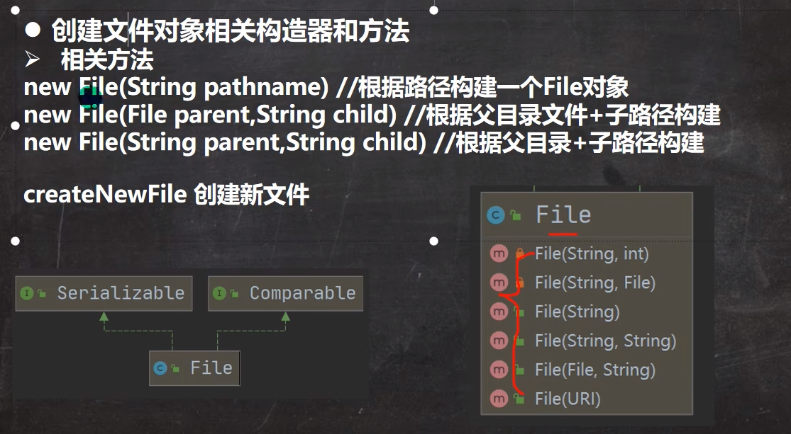
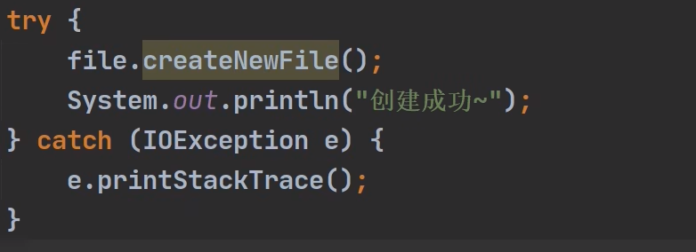

# IO流

## 文件

- 文件流

  文件在程序中是以流的形式来操作的

  

  **流**：数据在数据源(文件)和程序(内存)之间经历的路径

  **输入流**：数据从数据源(文件)到程序(内存)的路径

  **输出流**：数据从程序(内部)到数据源(文件)的路径

- 常用的文件操作

### 1.创建文件

 **真正创建文件的是：**

### 2.获取文件

~~~Java
File file = new File("e:\\news1.txt");
System.out.println("文件名字=" + file.getName());
System.out.println("文件绝对路径=" + file.getAbsoluteFile());
System.out.println("文件父级目录=" + file.getParent());
System.out.println("文件大小(字节)=" + file.length());
System.out.println("文件是否存在=" + file.exists());
System.out.println("是不是一个文件" + file.isFile());
System.out.println("是不是一个目录件" + file.isDirectory());
~~~

### 3.目录操作

- 目录可以当作文件处理
- mkdir() : 创建一级目录
- mkdirs() : 可以创建多级目录

## IO流原理及流的分类

### 1. Java IO 流原理

- Java IO流原理

1. /O是Input/,Output的缩写，I/O技术是非常实用的技术，用于处理数据传输。
   如读/写文件，网络通讯等。
2. Java程序中，对于数据的输入/输出操作以”流(stream)”的方式进行。
3. java.io包下提供了各种“流”类和接口，用以获取不同种类的数据，并通过方
   法输入回或输出数据
4. 输入input: 读取外部数据(磁盘、光盘等存储设备的数据)到程序(内存)中。
5. 输出output: 将程序(内存)数据输出到磁盘、光盘等存储设备中。

### 2. 流的分类

- 按操作数据单位不同分为：**字节流(8 bit)** 二进制文件, **字符流(按字符)**文本文件
- 按数据流的流向不同分为：输入流，输出流
- 按流的角色的不同分为：节点类，处理流/包装流

| （抽象基类） | 字节流       | 字符流 |
| ------------ | ------------ | ------ |
| 输入流       | InputStream  | Reader |
| 输出流       | OutputStream | Writer |

1） Java的IO流共涉及40多个类，实际上非常规则，都是从如上4个抽象基类派生的。

2） 由这四个类派生出来的子类名称都是以其父类名作为子类名后缀

