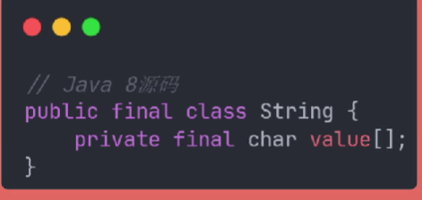
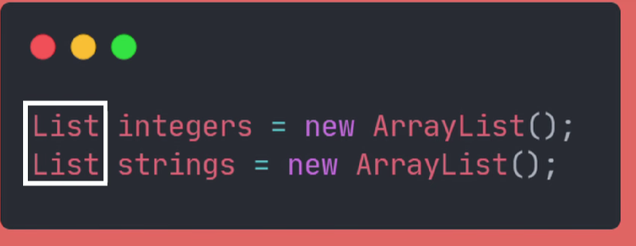
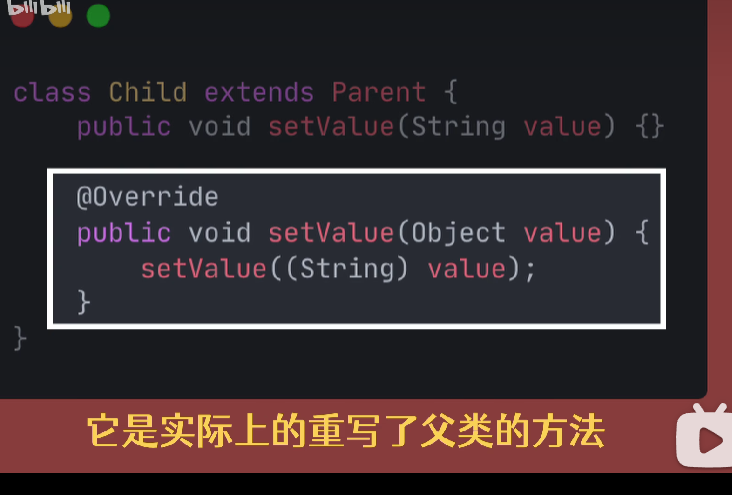

[TOC]
# Java部分
### 一、<br> 1）continue、break、return
- continue:只是结束当前循环然后执行下一次循环
- break：跳出整个循环继续执行循环体后的语句
- return： 
  1. 作用于方法用来结束整个方法体
  2. return可以单独被调用用于没有返回值的方法
  3. 也可以携带返回值用于返回有返回值的方法
  4. return放于循环中，结束时循环体后边的语句也不会执行
### 2）final
- fina修饰类则表示这个类不能被继承
- final修饰方法则表示这个方法不能被子类重写
- final修饰变量（包含静态变量、局部变量等）则变量的值在赋值后无法被修改
- final修饰引用类型则表示该引用只有一次指向对象的机会即不能变更变量所指向的对象<br>
  但是对象的成员属性可以修改<br>
### 3）重载和重写xx
- 方法的重载：是指在一个类中定义相同名字单参数不同的多个方法，调用时会根据不同的参数表达来选择对应的方法<br>方法的重载可以修改返回类型也可以修改访问权限，但不能只修改这两者<br>只要能够区分开来方法不会造成混淆则构成重载
- 方法的重写：是指子类覆盖父类的方法逻辑，子类的重写方法必须和父类的被重写方法具有相同的方法名称、参数列表和返回类型并且用重写方法不能比被重写的方法更严格的访问权限


|       重载       |         重写         |
| :--------------: | :------------------: |
| 放生在一个类之间 | 发生在子类和父类之间 |
| 必须修改方法参数 |   不能修改方法参数   |
### 4）包装类
| 基本类型 | 包装类型  |
| :------- | :-------- |
| byte     | Byte      |
| short    | Short     |
| int      | Integer   |
| long     | Long      |
| float    | Float     |
| double   | Double    |
| boolean  | Boolean   |
| char     | Character |
注：<br>
- 基本赋值到包装即装箱，反之为拆箱<br>
- 若为包装类型不可用“==”判断要用equals()方法判断
- 包装类是有一定的**缓存池**范围
- 创建包装类对象:<br>
  1.使用自动装箱或使用valueOf()方法<br>
  2.但不要直接new,valueOf()利用了缓存
  ```
  Integer a = 8;
  Integer b = Integer.valueOf(8);
  Integer c = new Integer(8);
  
  System.out.println(a == b);//true
  System.out.println(b == c);//false
  ```
### 5）修饰符访问权限
| 修饰符              | 同一个类 | 同一个包 | 子类  | 任何地方 |
| :------------------ | :------: | :------: | :---: | :------: |
| public              |   yes    |   yes    |  yes  |   yes    |
| protected           |   yes    |   yes    |  yes  |          |
| default(什么也不写) |   yes    |   yes    |       |          |
| private             |   yes    |          |       |          |
注：<br>
- 接口中的权限只能为public权限，所以可以省去public，但依然为public权限
### 6）继承
判断：<br>
- is a 判断父子类的关系
- has a 判读类与成员的关系
### 7）多态
必要条件：
1. 要有继承(关键字：extends)<br>
2. 父类引用指向子类对象<br>

- 多态成员变量：编译运行看左边
  ```
  Animal dog = new Dog();   //Animal是引用类型，Dog是实际类型
  System.out.println(dog.age) //dog的引用类型是Animal,所以取到的是父类Animal中的值,
  说白了dog是属于Animal类，Animal中变量的值是多少就通过对象就取得多少
  ```
- 多态成员方法：编译看左边，运行看右边
```
Animal dog = new Dog（）； //Animal是引用类型，Dog是实际类型
dog.eat();   //变量dog的实际类型是Dog,即是由Dog 这个实际类型new出来的，
因此dog.eat() 调用的应该是子类Dog中重写的方法
```

特点：<br>
1. 多态情况下，子类和父类存在同名的成员变量时，访问的时父类的成员变量
2. 多态情况下，子父类存在同名的非静态成员方法时，访问的是子类中重写的方法
3. 多态情况下，子父类存在同名的静态成员变量成员方法时，访问的是父类的成员函数
4. 多态情况下，不能访问子类独由的方法(若想访问可向下转型)

注：不同对象调用父类的同一个方法，产生不同的结果就是多态（子重写了父类里边的方法）
### 8）对象的向上和向下转型
1. 向上转型：```  Animal animal1 = new Dog();```<br>
    当参数类型为父类时传入子类即位默认向上转型
2. 向下转型：```  Dog dog = (Dog) animal```<br>
    这种方法会在运行时抛出异常，可以先使用instanceof判断
    下面也注释一下instanceof用法:
    ```object instanceof ClassName```<br>
    其中，object是待检查的对象，ClassName是要检查的类名。instanceof运算符的返回值是一个布尔类型，如果object是ClassName类或其子类的实例，则返回true；否则返回false。
    示例:
  ```
    class Animal {
      // ...
  }

  class Dog extends Animal {
      // ...
  }

  class Cat extends Animal {
      // ...
  }

  public class Main {
      public static void main(String[] args) {
          Animal animal = new Dog();

          System.out.println(animal instanceof Animal); // true
          System.out.println(animal instanceof Dog);    // true
          System.out.println(animal instanceof Cat);    // false
      }
  }
  ```
在上面的示例中，animal对象是Animal类的一个实例，同时也是Dog类的一个实例。因此，animal instanceof Animal和animal instanceof Dog都返回true。然而，animal不是Cat类的实例，所以animal instanceof Cat返回false。

### 9）抽象类和接口
相同点：
1. 将方法进行抽象然后让子类去实现
2. 不能创建本类对象，只能由子类去实例化子类对象<br>
   

不同点：
1. 子类实现：implements；子类继承父类：extends
2. 抽象类可以继承接口；接口只能继承接口，不能继承类。一个类只能继承一个父类，但可以实现多个接口
3. 抽象类可以定义成员属性，接口不能定义成员属性。（接口没有了成员属性，只有方法，只能用static  final关键字定义静态常量，不能定义静态变量。子类实现接口后，只能重写方法；子类继承抽象类，连带着父类的成员属性也继承过来了）
4. 抽象类有构造器，接口没有构造器。（抽象类的构造器作用：限定子类的构造行为）
   

注:当存在冲突时默认调用优先级高的（类地优先级比接口高，子类的优先级比父类高），越具体的越优先，如果优先级分不出来必须显式地指定方法实现，如果不知道便会编译出错

### 10）static
static关键字：<br>
- 静态属性
- 静态方法
- 静态代码块
- 静态导包（引用时可以省去类名）

初始化顺序：
1. 父类的静态属性/静态代码块
2. 子类的静态属性/静态代码块
3. 父类的成员属性/普通代码块
4. 父类的构造器
5. 子类的成员属性/普通代码块
6. 子类的构造器

### 10）内部类
内部类可分为静态内部类、成员内部类、局部内部类、匿名内部类
1. 静态内部类 <--- 静态
2. 成员内部类 <--- 成员
3. 局部内部类和匿名内部类 <--- 局部<br>
  - 静态内部类示例：
  ```
  public class OuterClass {
    private static int outerData = 10;

    public static class StaticInnerClass {
        public void display() {
            System.out.println("Outer data: " + outerData);
        }
    }

    public static void main(String[] args) {
        OuterClass.StaticInnerClass inner = new OuterClass.StaticInnerClass();
        inner.display();
    }
  }
  ```
  - 成员内部类示例：
   ```
   public class OuterClass {
    private int outerData = 10;

    public class InnerClass {
        public void display() {
            System.out.println("Outer data: " + outerData);
        }
    }

    public static void main(String[] args) {
        OuterClass outer = new OuterClass();
        OuterClass.InnerClass inner = outer.new InnerClass();
        inner.display();
    }
  }
   ```
  - 局部内部类示例：
  ```public class OuterClass {
    private int outerData = 10;

    public void outerMethod() {
        class LocalInnerClass {
            public void display() {
                System.out.println("Outer data: " + outerData);
            }
        }

        LocalInnerClass inner = new LocalInnerClass();
        inner.display();
    }

    public static void main(String[] args) {
        OuterClass outer = new OuterClass();
        outer.outerMethod();
    }
  }
  ```
  - 匿名内部类：
  ```
  public class OuterClass {
    public void displayMessage() {
        Message message = new Message() {
            @Override
            public void showMessage() {
                System.out.println("Hello from anonymous inner class!");
            }
        };
        message.showMessage();
    }

    public static void main(String[] args) {
        OuterClass outer = new OuterClass();
        outer.displayMessage();
    }
    
    interface Message {
        void showMessage();
    }
  }
  ```

### 11) Date
```
import java.time.LocalDate;
import java.time.LocalDateTime;
import java.time.LocalTime;
import java.time.ZonedDateTime;
```
### 12) 值传递和引用传递  
- 值传递：对形参的修改不会影响到实参
- 引用传递：对形参的修改能影响到实参
注：Java为值传递，若为基本数据类型，则将值复制一份给形参；若为引用类型，则将引用复制一份传递给形参
### 13) ==和equals()
- equals()方法:主要用来比较对象的属性。最好用常量比变量，避免空指针问题；不能比较基本数据类型<br>一般每个类都会重写equals（）方法，若不重写，则==和equals等价
- ==：对于基本数据类型比较的是值，<br>  对于引用类型比较的是对象的内存地址即判断两个引用是否都指向一个对象

补：<br>
引用类型String重写了equals方法，所以在比较字符串是我们equals()方法便能得到想要的效果<br>
比较包装类型时要注意比较的值是否和包装类型一致
### 14）hashCode()
hashCode()和equals()方法要同时重写，因为hashCode()用来定位索引位置以提高效率的同时可能会发生哈希冲突，当哈希冲突时，我们就要通过equals()来判断冲突的对象是否相等；如果只重写了hashCode()，那哈希冲突发生时，即使两个对象相等也不会被判定为重复，进而导致数组里存储一大堆重复对象，如果只重写equals()，那两个相等的对象，内存地址不相等还是会造成重复元素的问题，所以两个方法最好一起重写。

### 15) super和this
- this:指定当前对象的成员属性、调用成员方法、调用本类的构造方法
- super：调用父类的属性等，一般是调用父类构造器

注：在被static修饰的地方是无法调用super和this
### 16) 可变参数
可变参数也叫不定长参数,当不确定要接受的参数个数时就可以用三个点...来声明可变参数，它可以接受零个或多个实参。eg:String...
### 17) 枚举
Enum父类无法手动继承，只能用enum关键字来定义枚举类
枚举类可以更好的帮助我们限定语义，能够在编译阶段就检查每个值的合理性，并可以用switch判断
### 18）异常
Java中处理异常的方式：try...catch和throws  
- try...catch：捕获异常，try代码块正常执行，那么catch就不会生效；反之，如果发生指定的异常则执行对应的catch代码块然后继续向下执行；捕获异常时还可以接上finally代码块，无论有无发生异常，fianlly代码块都会执行
- throws：抛出异常(往上抛)，如果到了最顶层mian方法都没解决，则会终止程序

使用选择判断标准：当前方法需要继续运行下去就肯定会用try...catch,反之则用throws
### 19）拷贝
- 引用拷贝不是真的拷贝<br><br>
- 对象拷贝分为浅拷贝和深拷贝两种<br>
  1. 浅拷贝：Java中提供了clone()，该方法的修饰符为protected。因为其为native方法底层已经实现了拷贝对象的逻辑，**直接调用Object的clone()**，注意子类一定要实现Cloneable接口否则调用clone方法就会抛出异常<br><br><br>
   注：若复制对象存在引用类型还是会发生改变，和引用拷贝一样指向的是同一个对象
  2. 深拷贝：修改clone()，拷贝出对象后再对对象进行一次拷贝这样就完成了属性的复制，这样属性就指向了不同的地址


三者区别：<br>
- 引用拷贝:只是复制对象的地址并不会创建一个新对象
- 浅拷贝：创建一个对象并进行属性复制，但对引用类型的属性只会复制其对象地址
- 深拷贝：完全复制整个对象包括引用类型的使用
### 20）String
String不可变<br><br>
- 原因：被private修饰并且Strng没有暴露和提供任何修改字符数组的方法，一些字符串操作都是返回的新的String对象绝对不会影响原数据，获取其底层字符数组时都是的复制一个新数组进行返回，原数组也不会受到影响；并且String类型还被fianl修饰，代表其不可被继承杜绝了子类覆盖父类行为的可能
- 作用：<br>
  1. 这样字符串常量池才可以起作用
  2. 保证哈希码不变
  3. 不可变对象都是线程安全的

### 21）StringBuilder和StringBuffer
***频繁操作字符串推荐使用StringBuilder***
- StringBuilder（简称sb继承老sb）：是一个可变的字符串类型并提供了许多方法以便我们修改字符串<br><br>注：这些都是修改的自身数据，返回的对象也是它本身，但是存在线程安全问题
- StringBuffer(简称小sb继承老sb)：用来解决线程安全，与sb的区别在于其内部使用了<br>synchronized关键字修饰了字符串操作方法，从而保证线程安全但性能比较低<br>

(补充：AbstractStringBuilder简称老sb)
<br>
|类型|特点|适用场景|
|:-|:-|:-|
|String|不可变，线程安全|操作少量数据或不需要操作数据|
|StringBuilder|可变，线程不安全|需要频繁操作数据且**不用**考虑线程安全|
|StringBuffer|可变，线程安全，性能较低|需要频繁操作数据且**需要**考虑线程安全|

### 22）拼接字符串StringJoiner


### 23）集合
集合主要分为两种Collection和Map，两者都是接口
- Collection主要用来存储单一类型的元素
- Map主要用来存放映射关系，映射关系称作键值对(key——Value)，通过唯一的key快速定位到value<br>
<br>
实现：<br>
1. Map的实现类一般是HashMap
2. Collection的实现类比较多，根据特性可细分为List、Set和Queue三大接口
   - list最大的特性是存储的元素是有序的且可重复和数组的使用思路一样<br>(存储数据若没有额外需求便选择使用list)<br>最常用的实现类是ArryList
   - Set最大的特性是元素不可重复并且元素往往还是无序的<br>(如果存储的数据不能包含重复的数据便用Set)<br>最常用的实现类是HashSet
   - Queue存储的元素是有序的且可以重复，Queue的顺序是指**特定规则下的顺序**而不是插入时的顺序，它最大的特性是可以按照特定的规则去操作元素比如先进先出，<br>常用的实现类有ArrayDeque和LinkedList

<br>


### 24）迭代器之lterable&lterator
1. - hasNext():用来判断还有没有数据可以访问
   - next():用来访问集合的下一个数据<br>
    <br>
     <br>
     Collection继承了lterable接口，所以Collection体系的集合必须按照下面的方式返回迭代器
     <br>
     <br>
     注：集合并不是直接去实现lterator接口而是实现的lterable接口，用lterable定义的方法去返回当前集合的迭代器。通过lterable这种方式可以每次返回新的迭代器<br><br>
2.  **迭代器是具有独立性和隔离性**<br>
    <br>不同迭代器之间遍历数据时互不影响可以看出这两个特性
    - 独立性：指不同迭代器之间遍历元素时互不影响
    - 隔离性：指如果集合增加或删除了元素不能影响到已有的迭代器

    为了优化迭代器性能，Java标准库中常用集合类的做法是在获取迭代器时让迭代器保存一个int数值，用来记录增删操作的次数，当集合增删元素时，该数值就会加一。因为迭代器时集合的成员内部类，所以可以随时访问集合的成员属性，迭代器再遍历元素时会检查modCount是否和当初保存的数值一致，如果不一致就代表集合在获取迭代器后进行了增删操作，此时迭代器就会抛出异常停止迭代。<br>
    <br><br>
3. 如果碰到了影响正常逻辑的情况，自己无法处理时可以选择抛出异常终止逻辑，我们将这种方式称之为**fail-fast**，即快速失败机制。<br>
   <br>在上面例子中，增加增删元素然后用迭代器访问元素此时就会抛出异常
   为了满足集合增删处理方式主要有三种处理方式：复制元素、fail-fast和CopyOnWrite
   <br><br>三者的**本质都是保存迭代器当时的数据**只不过保存的数据**不同**而已
### 25）CopyOnWrite(检查为COW即写入时复制)
1. COW只会复制数据的引用并不会复制数据的本身，所以在获取迭代器时很速度会很快，此时迭代器和集合都是持有的同一数组引用，为了避免增删元素时影响到迭代器，COW集合增删元素便不是在原数组上操作了，而是见一个新数组，然后将原数组的元素挨个复制过去，然后再在新数组上增删元素，以满足不影响其他迭代器。<br><br><br>
2. COW技术只适用于读多写少且数据量不大的情况
3. COW技术的优缺点<br>

### 25）泛型
1. 定义个一泛型类只需在类名后边使用尖括号将一个或多个符号包括起来，然后在类中就可以使用该符号替换掉具体类型了，这个符号可以看作一个参数,这个符号我们有称之为类型参数或泛型参数，可用任意的合法标识命名<br><br><br><br>
2. 应用：<br>在上图的示例泛型类中，可以接收指定的类型，可以有效避免调用者乱传参数<br>
注：在使用泛型类时不指定类型那么类型参数就会将其视为Object
4. 泛型的局限：**静态方法和静态属性访问不了类上定义的泛型参数**，因为在指定参数的类型时是在实例化该类时指定的，已经实例化了，静态的无法访问对象的实例，所以静态方法要使用泛型必须定义成泛型方法<br>

||泛型类|泛型方法|
|:-|:-|:-|
|定义|在类后面定义泛型参数|在方法返回值前面定义泛型参数<br>可以定义在泛型类中也可以定义在普通类中|
|使用|实例化时指定具体类型|调用时推导类型|
|静态方法|不能访问泛型类型|可以访问泛型参数|
|使用场景|泛型参数需要在<br>多个方法或成员属性间扭转|泛型参数只需作用于某个方法|
5. 泛型擦除
   在编译阶段传递错误参数会编译失败，若编译成功，编译器就会将泛型给擦掉，到了运行阶段，对于JVN便没有了泛型类型的对象，所有的对象都属于普通类。eg:<br><br>在上示例中，编译器在完成编译后只有List类型，而这种擦掉泛型参数后的类型，我们称之为**原始类型**。
6. java泛型弊端
   
7. 变型分为协变、逆变和不变<br><br>
   - 泛型的协变&上界<br>在Java中只需要在类型参数前加上**？extends**关键字，即可让泛型支持协变。<br>这个？被称作通配符用来表示不确定的类型,extends关键字和通配符结合起来就声明了类型的上限(上界)，表示泛型可接受的类型只能是指定的类型或者是该类型的子类<br><br>**协变是只读不写，除了null之外一律不能传入泛型**，示例：<br>

8. 泛型之逆变&下界
   我们可以使用？通配符加super关键字来声明泛型的下界，这样将泛型逆变后就可以**接受本类型或者父类型的泛型类**，但是给逆变泛型添加元素时还是**只能添加指定类型或指定类型的子类**，<br>
   **注意不要将接受泛型类和添加元素弄混**<br><br>
   逆变时只写不读,因为在获取元素时不知道是什么类型，只能用Object获取对象<br><br>
   总结一下：<br>
9. 泛型之桥接方法(编译器会自动生成)
    桥接方法实际上重写了父类的方法，在方法内部委托了子类的原始方法,便避免了泛型擦除带来的效果，以满足重写机制<br><br>
   - 除了在有泛型的情况外当子类重写方法的返回类型是父类方法返回类型的子类时，编译器也会自动生成桥接方法，用来满足重写规则<br>

**Java泛型的三大实现机制主要是类型擦除、类型转换指令插入和桥接方法生成**

### 26）懒汉式和饿汉式

在Java中，饱汉式（Lazy Initialization）和饿汉式（Eager Initialization）是两种常见的单例设计模式。

1. 饱汉式：
饱汉式也被称为懒汉式，是指在需要使用实例时才会进行初始化的方式。具体实现方式如下：
```java
public class LazySingleton {
    private static LazySingleton instance;
    
    private LazySingleton() {}
    
    public static synchronized LazySingleton getInstance() {
        if (instance == null) {
            instance = new LazySingleton();
        }
        return instance;
    }
}
```
在饱汉式中，通过将构造函数私有化，确保只能通过getInstance()方法获取实例。在getInstance()方法中，首先判断实例是否已经被创建，如果没有则进行初始化，否则直接返回已有的实例。由于在多线程环境下可能会出现竞争条件，因此需要使用synchronized关键字进行同步，确保只有一个线程可以创建实例。

2. 饿汉式：
饿汉式是指在类加载的时候就进行实例化的方式。具体实现方式如下：
```java
public class EagerSingleton {
    private static final EagerSingleton instance = new EagerSingleton();
    
    private EagerSingleton() {}
    
    public static EagerSingleton getInstance() {
        return instance;
    }
}
```
在饿汉式中，通过将实例定义为私有的静态常量，确保只能在类内部访问。在getInstance()方法中直接返回已有的实例。由于实例在类加载时就已经被创建，因此不存在多线程竞争的问题。

总结：
饱汉式和饿汉式都是单例模式的实现方式，都可以保证在程序中只有一个实例存在。饱汉式在需要时才进行实例化，而饿汉式在类加载时就进行实例化。饱汉式在多线程环境下需要考虑线程安全性，而饿汉式不存在线程安全问题。选择使用哪种方式需要根据具体的需求和场景来决定。