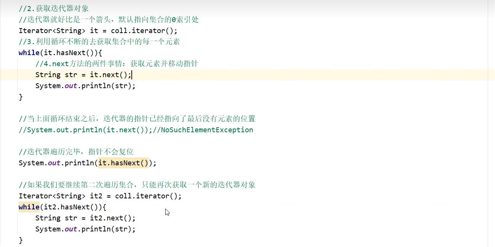
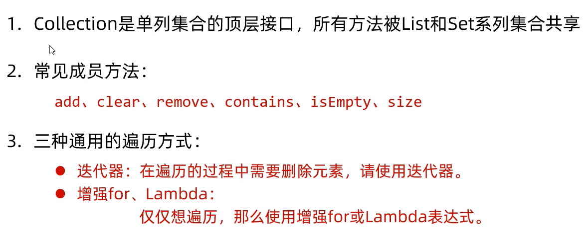
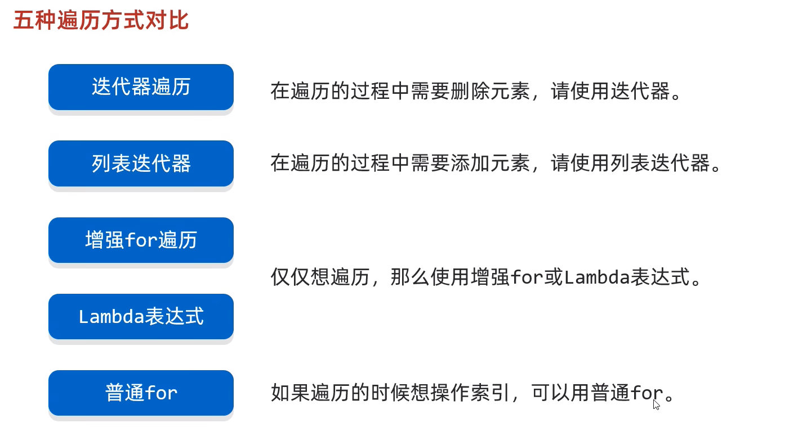

1. list系列集合：添加的元素是**有序、可重复、有索引**
2. Set系列集合：添加的元素是**无序、不重复、无索引**

# 一、Collection

1. list中contains()底层是通过**equals()实现**不能判断引用类型，若想**使用需要重写**

2. 迭代器的遍历

   

     

3. 迭代器注意点

4. 增强for循环 

   ### **总结**

   

   ###  

   ### list集合的特有方法

   

|      | 周六下午 | 周六晚上 | 周日下午 | 周日晚上 |
| ---- | -------- | -------- | -------- | -------- |
|      |          |          | 冯琮雁   | 冯琮雁   |
|      |          | 谢晓凤   | 谢晓凤   |          |
|      |          |          |          |          |

### 五种遍历方式对比

