# 正则表达式——处理文本的利器

# 正则表达式：regular expression => RegExp

# 一、正则表达的基本介绍

## （1）介绍

1. 一个正则表达式，就是用某种模式去**匹配字符串的一个公式**。
2. 正则表达式不是只有Java才有，实际上很多编程语言都支持正则表达式进行字符串操作！

1)

- 根据指定的规则，定位满足规则的子字符串（比如1999）
- 找到后，将子字符串的开始的索引记录到matcher对象的属性int [] groups;
  groups[0]=31,把该子字符串的结束的索引+1的值记录到groups[1]=35
- 同时记录oldLast的值为子字符串的结束的索引+1的值35，即下次执find时，就从35开始匹配

2）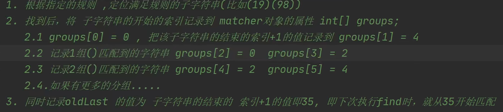

## （2)分组

1. 如果正则表达式有() 即分组
2. 取出匹配的字符串规则如下：
3. group(0)表示匹配到的子字符串
4. group(1)表示匹配到的子字符串的第1组字串
5. group(2)表示匹配到的子字符串的第2组字串
6.  ...但是分组的数不能越界。

# 二、基本语法

- 基本介绍

  如果要想灵活的运用正则表达式，必须了解其中的各种元字符的功能，元字符从功能上大致分为：

  1. 限定符
  2. 选择匹配符
  3. 分组组合和反向引用符
  4. 特殊字符
  5. 字符匹配符
  6. 定位符

- **元字符**—转义号 **\\\\**

- **\\\\**符号 说明：在我们使用正则表达式去检索某些特殊字符的时候，需要用到转移符号，否则检索不到结果，甚至会报错。

  提示：在Java的正则表达式中，两个**\\\\**代表其他语言的一个\

  需要用到转义符号的字符有以下：**.  *  +  (  )  $  /  \ ？[  ]  ^  {  }**

  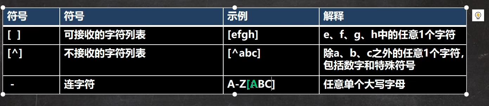

  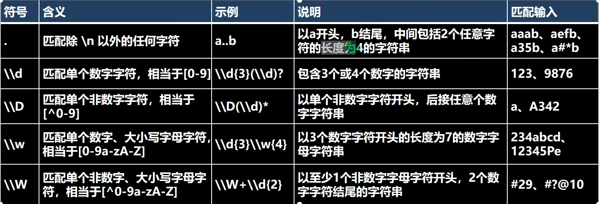

## 1.字符匹配符

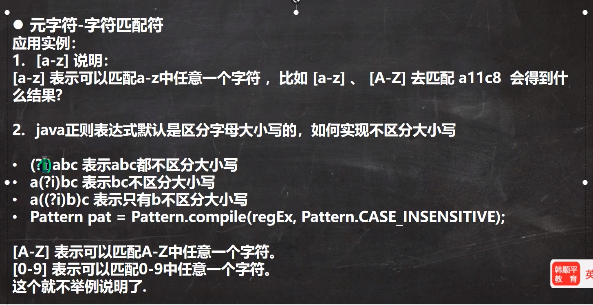

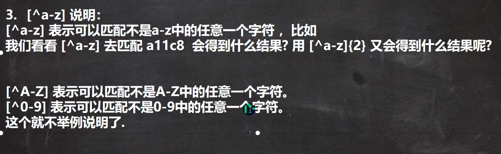

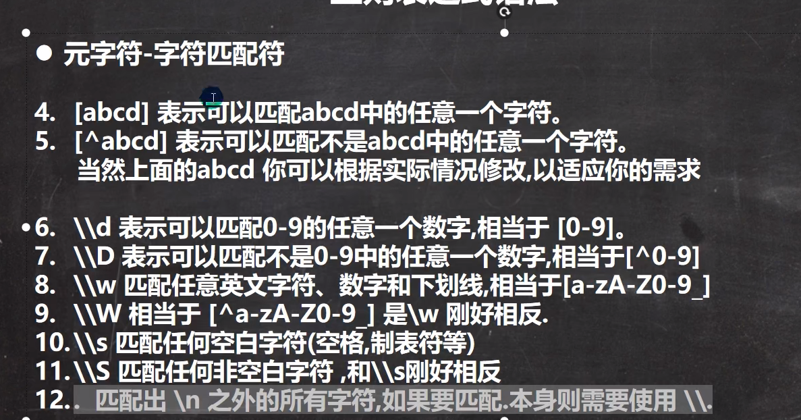

**注意：[ . ]表示匹配就是 . 本身**

## 2.选择匹配符

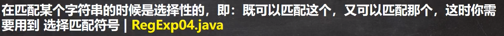

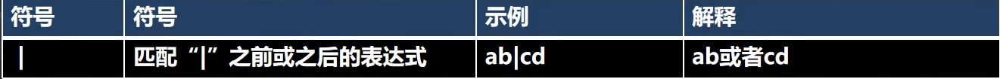

## 3.限定符

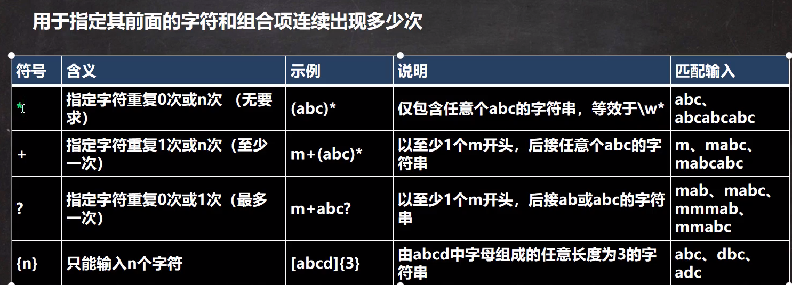

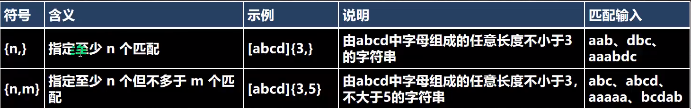

细节：Java匹配**默认贪婪匹配**，尽可能匹配多的

## 4.定位符

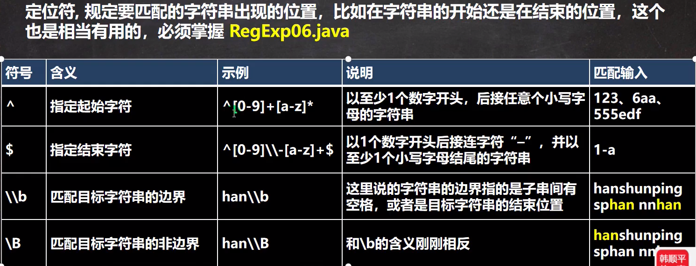

## 5.分组

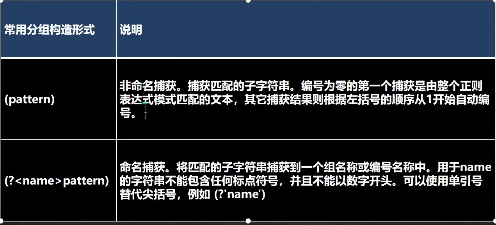 

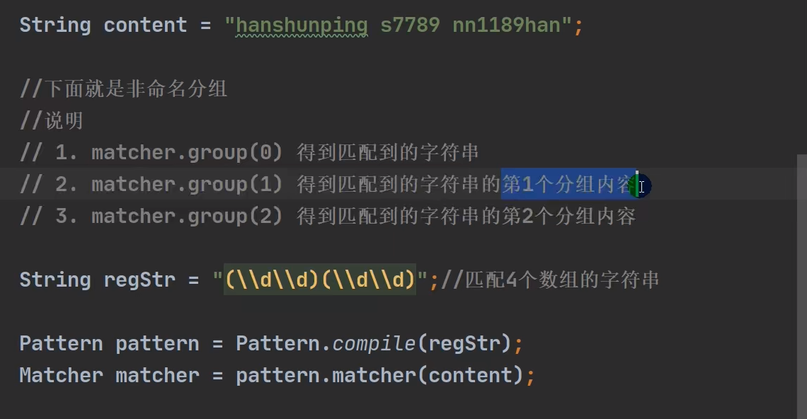

~~~java
public class Regexp_ {
    public static void main(String[] args) {
        String content = "用3443于基于Java的应用服务器。Java2平台的发布，是Java发展过程中最重要的一个"+
                "里程碑，标志着Java的应用开始普及9889,1234";
//        String content = "123abcABC_@ ";
        //1. \\d表示一个任意的数字
        String regStr = "(?<g1>\\d\\d)(\\d)(\\d)";
        //2.创建模式对象[即正则表达式对象]
        Pattern pattern = Pattern.compile(regStr);
        //3.创建匹配器
        //说明：创建匹配器matcher，按照正则表达式的规则去匹配 content 字符串
        Matcher matcher = pattern.matcher(content);
        //4.开始匹配
        while (matcher.find()){
            System.out.println("找到第一组：" + matcher.group("g1"));
            System.out.println("找到：" + matcher.group(1));
            System.out.println("找到：" + matcher.group(2));
            System.out.println("找到：" + matcher.group(3));
        }
    }
}
~~~

### 特别分组

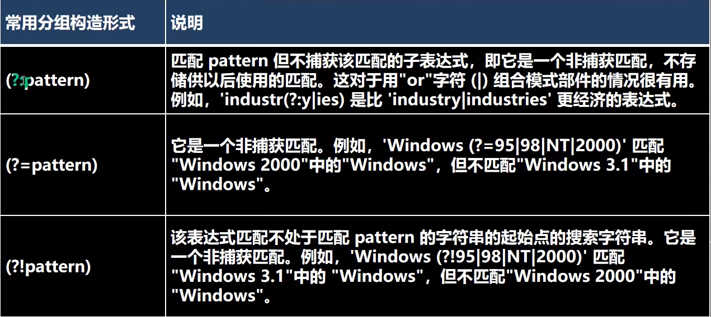

~~~java
/String regStr="韩顺平教育|韩顺平老师|韩顺平同学"：
//上面的写法可以等价非捕获分组
String regstr="韩顺平(？：教育|老师|同学)"；
Patternpattern Pattern.compile(regstr);
Matcher matcher pattern.matcher(content);
~~~

## 正则表达式元字符-详细说明

| **字符**                        | **说明**                                                     |
| ------------------------------- | ------------------------------------------------------------ |
| **\**                           | **将下一字符标记为特殊字符、文本、反向引用或八进制转义符。例如，"n"匹配字符"n"。"\n"匹配换行符。序列"\\\\"匹配"\\"，"\\("匹配"("。** |
| **^**                           | **匹配输入字符串开始的位置。如果设置了 RegExp 对象的 Multiline 属性，^ 还会与"\n"或"\r"之后的位置匹配。** |
| **$**                           | **匹配输入字符串结尾的位置。如果设置了 RegExp 对象的 Multiline 属性，$ 还会与"\n"或"\r"之前的位置匹配。** |
| *****                           | **零次或多次匹配前面的字符或子表达式。例如，zo\* 匹配"z"和"zoo"。\* 等效于 {0,}。** |
| **+**                           | **一次或多次匹配前面的字符或子表达式。例如，"zo+"与"zo"和"zoo"匹配，但与"z"不匹配。+ 等效于 {1,}。** |
| **?**                           | **零次或一次匹配前面的字符或子表达式。例如，"do(es)?"匹配"do"或"does"中的"do"。? 等效于 {0,1}。** |
| **{*****n\*****}**              | ***n\*** **是非负整数。正好匹配** ***n\*** **次。例如，"o{2}"与"Bob"中的"o"不匹配，但与"food"中的两个"o"匹配。** |
| **{*****n\*****,}**             | ***n\*** **是非负整数。至少匹配** ***n\*** **次。例如，"o{2,}"不匹配"Bob"中的"o"，而匹配"foooood"中的所有 o。"o{1,}"等效于"o+"。"o{0,}"等效于"o\*"。** |
| **{*****n\*****,*****m\*****}** | ***m\*** **和** ***n\*** **是非负整数，其中** ***n\*** **<=** ***m\*****。匹配至少** ***n\*** **次，至多** ***m\*** **次。例如，"o{1,3}"匹配"fooooood"中的头三个 o。'o{0,1}' 等效于 'o?'。注意：您不能将空格插入逗号和数字之间。** |
| **?**                           | **当此字符紧随任何其他限定符（\*、+、?、{*****n\*****}、{*****n\*****,}、{*****n\*****,*****m\*****}）之后时，匹配模式是"非贪心的"。"非贪心的"模式匹配搜索到的、尽可能短的字符串，而默认的"贪心的"模式匹配搜索到的、尽可能长的字符串。例如，在字符串"oooo"中，"o+?"只匹配单个"o"，而"o+"匹配所有"o"。** |
| **.**                           | **匹配除"\r\n"之外的任何单个字符。若要匹配包括"\r\n"在内的任意字符，请使用诸如"[\s\S]"之类的模式。** |
| **(*****pattern\*****)**        | **匹配** ***pattern\*** **并捕获该匹配的子表达式。可以使用 $0…$9 属性从结果"匹配"集合中检索捕获的匹配。若要匹配括号字符 ( )，请使用"\("或者"\)"。** |
| **(?:*****pattern\*****)**      | **匹配** ***pattern\*** **但不捕获该匹配的子表达式，即它是一个非捕获匹配，不存储供以后使用的匹配。这对于用"or"字符 (\|) 组合模式部件的情况很有用。例如，'industr(?:y\|ies) 是比 'industry\|industries' 更经济的表达式。** |
| **(?=*****pattern\*****)**      | **执行正向预测先行搜索的子表达式，该表达式匹配处于匹配** ***pattern\*** **的字符串的起始点的字符串。它是一个非捕获匹配，即不能捕获供以后使用的匹配。例如，'Windows (?=95\|98\|NT\|2000)' 匹配"Windows 2000"中的"Windows"，但不匹配"Windows 3.1"中的"Windows"。预测先行不占用字符，即发生匹配后，下一匹配的搜索紧随上一匹配之后，而不是在组成预测先行的字符后。** |
| **(?!*****pattern\*****)**      | **执行反向预测先行搜索的子表达式，该表达式匹配不处于匹配** ***pattern\*** **的字符串的起始点的搜索字符串。它是一个非捕获匹配，即不能捕获供以后使用的匹配。例如，'Windows (?!95\|98\|NT\|2000)' 匹配"Windows 3.1"中的 "Windows"，但不匹配"Windows 2000"中的"Windows"。预测先行不占用字符，即发生匹配后，下一匹配的搜索紧随上一匹配之后，而不是在组成预测先行的字符后。** |
| ***x\*****\|*****y\***          | **匹配** ***x\*** **或** ***y\*****。例如，'z\|food' 匹配"z"或"food"。'(z\|f)ood' 匹配"zood"或"food"。** |
| **[*****xyz\*****]**            | **字符集。匹配包含的任一字符。例如，"[abc]"匹配"plain"中的"a"。** |
| **[^*****xyz\*****]**           | **反向字符集。匹配未包含的任何字符。例如，"[^abc]"匹配"plain"中"p"，"l"，"i"，"n"。** |
| **[*****a-z\*****]**            | **字符范围。匹配指定范围内的任何字符。例如，"[a-z]"匹配"a"到"z"范围内的任何小写字母。** |
| **[^*****a-z\*****]**           | **反向范围字符。匹配不在指定的范围内的任何字符。例如，"[^a-z]"匹配任何不在"a"到"z"范围内的任何字符。** |
| **\b**                          | **匹配一个字边界，即字与空格间的位置。例如，"er\b"匹配"never"中的"er"，但不匹配"verb"中的"er"。** |
| **\B**                          | **非字边界匹配。"er\B"匹配"verb"中的"er"，但不匹配"never"中的"er"。** |
| **\c*****x\***                  | **匹配** ***x\*** **指示的控制字符。例如，\cM 匹配 Control-M 或回车符。*****x\*** **的值必须在 A-Z 或 a-z 之间。如果不是这样，则假定 c 就是"c"字符本身。** |
| **\d**                          | **数字字符匹配。等效于 [0-9]。**                             |
| **\D**                          | **非数字字符匹配。等效于 [^0-9]。**                          |
| **\f**                          | **换页符匹配。等效于 \x0c 和 \cL。**                         |
| **\n**                          | **换行符匹配。等效于 \x0a 和 \cJ。**                         |
| **\r**                          | **匹配一个回车符。等效于 \x0d 和 \cM。**                     |
| **\s**                          | **匹配任何空白字符，包括空格、制表符、换页符等。与 [ \f\n\r\t\v] 等效。** |
| **\S**                          | **匹配任何非空白字符。与 [^ \f\n\r\t\v] 等效。**             |
| **\t**                          | **制表符匹配。与 \x09 和 \cI 等效。**                        |
| **\v**                          | **垂直制表符匹配。与 \x0b 和 \cK 等效。**                    |
| **\w**                          | **匹配任何字类字符，包括下划线。与"[A-Za-z0-9_]"等效。**     |
| **\W**                          | **与任何非单词字符匹配。与"[^A-Za-z0-9_]"等效。**            |
| **\x*****n\***                  | **匹配** ***n\*****，此处的** ***n\*** **是一个十六进制转义码。十六进制转义码必须正好是两位数长。例如，"\x41"匹配"A"。"\x041"与"\x04"&"1"等效。允许在正则表达式中使用 ASCII 代码。** |
| **\*****num\***                 | **匹配** ***num\*****，此处的** ***num\*** **是一个正整数。到捕获匹配的反向引用。例如，"(.)\1"匹配两个连续的相同字符。** |
| **\*****n\***                   | **标识一个八进制转义码或反向引用。如果 \*****n\*** **前面至少有** ***n\*** **个捕获子表达式，那么** ***n\*** **是反向引用。否则，如果** ***n\*** **是八进制数 (0-7)，那么** ***n\*** **是八进制转义码。** |
| **\*****nm\***                  | **标识一个八进制转义码或反向引用。如果 \*****nm\*** **前面至少有** ***nm\*** **个捕获子表达式，那么** ***nm\*** **是反向引用。如果 \*****nm\*** **前面至少有** ***n\*** **个捕获，则** ***n\*** **是反向引用，后面跟有字符** ***m\*****。如果两种前面的情况都不存在，则 \*****nm\*** **匹配八进制值** ***nm\*****，其中** ***n\*** **和** ***m\*** **是八进制数字 (0-7)。** |
| **\nml**                        | **当** ***n\*** **是八进制数 (0-3)，*****m\*** **和** ***l\*** **是八进制数 (0-7) 时，匹配八进制转义码** ***nml\*****。** |
| **\u*****n\***                  | **匹配** ***n\*****，其中** ***n\*** **是以四位十六进制数表示的 Unicode 字符。例如，\u00A9 匹配版权符号 (©)。** |

# 三、正则表达式三个常用类

iava.util.regex包主要包括以下三个类Pattern类、Matcher类和
PatternSyntaxException

- Pattern类
  pattern对象是一个正则表达式对象。Pattern类没有公共构造方法。要创建一个Pattern对
  象，调用其公共静态方法，它返回一个Pattern对象。该方法接受一个正则表达式作为它的第
  一个参数，比如：Pattern r=Pattern.compile(pattern);
- Matcher类
  Matcher对象是对输入字符串进行解释和匹配的引擎。与Pattern类一样，Matcher也没有
  公共构造方法。你需要调用Pattern对象的matcher方法来获得一个Matcher对象
- PatternSyntaxException
  PatternSyntaxException是一个非强制异常类，它表示一个正则表达式模式中的语法错误。

## Pattern类

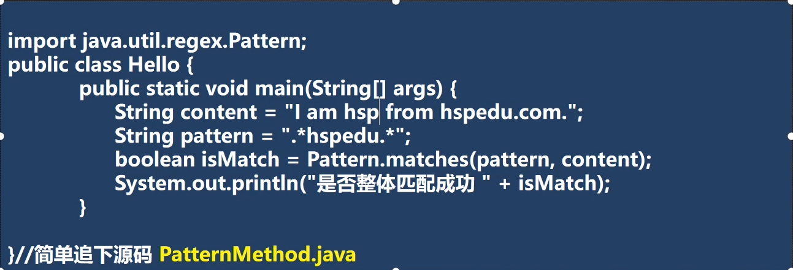

## Matcher类

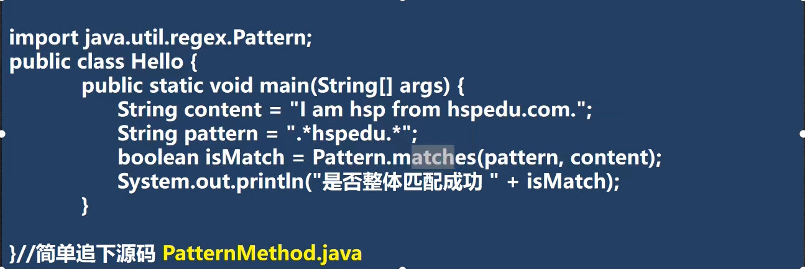

**方法一览**

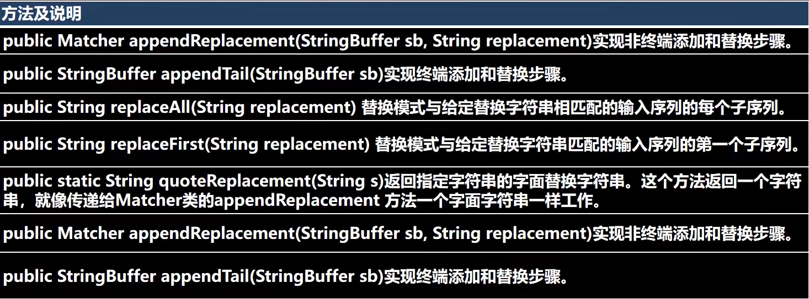

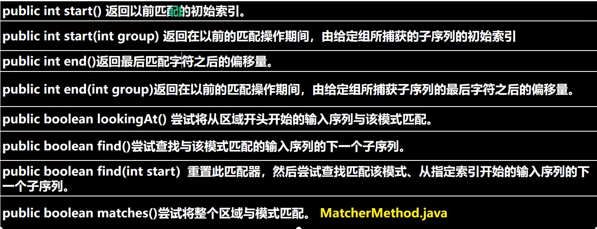

# 四、分组、捕获、反向引用

## 1.分组

我们可以用圆括号组成一个比较复杂的匹配模式，那么一个圆括号的部分我们可
以看作是一个子表达式/一个分组。

## 2.捕获

把正则表达式中子表达式/分组匹配的内容，保存到内存中以数字编号或显式命名
的组里，方便后面引用，从左向右，以分组的左括号为标志，第一个出现的分组
的组号为1，第二个为2，以此类推。组0代表的是整个正则式

## 3.反向引用

圆括号的内容被捕获后，可以在这个括号后被使用，从而写出一个比较实用的匹
配模式，这个我们称为**反向引用**，这种引用既可以是在正则表达式内部，也可以是
在正则表达式外部，内部反向引用分组号，外部反向引用$分组号

## String 类中使用正则表达式

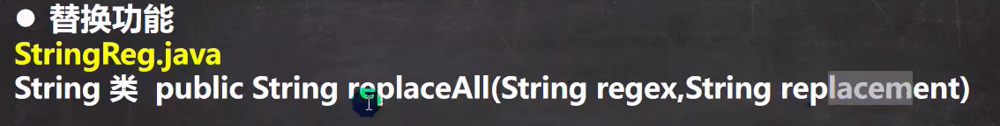

~~~Java
//使用正则表达式方式，将JDK1.3和JDK1.4替换成JDK
content = content.replaceAll("JDK1\\.3|JDK1\\.4","JDK")
System.out.println(content);
~~~

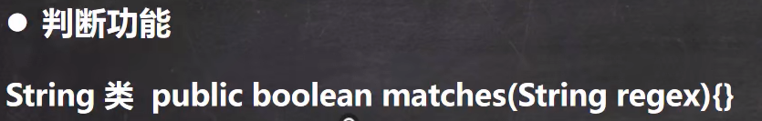

~~~Java
//要求验证一个手机号，要求必须是以138139开头的
content="13888889999";
if (content.matches("1(38139)\\d{8}")){
	System.oUt.println("验证成功")；
}else{
	System..out.printin("验证失败")；
}
~~~

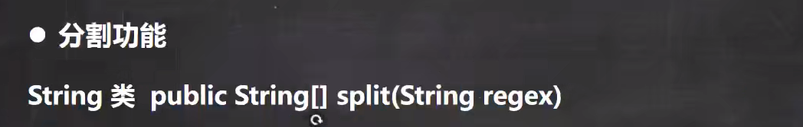

~~~java
//要求按照#或者-或者、或者数字来分割
System.OUt.println("=================");
content="hello#abc-jack12 smith~北京"；
String[]split content.split("#|-|~|\\d+");
for (String s : split)
	System.out.println(s);
}
~~~

