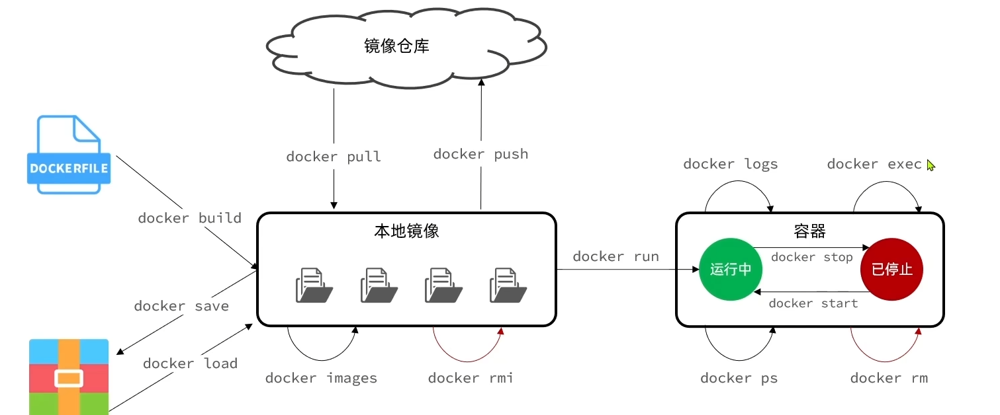

# **Docker**

## 一、 初识docker

当我们利用Docker安装应用时，Docker会自动搜索并下载应用**镜像(image)**。

镜像不仅包含应用本身，还包含应用运行所需要的环境、配置、系统函数库。

Docker:会在运行镜像时创建一个隔离环境，称为**容器**（container)。
**镜像仓库**：存储和管理镜像的平台，Docker官方维护了一个公共仓库：Docker Hub。


配置镜像加速器的命令 

目前测试到的只有下面这一个镜像源可用：https://docker.m.daocloud.io

~~~bash
sudo mkdir -p /etc/docker

sudo tee /etc/docker/daemon.json <<-'EOF'
{
  "registry-mirrors": ["https://docker.m.daocloud.io"] 
}
EOF

sudo systemctl daemon-reload

sudo restart docker
~~~

安装MySQL示例：

安装root用户，密码123，任意源3306端口访问本机的3306端口的MySQL服务

~~~bash
docker run -d --name mysql -p 3306:3306 -e TZ=Asia/Shanghai -e MYSQL_ROOT_PASSWORD=123 mysql
~~~

查看安装的镜像

~~~bash
docker images
~~~

查看启动的镜像服务

~~~bash
docker ps
~~~

## 二、 安装docker

在 Ubuntu 系统上安装 Docker 的步骤如下：

### 1. 更新现有的软件包
```bash
sudo apt-get update
```

### 2. 安装必要的软件包
```bash
sudo apt-get install apt-transport-https ca-certificates curl software-properties-common
```

### 3. 添加 Docker 的 GPG 密钥
```bash
curl -fsSL https://download.docker.com/linux/ubuntu/gpg | sudo gpg --dearmor -o /usr/share/keyrings/docker-archive-keyring.gpg
```

### 4. 设置 Docker 仓库
```bash
echo "deb [arch=$(dpkg --print-architecture) signed-by=/usr/share/keyrings/docker-archive-keyring.gpg] https://download.docker.com/linux/ubuntu $(lsb_release -cs) stable" | sudo tee /etc/apt/sources.list.d/docker.list > /dev/null
```

### 5. 更新软件包列表
```bash
sudo apt-get update
```

### 6. 安装 Docker CE（Community Edition）
```bash
sudo apt-get install docker-ce
```

### 7. 检查 Docker 服务状态
确保 Docker 服务已经启动并运行：
```bash
sudo systemctl status docker
```

### 8. 运行一个测试容器
```bash
sudo docker run hello-world
```

### 9. （可选）将当前用户加入 `docker` 组
为了在不使用 `sudo` 的情况下运行 Docker 命令，可以将当前用户添加到 `docker` 组：
```bash
sudo usermod -aG docker $USER
```
然后，退出并重新登录，或使用以下命令应用组更改：
```bash
newgrp docker
```

完成以上步骤后，则能够在 Ubuntu 上成功安装并使用 Docker。

### 10. 版本检查

~~~bash
docker --version
~~~

## 三、命令解读

对于刚才得安装MySQL的指令可能不太理解，所以进行解释一下。

~~~bash
docker run -d \
--name mysql \
-p 3306:3306 \
-e TZ=Asia/Shanghai \
-e MYSQL_ROOT_PASSWORD=123 \
mysql
~~~

- **docker  run** ：创建并运行一个容器，**-d**是让容器在后台运行
- **--name mysql** ：给容器起个名字，必须唯一
- **-p 3306:3306** ：设置端口映射 （0.0.0.0的3306端口可以让问本机的3306端口服务，第二个端口取决于进程的端口，mysql的端口为3306）
- **-e KEY= VALUE**：是设置环境变量
- **mysql**：指定运行的镜像的名字

### 镜像命名规范

- 镜像名称一般分为两部分组成：[repository]:[tag]
  - 其中repository就是镜像名
  - tag是镜像的版本
- 没有指定tag时，默认是latest，代表最新版本的镜像


~~~
简单小结一下:										nagin为例
-d: 让容器在后台运行							   docker run -d \
--name: 给容器起名字								--name nginx \
-e: 环境变量
-p: 宿主机端口映射到容器内端口					   -p 80:80
镜像名称结构:						
Repository:TAG ------> 镜像名:版本号				nginx
~~~

## 四、Docker基础

### （一）常见命令

Docker:最常见的命令就是操作镜像、容器的命令，详见官方文档：https://hub.docker.com/



下述均已容器名为nginx的进程为例

~~~bash
查看容器更简洁一点：
docker ps --format "table {{.ID}}\t{{.Image}}\t{{.Ports}}\t{{.Status}}\t{{.Names}}"
~~~

docker ps ：仅查看运行中的进程，若需查看所以需要加上 -a

~~~bash
查看日志：
docker logs nginx ---------->查看nginx的日志
docker logs -f nginx ------->实时跟踪nginx日志
~~~

~~~bash
删除容器：
docker rm nginx ------>删除前需要先停止容器
docker rm nginx -f --->强制删除容器

删除镜像：
docker rmi nginx ------>删除前需要先删除容器
docker rmi nginx -f --->强制删除镜像
~~~

#### 命令别名

进入编辑面板

~~~bash
# 修改/root/.bashrc文件
vi ~/.bashrc   
~~~

加入内容

~~~bash
alias dps='docker ps --format "table {{.ID}}\t{{.Image}}\t{{.Ports}}\t{{.Status}}\t{{.Names}}"'

alias dis='docker images'
~~~

执行命令使别名生效

~~~bash
source ~/.bashrc
~~~

### （二）数据卷挂载

#### 数据卷

**数据卷(volume)**是一个虚拟目录，是**容器内目录**与**宿主机目录**之间映射的桥梁。


| 命令                  | 说明                 | 文档地址 |
| --------------------- | -------------------- | -------- |
| docker volume create  | 创建数据卷           |          |
| docker volume ls      | 查看所有数据卷       |          |
| docker volume rm      | 删除指定数据卷       |          |
| docker volume inspect | 查看某个数据卷的详情 |          |
| docker volume prune   | 清楚数据卷           |          |

#### 1)案例1-利用Nginx容器部署静态资源

需求：

- 创建Nginx容器，修改nginx容器内的html目录下的index.html文件，查看变化
- 将静态资源部署到nginxl的html目录

提示：

- 在执行docker run命令时，使用-**v数据卷：容器内目录**可以完成数据卷挂载
- 当创建容器时，如果挂载了数据卷且数据卷不存在，会自动创建数据卷

以nginx为例子

~~~bash
# 挂载操作
docker run -d --name nginx -p 80:80 -v html:/usr/share/nginx/html nginx
# 查看挂载的所有数据卷
docker volume ls
# 查看创建的数据卷的位置
docker volume inspect html # html 为查看的数据卷的名称
# 如果要修改其中的内容只需要移动到宿主机的数据卷的位置找到对应文件锦绣修改就可以了

# 查看容器内的文件情况
# 进入容器
docker exec -it nginx bash
# 切换目录 
cd /usr/share/nginx/html/
# 查看
ls
~~~

#### 2)案例2-mysql容器的数据挂载

需求：

- 查看mysql容器，判断是否有数据卷挂载

- 基于宿主机目录实现MySQL数据目录、配置文件、初始化脚本的挂载（查阅官方镜像文档)

  - 挂载/root/mysql/data到容器内的/var/ib/mysq目录

  - 挂载/root/mysql/init到容器内的/docker-entrypoint-initdb.d目录，携带提前准备好的SQL脚本

  - 挂载/root/mysql/conf到容器内的/etc/mysql/conf.d目录，携带提前准备好的

    配置文件

~~~bash
docker run -d \
--name mysql \
-p 3306:3306 \
-e TZ=Asia/Shanghai \
-e MYSQL_ROOT_PASSWORD=123 \
-v /root/mysql/data:/var/lib/mysql \
-v /root/mysql/init:/docker-entrypoint-initdb.d \
-v /root/mysql/conf:/etc/mysql/conf.d \
mysql
~~~


提示：

- 在执行docker run命令时，使用-v本地目录：容器内目录可以完成本地目录挂载
- 本地目录必须以“/”或"/"开头，如果直接以名称开头，会被识别为数据卷而非本地目录
  - -v mysql:var/Iib/mysql会被识别为一个数据卷叫mysql
  - -v/mysql:var/Iib/mysql会被识别为当前目录下的mysql目录

### 自定义镜像

镜像就是包含了应用程序、程序运行的系统函数库、运行配置等文件的文件包。构建镜像的过程其实就是把上述文件打包的过程。


**Dockerfile**就是一个文本文件，其中包含一个个的**指令**(Instruction)，用指令来说明要执行什么操作来构建镜像。将来Docker可以根据Dockerfile帮我们构建镜像。常见指令如下：

| 指令       | 说明                                         | 示例                                                         |
| ---------- | -------------------------------------------- | ------------------------------------------------------------ |
| FROM       | 指定基础镜像                                 | FROM centos:6                                                |
| ENV        | 设置环境变量，可在后面指令使用               | ENV key value                                                |
| COPY       | 拷贝本地文件到镜像的指定目录                 | COPY ./jrell.tar.gz/temp                                     |
| RUN        | 执行linux的shell命令，一般是安装过程的命令   | RUN tar -zxvf /tmp/jrell.tar.gz && EXPORTS path = /temp/jrell:$path |
| EXPOSE     | 指定容器运行时监听的端口，是给镜像使用者看的 | EXPOSE 8080                                                  |
| ENTRYPOINT | 镜像中应用的启动命令，容器运行时调用         | ENTRYPOINT java -jar xx.jar                                  |

更新详细语法说明，请参考官网文档：https://docs.docker.com/engine/reference/builder

可以选择基于Ubuntu基础镜像，利用Dockerfile描述镜像结构

~~~bash
# 指定基础镜像
FROM ubuntu:16:04
# 配置环境变量，JDK的安装目录、容器内时区
ENV JAVA_DIR=/user/local
# 拷贝jdk和java项目
COPY ./jdk8.tar.gz $JAVA_DIR/
COPY ./docker-demo.jar /temp/app.jar
# 安装JDK
RUN cd $JAVA_DIR \ 
&& tar -xf ./jdk8.tar.gz \ 
&& mv ./jdk1.8.0_144 ./java8
# 配置环境变量
ENV JAVA_HOME=$JAVA_DIR/java8
ENV PATH=$PATH:$JAVA_HOME/bin
# 入口，java项目的启动命令
ENTRYPOINT ["java","-jar","/app.jar"]
~~~

也可以直接基于JDK为基础镜像，省略前面的步骤：

~~~bash
# 基础镜像
FROM openjdk:11.0-jre-buster
# 拷贝jar包
COPY docker-demo.jar /app.jar
# 入口
ENTRYPOINT ["java","-jar","/app.jar"]
~~~

当编写好了Dockerfile，可以利用下面命令来构建镜像：

~~~bash
docker build -t myImage:1.0 .
~~~

- -t : 是给镜像起名，格式依然是repository:tag的格式，不指定tag时，默认为latest
- . :是指定Dockerfile所在目录，如果在当前目录，则指定为"."


### 网络

默认情况下，所有容器都是以bridge方式连接到Docker的一个虚拟网桥上：


加入自定义网络的容器才可以通过容器名互相访问，Docker的网络操作命令如下：

| 命令                      | 说明                     | 文档地址 |
| ------------------------- | ------------------------ | -------- |
| docker network create     | 创建一个网络             |          |
| docker network ls         | 查看所有网络             |          |
| docker network rm         | 删除指定网络             |          |
| docker network prune      | 清除未使用的网络         |          |
| docker network connect    | 使指定容器连接加入某网络 |          |
| docker network disconnect | 使指定容器连接离开某网络 |          |
| docker network inspect    | 查看网络详细信息         |          |

~~~bash
# 创建一个网桥
docker network create answer
# 将容器加入网桥，如将名mysql的容器加入名为answer的网桥
docker network connect answer mysql

# 可以选择在创建容器时加入网桥
docker run -d --name demo -p 8080:8080 --network answer docker-demo
~~~

## 五、项目部署

### （一）部署Java应用

~~~bash
# 1. 打成jar包
# 2. 填写dockerfile文件
# 3. 然后一起丢入到ubuntu中
# 4. 构建镜像
docker build -t campus . #jar包必须和dockerfile在一个文件夹
# 5. 部署应用
docker run -d --name campus -p 8080:8080 --network answer campus 
# 如果说数据库用到的是容器内的，需要保证在同一网段
~~~

### （二）部署前端

需求：创建一个新的nginx容器，将nginx.conf、html目录与容器挂载

~~~bash
docker run -d  \
--name nginx  \
-p 8090:8090  \
-v /home/answer/nginx/html:/usr/share/nginx/html  \
-v /home/answer/nginx/nginx.conf:/etc/nginx/nginx.conf  \
--network answer  \ # 如果容器互联需要在同一个网桥
nginx
~~~

### （三）DockerCompose

Docker Compose:通过一个单独的docker-compose.yml模板文件(YAML格式)来定义一组相关联的应用容器，帮
助我们实现**多个相互关联的Docker容器的快速部署。**


docker-compose.yml文件示例

~~~bash
  services:
    mysql:
      image: mysql
      container_name: mysql
      ports:
        - "3306:3306"
      environment:
        TZ: Asia/Shanghai
        MYSQL_ROOT_PASSWORD: 123
      volumes:
          - "/home/answer/mysql/conf:/etc/mysql/conf.d"
          - "/home/answer/mysql/data:/var/lib/mysql"
          - "/home/answer/mysql/init:/docker-entrypoint-initdb.d"
      networks:
        - answer
    campus:
      build:
        context: .
        dockerfile: Dockerfile
      container_name: campus
      ports:
        - "8080:8080"
      networks:
        - answer
      depends_on:
        - mysql
    nginx:
      image: nginx
      container_name: nginx
      ports:
        - "8089:8089"
      volumes:
        - "/home/answer/nginx/nginx.conf:/etc/nginx/nginx.conf"
        - "/home/answer/nginx/html:/usr/share/nginx/html"
      depends_on:
        - campus
      networks:
        - answer
  networks:
    answer:
      name: campus_net
~~~


docker compose的命令格式如下：

~~~bash
docker compose [OPTIONS] [COMMAND]
~~~

| 类型     | 参数或指令 | 说明                         |
| -------- | ---------- | ---------------------------- |
| Options  | -f         | 指定compose文件的路径和名称  |
| Options  | -p         | 指定project名称              |
| Commands | up         | 创建并启动所有service容器    |
| Commands | down       | 停止并移动所有容器、网络     |
| Commands | ps         | 列出所有启动的容器           |
| Commands | logs       | 查看指定容器的日志           |
| Commands | stop       | 停止容器                     |
| Commands | start      | 启动容器                     |
| Commands | restart    | 重启容器                     |
| Commands | top        | 查看运行的进程               |
| Commands | exec       | 在指定的运行中容器中执行命令 |

