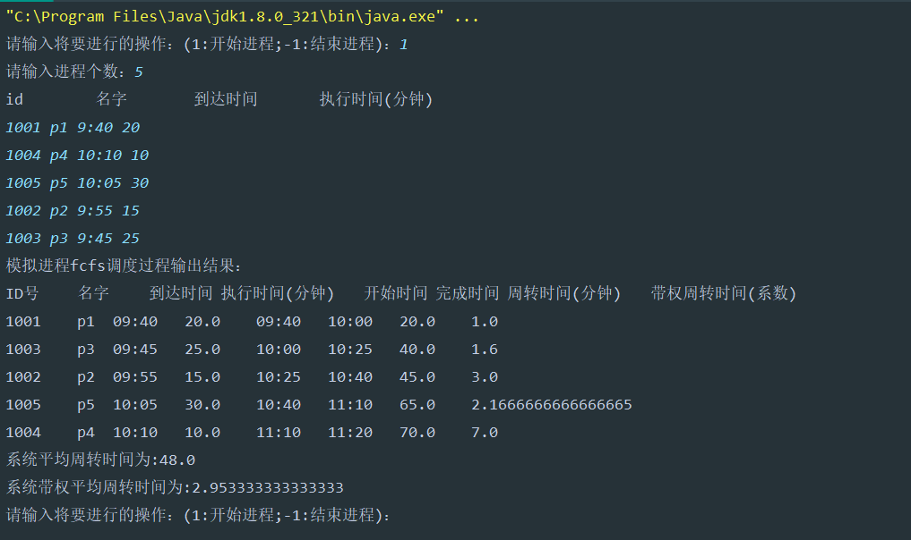

# Java操作系统进程调度算法------先来先服务（FCFS）算法

## 一、算法思想

先来先服务（FCFS）调度算法是一种最简单的调度算法，该算法既可用于作业调度，也可用于进程调度。采用FCFS算法，每次从后备队列中选择一个或多个最先进入该队列的作业，将他们调入内存，为他们分配资源，创建进程，然后放入就绪队列。在进程调度中采用FCFS算法时，则每次调度是从就绪队列中选择一个最先进入该队列的进程，为之分配处理机，使之投入运行。该进程一直运行到完成或发生某事件而阻塞后才放弃处理机。

## 二、算法分析

假设现在有五个进程先后到达系统进行调度

| 进程号 | 进程名 | 到达时间 | 服务时间（执行时间） |
| ------ | ------ | -------- | -------------------- |
| 1001   | p1     | 9:40     | 20                   |
| 1004   | p4     | 10:10    | 10                   |
| 1005   | p5     | 10:05    | 30                   |
| 1002   | p2     | 9:55     | 15                   |
| 1003   | p3     | 9:45     | 25                   |

在先来先服务算法中，由于在0时刻系统中只有作业p1,因比系统将优先为作业p1进行调度。作业p1在完成的过程中作业p2、p3、p4、p5先后都到达了系统中。也就是说在作业p1调度完成后系统中会有p2、p3、p4、p5四个作业等待调度。根据先来先服务的思想，
系统将依次按p3、p2、p5、p4的顺序为接下来的四个作业进行调度。

**周转时同 = 完成时间 - 到达时间**

p1 = 10:00 - 9:40 = 20; p2 = 10:40 - 9:55 = 45; p3 = 10:25 - 9:45 = 40; p4 = 11:20 - 10:10 = 70; p5 = 11:10 - 10:05 = 65; 

**带权周转时间=周转时间/运行时间**

p1 = 20 / 20 = 1; p2  = 45 / 15 = 3; p3 = 40 / 25 = 1.6; p4 = 70 / 10 = 7; p5 = 65 / 30 = 2.17
**等待时间=周转时间-运行时间（分钟）**

p1 = 20 - 20 = 0; p2 = 45 - 15 = 30; p3 = 40 - 25 = 15; p4 = 70 - 10 = 60; p5 = 65 - 30 = 35

**平均周转时间Q=(20 + 45 + 40 + 70 + 65) / 5 = 48**
**平均带权周转时间=(1 + 3  + 1.6 + 7 + 2.17 ) = 2.96**
**平均等待时间=(0 +30 +15 + 60 +35 ) / 5  =  28**

## 三、数据结构

### **作业数据类**

~~~java
class ProcessData{
    //进程号
    public int id;
    //进程名字
    public String name;
    //到达时间
    public LocalTime arriveTime;
    //执行时间
    public double serviceTime;
    //开始时间
    public LocalTime startTime;
    //完成时间
    public LocalTime finishTime;
    //周转时间
    public double wholeTime;
    //带权周转时间
    public double weightWholeTime;

    public ProcessData(int id, String name, String arriveTime, double serviceTime) {
        this.id = id;
        this.name = name;
        if(arriveTime.length() < 5){
            this.arriveTime = LocalTime.parse("0" + arriveTime);
//            System.out.println(arriveTime);
        }else {
            this.arriveTime = LocalTime.parse(arriveTime);
        }
        this.serviceTime = serviceTime;
    }

    @Override
    public String toString() {
        return id + "\t" +
                name + "\t" +
                arriveTime + "\t" +
                serviceTime + "\t" +
                startTime + "\t" +
                finishTime + "\t" +
                wholeTime + "\t" +
                weightWholeTime;
    }
}
~~~

### 作业调度（算法实现部分）

~~~java
package cn.homyit;

import java.time.LocalTime;
import java.time.temporal.ChronoUnit;
import java.util.Scanner;

/**
 * @param:
 * @description:
 * @author: Answer
 * @create:2024/3/7 18:31
 **/
public class FCFS {
    //平均周转时间
    public static double avgWholeTime;
    //平均带权周转时间
    public static double avgWeightWholeTime;

    public static void main(String[] args) {
        boolean answer = true;
        Scanner myScanner = new Scanner(System.in);
        while (answer){
            System.out.print("请输入将要进行的操作：(1:开始进程;-1:结束进程)：");
            int condition = myScanner.nextInt();
            if (condition == 1){
                System.out.print("请输入进程个数：");
                int num = myScanner.nextInt();
                ProcessData[] processData = new ProcessData[num];
//                System.out.println( "id\t名字\t到达时间\t执行时间(分钟)" );
                System.out.println( "id    \t  名字    \t 到达时间\t   执行时间(分钟)" );
                for( int i = 0; i < num; i++ ) {
                    processData[i] = new ProcessData
                            (myScanner.nextInt(),
                            myScanner.next(),
                            myScanner.next(),
                            myScanner.nextDouble());
                }
                fcfs(processData);
            } else if (condition == -1) {
                answer = false;
                return;
            }else {
                System.out.println("请输入正确操作！");
            }
        }
    }

    //先来先服务算法实现
    private static void fcfs(ProcessData[] processData){
        avgWholeTime = 0;//平均周转时间
        avgWeightWholeTime = 0;//平均带权周转时间

        //初始化完成的时间，周转时间，带权周转时间的初始化
        for (ProcessData processDatum : processData) {
            processDatum.finishTime = LocalTime.parse("00:00");//设置初始时间为0：00
            processDatum.wholeTime = 0;//设置平均周转时间为0
            processDatum.weightWholeTime = 0;//设置平均带权周转时间为0
        }

        //1.按照到达时间进行排序
        int n = processData.length;
        for (int i = 0; i < n - 1; i++) {
            for (int j = 0; j < n - i - 1; j++) {
                if (!timeComparison(processData[j].arriveTime,processData[j + 1].arriveTime)) {
                    // 交换元素
                    ProcessData temp = processData[j];
                    processData[j] = processData[j + 1];
                    processData[j + 1] = temp;
                }
            }
        }
        //2.第一个作业的到达时间应为第一个作业的开始时间
        processData[0].startTime = processData[0].arriveTime;
        for (int i = 0; i < processData.length ; i++) {
            //作业的完成时间为上一个作业的完成时间或者开时时间 + 当前作业的服务时间
            processData[i].finishTime = processData[i].startTime.plusMinutes((long) processData[i].serviceTime);
            //下一个任务的开始时间 = 当前任务的完成时间
            if(i!= processData.length - 1) {
                processData[i + 1].startTime = processData[i].finishTime;
            }
            //周转时间 = 完成时间 - 到达时间
            processData[i].wholeTime = ChronoUnit.MINUTES.between(processData[i].arriveTime,processData[i].finishTime);
            //带权周转时间 = 周转时间 / 系统提供的服务时间
            processData[i].weightWholeTime = processData[i].wholeTime / processData[i].serviceTime;
        }
        System.out.println("模拟进程fcfs调度过程输出结果：");

        print(processData);
    }

    //打印
    private static void print(ProcessData[] processData) {
        System.out.println("ID号\t" + "名字\t" + "到达时间\t" + "执行时间(分钟)\t" + "开始时间\t" + "完成时间\t" + "周转时间(分钟)\t" + "带权周转时间(系数)\t");
        for (ProcessData processData1 : processData){
            System.out.println(processData1);
            avgWholeTime += processData1.wholeTime;
            avgWeightWholeTime += processData1.weightWholeTime;
        }
        avgWholeTime = avgWholeTime / processData.length;
        avgWeightWholeTime = avgWeightWholeTime / processData.length;
        System.out.println("系统平均周转时间为:" + avgWholeTime);
        System.out.println("系统带权平均周转时间为:" + avgWeightWholeTime);
    }

    private static boolean timeComparison(LocalTime time1, LocalTime time2){
        return time1.isBefore(time2);
    }
}
~~~

### 运行结果

