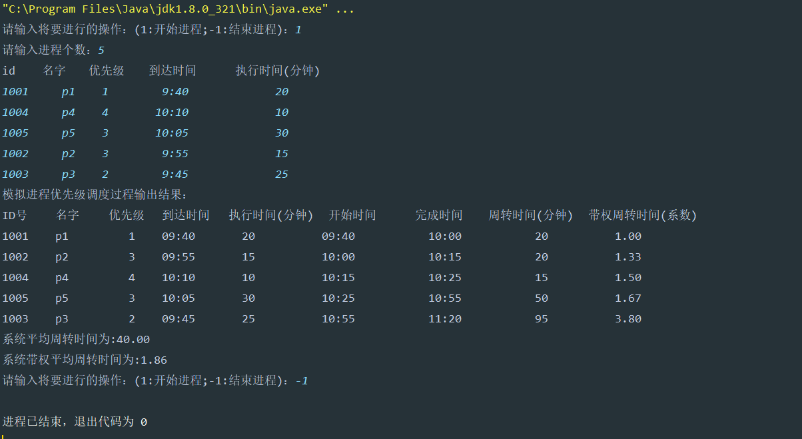

# Java操作系统进程调度算法------优先级调度算法

## 一、算法思想

1. 每个进程都被赋予一个优先级，通常是一个整数值，数值越大表示优先级越高。
2. 在进程就绪队列中，选择优先级最高的进程进行调度执行。
3. 如果有多个优先级相同的进程，可以采用先来先服务（FCFS）或轮转调度算法来决定调度顺序。

## 二、算法分析

假设现在有五个进程先后到达系统进行调度

| 进程号 | 进程名 | 优先级 | 到达时间 | 服务时间（执行时间） |
| ------ | ------ | ------ | -------- | -------------------- |
| 1001   | p1     | 1      | 9:40     | 20                   |
| 1004   | p4     | 4      | 10:10    | 10                   |
| 1005   | p5     | 3      | 10:05    | 30                   |
| 1002   | p2     | 3      | 9:55     | 15                   |
| 1003   | p3     | 2      | 9:45     | 25                   |

在先来先服务算法中，由于在0时刻系统中只有作业p1,因比系统将优先为作业p1进行调度。作业p1在完成的过程中作业p2、p3、p4、p5先后都到达了系统中。也就是说在作业p1调度完成后系统中会有p2、p3、p4、p5四个作业等待调度。**根据优先级高的优先的思想**，系统将依次按p2、p4、p5、p3的顺序为接下来的四个作业进行调度。

下述具体的计算可以参考本人FCFS算法的具体内容，此处不过多叙述（[操作系统——FCFS算法（Java实现）-CSDN博客](https://blog.csdn.net/qq_74374916/article/details/136546952?spm=1001.2014.3001.5501)）

**周转时间 = 完成时间 - 到达时间**

**带权周转时间=周转时间/运行时间**
**等待时间=周转时间-运行时间（分钟）**

**平均周转时间**
**平均等待时间**

## 三、数据结构

### 作业数据类

~~~java
class ProcessData {
    //进程号
    public int id;
    //进程名字
    public String name;
    //到达时间
    public LocalTime arriveTime;
    //运行时间
    public double serviceTime;
    //优先级
    public int PRI;
    //开始时间
    public LocalTime startTime;
    //完成时间
    public LocalTime finishTime;
    //周转时间
    public double wholeTime;
    //带权周转时间
    public double weightWholeTime;

    public ProcessData(int id, String name,int PRI,String arriveTime, double serviceTime) {
        this.id = id;
        this.name = name;
        this.PRI = PRI;
        DateTimeFormatter dateTimeFormatter = DateTimeFormatter.ofPattern("H:m");
        this.arriveTime = LocalTime.parse(arriveTime,dateTimeFormatter);
        this.serviceTime = serviceTime;
    }

    @Override
    public String toString() {
        DecimalFormat decimalFormat1 = new DecimalFormat("#");
        DecimalFormat format = new DecimalFormat("#.00");
        return id + "\t" +
                name + "\t\t   " +
                PRI + "\t"+
                arriveTime + "\t\t" +
                decimalFormat1.format(serviceTime) + "\t\t\t" +
                startTime + "\t\t\t" +
                finishTime + "\t\t\t" +
                decimalFormat1.format(wholeTime) + "\t\t\t" +
                format.format(weightWholeTime);

    }
}
~~~

### 作业调度（算法实现部分）

~~~java
package homyit;

import java.text.DecimalFormat;
import java.time.LocalTime;
import java.time.format.DateTimeFormatter;
import java.time.temporal.ChronoUnit;
import java.util.Scanner;

/**
 * @param:
 * @description: 优先级调度算法(非抢占式)
 * @author: Answer
 * @create:2024/3/22 19:10
 **/
public class YXJ {
    //平均周转时间
    public static double avgWholeTime;
    //平均带权周转时间
    public static double avgWeightWholeTime;

    public static void main(String[] args) {
        boolean answer = true;
        Scanner myScanner = new Scanner(System.in);
        while (answer){
            System.out.print("请输入将要进行的操作：(1:开始进程;-1:结束进程)：");
            int condition = myScanner.nextInt();
            if (condition == 1){
                System.out.print("请输入进程个数：");
                int num = myScanner.nextInt();
                ProcessData[] processData = new ProcessData[num];
//                System.out.println( "id\t名字\t到达时间\t执行时间(分钟)" );
                System.out.println( "id \t  名字 \t 优先级\t  到达时间\t   执行时间(分钟)  " );
                for( int i = 0; i < num; i++ ) {
                    processData[i] = new ProcessData
                            (myScanner.nextInt(),
                                    myScanner.next(),
                                    myScanner.nextInt(),
                                    myScanner.next(),
                                    myScanner.nextDouble());
                }
                yxj(processData);
            } else if (condition == -1) {
                answer = false;
                return;
            }else {
                System.out.println("请输入正确操作！");
            }
        }
    }

    //短进程优先调度服务算法实现(非抢占式)
    private static void yxj(ProcessData[] processData){
        avgWholeTime = 0;//平均周转时间
        avgWeightWholeTime = 0;//平均带权周转时间

        //初始化完成的时间，周转时间，带权周转时间的初始化
        for (ProcessData processDatum : processData) {
            processDatum.finishTime = LocalTime.parse("00:00");//设置初始时间为0：00
            processDatum.wholeTime = 0;//设置平均周转时间为0
            processDatum.weightWholeTime = 0;//设置平均带权周转时间为0
            processDatum.hasTime = 0;//初始值为0
        }

        //1.按照到达时间进行排序
        int n = processData.length;
        for (int i = 0; i < n - 1; i++) {
            for (int j = 0; j < n - i - 1; j++) {
                if (!timeComparison(processData[j].arriveTime,processData[j + 1].arriveTime)) {
                    // 交换元素
                    ProcessData temp = processData[j];
                    processData[j] = processData[j + 1];
                    processData[j + 1] = temp;
                    if (processData[j].arriveTime.equals(processData[j + 1].arriveTime)) {
                        // 交换元素
                        if (processData[j].serviceTime > processData[j + 1].serviceTime) {
                            ProcessData temp_2 = processData[j];
                            processData[j] = processData[j + 1];
                            processData[j + 1] = temp_2;
                        }
                    }
                    if (processData[j].arriveTime.equals(processData[j + 1].arriveTime) && (processData[j].serviceTime==processData[j + 1].serviceTime )) {
                        // 交换元素
                        if (processData[j].id > processData[j + 1].id) {
                            ProcessData temp_1 = processData[j];
                            processData[j] = processData[j + 1];
                            processData[j + 1] = temp_1;
                        }
                    }

                }

            }
        }

        //2.每个进程运行完成之后,找到当前时刻已经到达的最短进程
        processData[0].startTime = processData[0].arriveTime;
        for (int i = 0; i < n; i++) {
            if (i == 0){
                processData[i].finishTime = processData[i].startTime.plusMinutes((long) processData[i].serviceTime);
            }
            else {
                processData[i].finishTime = processData[i - 1].finishTime.plusMinutes((long) processData[i].serviceTime);
            }
            //2.1查找当前进程执行过程中进入系统的进程
            int m = 0;
            for (int j = i + 1; j < n; j++) {
                if (processData[j].arriveTime.isBefore(processData[i].finishTime) || processData[j].arriveTime.equals(processData[i].finishTime)){
                    m++;
                }
            }
            //2.2processData[i].finishTime时刻已经到达的优先级最高的进程
            if (i != n - 1) {
                int minServiceTimeIndex = getMinServiceTimeIndex(processData, i, m);
                // 交换进程
                ProcessData temp = processData[i + 1];
                processData[i + 1] = processData[minServiceTimeIndex];
                processData[minServiceTimeIndex] = temp;
            }
        }
        run(processData);
        print(processData);
    }

    //算法实现核心
    private static int getMinServiceTimeIndex(ProcessData[] processData, int i, int m) {
        double max = processData[i + 1].PRI;
        int minServiceTimeIndex = i + 1;//用来解决优先权相等的时候交换元素

        for (int k = i + 2; k <= i + m; k++) {
            //优先级高的先执行，如若相等则按FCFS算法来
            if (processData[k].PRI > max ||
                    (processData[k].PRI == max && processData[k].arriveTime.isBefore(processData[minServiceTimeIndex].arriveTime))||
                    (processData[k].PRI == max && processData[k].arriveTime.equals(processData[minServiceTimeIndex].arriveTime) && processData[k].serviceTime < processData[minServiceTimeIndex].serviceTime) ||
                    (processData[k].PRI == max && processData[k].arriveTime.equals(processData[minServiceTimeIndex].arriveTime) && processData[k].serviceTime == processData[minServiceTimeIndex].serviceTime && processData[k].id < processData[minServiceTimeIndex].id)) {
                max = processData[k].PRI;
                minServiceTimeIndex = k;
            }
        }
        return minServiceTimeIndex;
    }

    //运行
    private static void run(ProcessData[] processData){
        for (int i = 0; i < processData.length ; i++) {
            //作业的完成时间为上一个作业的完成时间或者开时时间 + 当前作业的服务时间
            processData[i].finishTime = processData[i].startTime.plusMinutes((long) processData[i].serviceTime);
            //下一个任务的开始时间 = 当前任务的完成时间
            if(i!= processData.length - 1) {
                if(processData[i].finishTime.isBefore(processData[i + 1].arriveTime)){
                    processData[i + 1].startTime = processData[i+ 1 ].arriveTime;
                }
                else {
                    processData[i + 1].startTime = processData[i].finishTime;
                }

            }
            //周转时间 = 完成时间 - 到达时间
            processData[i].wholeTime = ChronoUnit.MINUTES.between(processData[i].arriveTime,processData[i].finishTime);
            //带权周转时间 = 周转时间 / 系统提供的服务时间
            processData[i].weightWholeTime = processData[i].wholeTime / processData[i].serviceTime;
        }
        System.out.println("模拟进程优先级调度过程输出结果：");
    }
    //打印
    private static void print(ProcessData[] processData) {
        System.out.println("ID号\t" + "名字\t" +"优先级\t"+ "到达时间\t" + "  执行时间(分钟)\t" + " 开始时间\t" + "  完成时间\t" + " 周转时间(分钟)\t" + "带权周转时间(系数)\t");
        for (ProcessData processData1 : processData){
            System.out.println(processData1);
            avgWholeTime += processData1.wholeTime;
            avgWeightWholeTime += processData1.weightWholeTime;
        }
        avgWholeTime = avgWholeTime / processData.length;
        avgWeightWholeTime = avgWeightWholeTime / processData.length;
//        DecimalFormat decimalFormat1 = new DecimalFormat("#");
        DecimalFormat decimalFormat2 = new DecimalFormat("#.00");
        String formatAvgWholeTime = decimalFormat2.format(avgWholeTime);
        System.out.println("系统平均周转时间为:" + formatAvgWholeTime);
        String formatAvgWeightWholeTime = decimalFormat2.format(avgWeightWholeTime);

        System.out.println("系统带权平均周转时间为:" + formatAvgWeightWholeTime);
    }

    private static boolean timeComparison(LocalTime time1, LocalTime time2){
        return time1.isBefore(time2);
    }
}
~~~

### 运行结果

