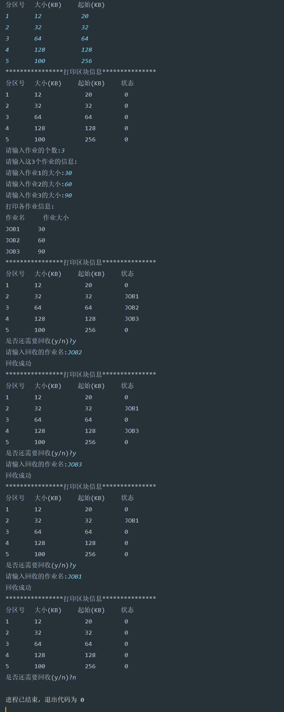

# 连续存储管理方式的模拟与实现(固定分区)Java实现

## 一、算法思想

1. 划分内存空间：将内存划分为若干个固定大小的分区，每个分区可以存放一个作业。这些分区的大小可以事先确定，也可以根据系统需求进行划分。
2. 空闲分区表：维护一个空闲分区表，记录每个分区的起始地址、大小以及是否被占用。初始时，所有分区都被标记为空闲状态。
3. 分配空闲分区：当作业到达时，操作系统会遍历空闲分区表，找到一个大小合适的空闲分区来分配给作业。分配策略可以是首次适应、最佳适应或最差适应等。
4. 作业执行：作业被分配到分区后开始执行，占用该分区直至作业执行结束。
5. 释放分区：作业执行结束后，释放该分区，并更新空闲分区表，使得其他作业可以使用该分区。

同时，固定分区的连续存储管理方式具有一些优点和缺点：

**优点：**

1. **简单易实现**：固定分区的实现相对简单，易于理解和实现。
2. **低碎片化**：固定分区可以减少内存碎片化的问题，因为分区大小是固定的，不会出现过多的小碎片。
3. **避免外部碎片**：由于分区大小固定，不会出现外部碎片的情况，可以更好地利用内存空间。

**缺点：**

1. **内部碎片**：固定分区可能会导致内部碎片的问题，即分配给作业的分区大小大于作业实际所需大小，造成一部分空间浪费。

2. **限制作业大小**：由于分区大小是固定的，可能会限制大作业的分配，导致某些作业无法被执行。

3. **分区不灵活**：固定分区的大小是固定的，无法根据实际作业需求进行动态调整，可能会导致资源浪费或无法满足需求。

   (后面会有可变分区避免这些缺点)

## 二、算法分析

模拟系统的分区块数（假设为5）

| 分区号 | 大小(KB) | 起始(KB) | 状态 |
| ------ | -------- | -------- | ---- |
| 1      | 12       | 20       | 0    |
| 2      | 32       | 32       | 0    |
| 3      | 64       | 64       | 0    |
| 4      | 128      | 128      | 0    |
| 5      | 100      | 256      | 0    |

状态为0，即为空闲状态，若为进程名则处于作业状态

## 三、数据结构

~~~java
package cn.homyit;

import java.util.Arrays;
import java.util.Scanner;

/**
 * @param:
 * @description:
 * @author: Answer
 * @create:2024/4/8 18:27
 **/
public class Allocation {
    public String distinct;//分区号
    public int lengthAddress;//长度
    public String beginAddress;//起始地址
    public String statusWork;//状态

    //分区构造器
    public Allocation(String distinct, int lengthAddress, String beginAddress, String statusWork) {
        this.distinct = distinct;
        this.lengthAddress = lengthAddress;
        this.beginAddress = beginAddress;
        this.statusWork = statusWork;
    }

    //作业构造器

    public Allocation(int lengthAddress, String statusWork) {
        this.lengthAddress = lengthAddress;
        this.statusWork = statusWork;
    }

    //打印分区
    public static void print(Allocation[] allocations){
        System.out.println("****************打印区块信息***************");
        System.out.println("分区号\t大小(KB)\t起始(KB)\t状态");
        for (Allocation allocation : allocations) {
            System.out.println(allocation.distinct + "\t    " + allocation.lengthAddress + "\t          "
                    + allocation.beginAddress + "\t     " + allocation.statusWork);
        }
    }

    //打印作业
    public static void printWork(Allocation[] allocations){
        System.out.println("打印各作业信息:");
        System.out.println("作业名     作业大小");
        for (Allocation allocation : allocations) {
            System.out.println(allocation.statusWork + "     " + allocation.lengthAddress);
        }
    }

    //算法实现
    public static void main(String[] args) {
        Scanner ins = new Scanner(System.in);
        System.out.print("请输入系统分区的块数:");
        int num = ins.nextInt();
        System.out.println("请依次输入:");
        System.out.println("分区号\t大小(KB)\t起始(KB)");
        Allocation[] allocations = new Allocation[num];
        for (int i = 0; i < allocations.length; i++) {
            allocations[i] = new Allocation(ins.next(),ins.nextInt(),ins.next(),"0");
        }
        print(allocations);

        System.out.print("请输入作业的个数:");
        int workNum = ins.nextInt();
        System.out.println("请输入这" + workNum + "个作业的信息:");
        Allocation[] workLengths = new Allocation[workNum];
        for (int i = 0; i < workNum; i++) {
            System.out.print("请输入作业" + (i+1) + "的大小:");
            workLengths[i] = new Allocation(ins.nextInt(),"JOB" + (i+1));
        }
        //打印作业
        printWork(workLengths);

        //开始分配空间
        int[] flags = new int[workNum];//10为内存过大2；5无可分配空间；0为成功分配
        Arrays.fill(flags,10);

        for (int j = 0; j < workNum; j++) {
            for (int i = 0; i < num; i++) {
                if (workLengths[j].lengthAddress <= allocations[i].lengthAddress){
                    flags[j] = 5;
                    if (allocations[i].statusWork.equals("0")){
                        allocations[i].statusWork = workLengths[j].statusWork;
                        flags[j] = 0;
                        break;
                    }
                }
            }
        }
        print(allocations);
        for (int i = 0; i < flags.length; i++) {
           if (flags[i] == 10){
               System.out.println(workLengths[i].statusWork + "内存过大，无法分配");
               return;
           }else if (flags[i] == 5){
               System.out.println(workLengths[i].statusWork + "无可分配分区");
               return;
           }
        }
        System.out.print("是否还需要回收(y/n)?");
        String param = ins.next();
        while (param.equals("y")){
            System.out.print("请输入回收的作业名:");
            String name = ins.next();
            int param1 = 1;//回收成功的判断标识,1为回收失败，0为回收成功
            for (Allocation allocation : allocations) {
                if (allocation.statusWork.equals(name)){
                    allocation.statusWork = "0";
                    param1 = 0;
                    System.out.println("回收成功");
                    break;
                }
            }
            if (param1 == 1){
                System.out.println("回收失败");
            }
            print(allocations);
            System.out.print("是否还需要回收(y/n)?");
            param = ins.next();
        }

    }
}
~~~

## 四、运行结果

