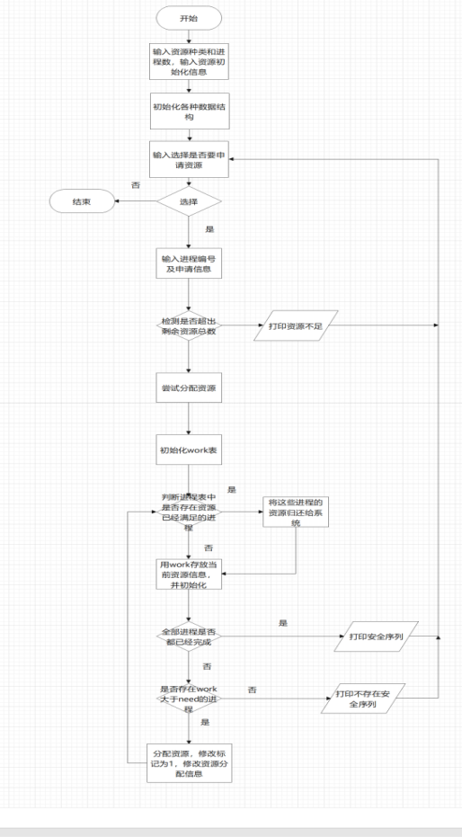
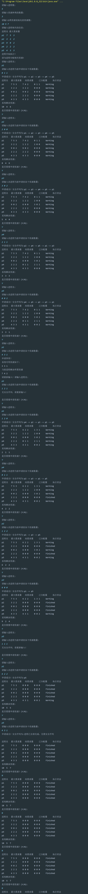
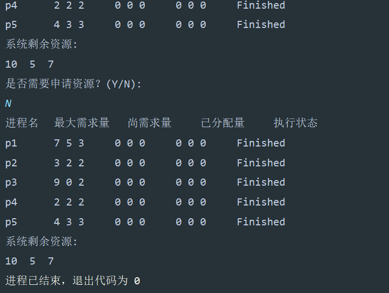

# Java操作系统------银行家算法

## 一、算法思想

​        银行家算法是一种用于避免死锁的资源分配算法。其主要思想是根据系统对资源的当前状态和进程对资源的需求，判断系统是否能够分配资源给进程，同时保证系统不会进入死锁状态。

银行家算法基于以下假设：
1. 每个进程在开始执行之前必须申请它所需要的最大资源数目。
2. 每个进程在执行过程中需要的资源数是变化的，但最大资源数不变。
3. 系统必须知道每类资源的总数和可用资源数。
4. 系统每次分配资源前都要检查系统状态，以确保分配资源不会导致系统进入不安全状态。

​        银行家算法通过安全性算法来判断系统是否处于安全状态，即系统能否按照某种顺序分配资源，使得所有进程都能完成执行而不会发生死锁。如果系统处于安全状态，就可以分配资源给进程；如果不安全，就需要等待，直到系统进入安全状态。
通过动态地分配资源、检查系统状态、避免死锁等方式，银行家算法可以有效地管理资源的分配，保证系统的稳定性和安全性。

## 二、算法分析

## 三、数据结构

### 作业数据类(包含部分数据处理)

~~~java
package cn.homyit;

import java.util.stream.IntStream;

/**
 * @param:
 * @description:
 * @author: Answer
 * @create:2024/4/2 20:25
 **/
public class Data {
    public int pcb_nums;//进程数量
    public int res_nums;//资源数
    public String[] ids;//进程号
    public int[][] max;//最大需求资源量
    public int[][] alloc;//已占有资源数向量
    public int[][] need;//还需要的资源向量
    public int[] ava;//可用资源数向量
    public int[] request;//本次申请的资源
    public int[] safe_seq;//安全序列组

    public String[] status;//执行状态

    //打印数据
    public void show(Data data){
        System.out.println("进程名\t最大需求量\t尚需求量\t\t已分配量\t\t执行状态\t");
        for (int i = 0; i < data.pcb_nums; i++) {
            System.out.print(data.ids[i]+ "      ");
            for (int j = 0; j < data.res_nums; j++) {
                System.out.print(data.max[i][j] + " ");
            }
            System.out.print("    ");
            for (int j = 0; j < data.res_nums; j++) {
                System.out.print(data.need[i][j] + " ");
            }
            System.out.print("    ");
            for (int j = 0; j < data.res_nums; j++) {
                System.out.print(data.alloc[i][j] + " ");
            }
            System.out.print("    ");
            System.out.print(data.status[i]);
            System.out.println();
        }
        System.out.println("系统剩余资源:");
        IntStream.range(0,data.res_nums)
                .mapToObj(i -> data.ava[i] + "  ")
                .forEach(System.out::print);
    }
    //    比较进程为m中的元素全大于n中的元素
    public boolean compare(int[] m, int[] n,int len){
        return IntStream.range(0,len)
                .allMatch(i -> m[i] >= n[i]);
    }

    //判断安全序列
    //安全性检验函数，检测是否存在安全序列
    public boolean safe(Data data){
        String[] finish = new String[data.pcb_nums];//记录每个进程是否已经完成
        int[] work = new int[data.res_nums];//模拟系统可用资源
        int num = 0;//用来记录已经完成的进程数量，若等于进程数则表示所有进程结束，安全性检验结束
        System.arraycopy(data.ava, 0, work, 0, data.res_nums);
        System.arraycopy(data.status,0,finish,0,data.pcb_nums);
        for (int i = 0; i < data.pcb_nums; i++) {
            if (num == data.pcb_nums){
                break;
            }
            for (int j = 0; j < data.pcb_nums; j++) {
                if(finish[j].equals("Finished")){
                    continue;
                }else {
                    if (compare(work,data.need[j], data.res_nums)){
                        finish[j] = "Finished";
                        data.safe_seq[num] = j + 1;
                        num++;
                        //释放已完成的资源
                        for (int k = 0; k < data.res_nums; k++) {
                            work[k] = work[k] + data.alloc[j][k];
                        }
                    }
                }
            }
        }
        //判断是否还有未完成的进程
        for (int i = 0; i < data.pcb_nums; i++) {
            if (!finish[i].equals("Finished")){
                return false;
            }
        }
        System.out.print("申请成功！安全序列为:");
        int count = 0;
        //输出安全序列
        for (int i = 0; i < data.pcb_nums; i++) {
            if (data.safe_seq[i] == 0){
                count++;
            }
            if(data.safe_seq[i] > 0){
                if (i > 0) {
                    System.out.print(" -> ");
                }
                System.out.print("p" + data.safe_seq[i]);
            }
        }
        if (count == data.pcb_nums){
            System.out.println("进程已全部完成，无需安全序列");
        }
        System.out.println();
        for (int i = 0; i < pcb_nums; i++) {
            if (status[i].equals("Finished")){
                break;
            }else {
                int k = 0;
                for (int j = 0; j < res_nums; j++) {
                    if (alloc[i][j] == max[i][j]) {
                        k++;
                    }
                }
            }
        }
        show(data);
        return true;
    }

}
~~~

### 算法实现

~~~java
package cn.homyit;

import java.util.Arrays;
import java.util.Scanner;
import java.util.stream.IntStream;

/**
 * @param:
 * @description:
 * @author: Answer
 * @create:2024/4/2 20:26
 **/
public class Bank {
    public static boolean compare(int[] m, int[] n,int len){
        for (int i = 0; i < len; i++) {
            if (m[i]<n[i])
                return false;
        }
        return true;
    }
    public static void main(String[] args) {
        Data data = new Data();
        Scanner ins = new Scanner(System.in);
        System.out.println("请输入进程数:");
        data.pcb_nums = ins.nextInt();
        System.out.println("请输入资源种类的数量:");
        data.res_nums = ins.nextInt();
        System.out.println("请输入" + data.res_nums + "类资源初始化的资源数:");
        data.ava = new int[data.res_nums];//可以获取的资源
        for (int i = 0; i < data.res_nums; i++) {
            data.ava[i] = ins.nextInt();
        }
        //相关数据初始化
        data.max = new int[data.pcb_nums][data.res_nums];
        data.alloc = new int[data.pcb_nums][data.res_nums];
        data.need = new int[data.pcb_nums][data.res_nums];
        data.ids = new String[data.pcb_nums];
        data.status = new String[data.pcb_nums];
        data.request = new int[data.res_nums];
        Arrays.fill(data.status, "Working");//初始化结束

        System.out.println("请输入进程相关的信息:");
        System.out.println("进程名 最大需求量");
        for (int i = 0; i < data.pcb_nums; i++) {
            data.ids[i] = ins.next();
            for (int j = 0; j < data.res_nums; j++) {
                data.max[i][j] = ins.nextInt();
            }
        }

        //计算需求和已分配矩阵
        for (int i = 0; i < data.pcb_nums; i++) {
            for (int j = 0; j < data.res_nums; j++) {
                data.need[i][j] = data.max[i][j];
                data.alloc[i][j] = 0;
            }
        }

        System.out.println("进程开始执行！\n请为进程分配相关资源!");
        String param = "Y";
        while (param.equals("Y")) {
            data.safe_seq = new int[data.pcb_nums];
            System.out.println("请输入进程名:");
            String id = ins.next();
            int n = 0;
            //找到是第几个进程
            for (int i = 0; i < data.pcb_nums; i++) {
                if (data.ids[i].equals(id)) {
                    n = i;
                    break;
                }
            }
            System.out.println("请输入该进程当前申请的各个资源数量:");
            for (int i = 0; i < data.res_nums; i++) {
                data.request[i] = ins.nextInt();
            }
            //判断请求资源要小于可获取资源和还需资源才可以继续申请
            boolean b = compare(data.ava, data.request, data.res_nums);
            boolean c = compare(data.need[n], data.request, data.res_nums);
            if (b && c) {
                for (int i = 0; i < data.res_nums; i++) {
                    data.alloc[n][i] = data.alloc[n][i] + data.request[i];
                    data.need[n][i] = data.need[n][i] - data.request[i];
                    data.ava[i] = data.ava[i] - data.request[i];
                }
                //判断申请过后该进程是否已经完成
                int k = 0;
                for (int i = 0; i < data.res_nums; i++) {
                    if(data.max[n][i] == data.alloc[n][i]){
                        k++;
                    }
                }
                if (k == 3) {
                    data.status[n] = "Finished";
                    for (int j = 0; j < data.res_nums; j++) {
                        data.alloc[n][j] = 0;
                        data.need[n][j] = 0;
                        data.ava[j] += data.max[n][j];
                    }
                }
                //判断是否存在安全序列，如果不存在回退资源到申请之前
                if (!data.safe(data)) {
                    for (int i = 0; i < data.res_nums; i++) {
                        data.alloc[n][i] = data.alloc[n][i] - data.request[i];
                        data.need[n][i] = data.need[n][i] + data.request[i];
                        data.ava[i] = data.ava[i] + data.request[i];
                    }
                    System.out.println("无安全序列，请重新输入！");
                }
            }else {
                System.out.println("申请异常！\n系统可用资源如下:");
                   IntStream.range(0,data.res_nums)
                            .mapToObj(i ->data.ava[i] + " ")
                            .forEach(System.out::print);
                System.out.println();
                System.out.println("当前进程剩余所需资源");
                for (int i = 0; i < data.res_nums; i++) {
                    System.out.print(data.need[n][i] + " ");
                }
                System.out.println();
                System.out.print("请重新输入！");
                continue;
            }
            System.out.println();
            System.out.println("是否需要申请资源？(Y/N):");
            param = ins.next();
        }
        data.show(data);
    }
}
~~~

## 四、运行结果

